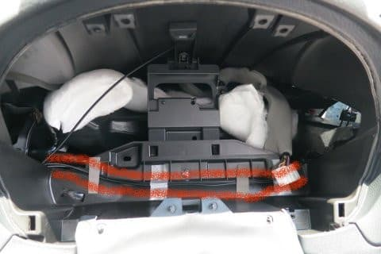
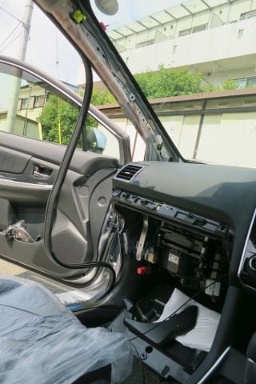

# プロジェクトX2第2章…LEVORG E型にKENWOODナビ取り付け…地デジ＆GPSのアンテナを設置！

📅 投稿日時: 2018-08-10 04:43:29

🏷️ カテゴリ: [車](cba0e8330b3f2ded7c1addfacc75d4547.md)

ということで．

そろそろLEVORGが納車されて一か月になろうというのに．

まだ続く，ナビ取り付けレポート．

この記事を読めば．

「自分もナビがつけられるのでは？」

と思えるよう，異常なほど細かく書いているので．

…この記事．

ナビを自分で取りつけようなどと，1ミクロンも

思わない人が見て，面白い記事なんだろうか…

と心配になっているSkier_Sです．

とりあえず．

本日は地デジアンテナ＆GPSアンテナの取り付けです．

では，どうぞ～！

---

ってな感じで．

地デジアンテナを取り付けるため，Aピラー内張りの

取り外しまで完了したので．

次は，地デジアンテナの貼り付けです！

地デジアンテナは，L字型のシールになっている

ものが4枚入っているので．

これを，台紙を剥がして，フロントガラスに

貼り付けていきます．

フロントガラス右側には，こんな位置に

二つのアンテナを貼りつけます．

…分かりにくいので，アンテナを赤く囲むと

こんな感じ．

貼りつける位置は．

L字側のガラス枠と並行になる部分がこんな感じで，

ガラス周囲の黒く塗られた部分（セラミックライン）

上にぎりぎり乗る位置に貼りつけます．

フロントガラス左側には．

12か月点検と車検のステッカーが貼ってあるので．

これを避けるように貼ります…

車検ステッカーって，普通はガラスの真ん中に

貼ってある気がするけど…

アイサイトのカメラの邪魔にならないよう，

LEVORGではこんな位置に貼ってあるのね…

BRレガシィは，真ん中に貼ってあったんだけどなぁ…

で．

アンテナを取り付けたら．

今度は，アンテナケーブルの取り付けです．

アンテナ表面の剥離フィルムを剥がして．

アンテナシール上にマークされたポチ二つと，

アンテナケーブルの取り付け台座にある

でっぱり二つの位置が合うようにして…

押さえつけると，貼りつけ完了！

これを繰り返して，計4個貼りつければ，

後は配線を取りまわすのみ．

配線を取りまわす際には．

邪魔になるフロントツイーターのネットを

外しちゃいましょう．

こんな感じでめくり上げると，簡単に

ポコッと外れます．

外すと，こんな感じ．

そうしたら，次はAピラー内側に

2本の配線を這わせて…

適当にテープで止めます．

そのあと，先っちょのコネクタがいろんな

ところに引っかからないように，二つまとめて

テープでグルグル巻きにしておいて…

ツイーター横にあいている，このスペースを通して．

インパネ下部に引っ張っていきます．

インパネ下部は，ここにケーブルを固定して，

ナビスペースまでコネクタを通します．

…分かりにくいので，固定した地デジアンテナを

赤く囲うとこんな感じ．

運転席側も同様に，Aピラー内側にケーブルを固定して．

そのあとは，メーターナセル内側に引っ張ります．

そして，メーター奥部分を通過する形で配線して，

ナビスペースまでケーブルを通します．

…配線が分かりにくいので，印をするとこんな感じ．

これで，地デジアンテナ取り付けは完了！！！

（Aピラー内張り取り付け後の写真）

…次は，最後のアンテナ．

GPSアンテナです．

GPSアンテナは，ナビの取り付けガイドには，

インパネ上部に取り付けることになってますが．

…私の美学的には．

インパネ上部にGPSアンテナがあるのは，美しくない．

どこかに隠したい…

隠せそうなところ，

隠せそうなところ…

うーむ．

ここの中かな．

やっぱり…

おあつらえ向きに．

ケーブルを上手く通せそうな穴も開いているので．

ここにケーブルを通して…

そして，アンテナ裏の両面テープの

剥離紙を剥がして．

ここに貼りつけました～！

ガラス越しに見ると，こんな感じです．

実際に使ってみても，アンテナがこの位置でも

問題なくGPSを捉えてくれているので．

GPSアンテナ，この位置で大丈夫なようです…

ってな感じで．

無事アンテナ類の取り付けが完了しました…

で．

ここまで作業が進んだ段階だと．

車はこんな姿になってます…

でも．

もう作業は終盤．

リアカメラ取り付けは苦労したけど．

ETC本体取り付けからアンテナ取り付けまでは

順調に進んだから，2時間ほどで終わったし．

残るは，ナビ本体の配線と，

本体の取り付けだけ．

もうあとちょっとで終わるな…

と．

この時は．

この先に起こる出来事を知る余地もなく．

あと1～2時間もすれば，ナビ取り付けが

完了して．

この内装が完全に元通りになっているものと

信じていたのだった…

（続く）
