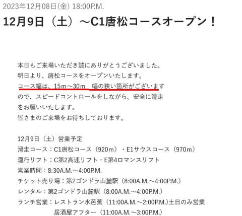

# 焼額山スキー場，明日から第2高速リフト運転！今週末も志賀高原で滑ってます～！

📅 投稿日時: 2023-12-09 00:26:36

🏷️ カテゴリ: [日記](cc4b5682fb7b8b144980957a978653fb0.md)

ってなことで．

焼額山スキー場ですが．

なんと，明日から第2高速リフトが動く

ようです…！

（[焼額山スキー場ホームページ](https://www.princehotels.co.jp/ski/shiga/winter/)より）

…残念ながらゴンドラはうごきません

でしたが．

12月2週で第2高速と第4ロマンスの2本が

動けば，まぁ平年並みといった感じ

でしょうか…

ってなことなので．

明日，志賀高原で滑れるのは

横手山　第4ペア（もしかしたら第1ペアも動く？）

熊の湯　第2ペア山頂から

高天ヶ原　トリプル

一ノ瀬ファミリー　ペアリフト

焼額山　第4ロマンス，第2高速

の6本のリフトとなります…

で．土日の志賀高原の天気ですが．

土曜：おそらく終日晴れ，気温は高く

　朝は締まっていて，下地の人工雪の

　硬さが出てきそうだけど，昼間の雪は

　緩み気味．

日曜：曇り時折晴れ間も．土曜より

　冷えるが昼間の気温は0℃を越える．

　時折わずかに雪が舞うかも…

　でも，積もるほどではない．

　あさイチは固めのシマシマ．

　ガチガチではないけど，全体的に

　人工雪でしっかり締まった硬めの

　バーン．

って感じでしょうか．

昨日も睡眠4時間でしたが，これからまた

睡眠3時間で出発です～！←大丈夫か？

また今週も志賀高原でお会いしましょう！
