# 再開！2014シーズンモデルのスキー試乗レポートその8…ROSSIGNOL編

📅 投稿日時: 2013-04-10 01:13:10

🏷️ カテゴリ: [スキー板試乗](c0bd8048615710cee890e403a36cc9a2b.md)

さてさて．

この週末．

ダイヤモンドで試乗会に参加の予定だったんですが．

「さすがにこの天気だと，試乗会やらないよな～」

と．思っていたところ．

驚くことに．

予定通り，試乗会は開催されたんですね～．

土曜はダイヤモンドスキー場リフトが動いてないのに，

予定通りダイヤモンドスキー場で貸し出しをやったので，

板を交換するたびにリフトが動いてるファミリースキー場まで

往復しなくてはならなかったという…(苦行）

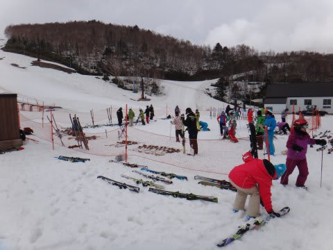

(ダイヤモンドクワッドが動いていないのに，なぜここで開催…？）

とりあえず．

土日2日間，参加してきました．

今回も乗りに乗ったり，16機種17種類！

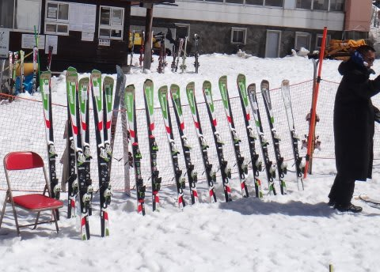

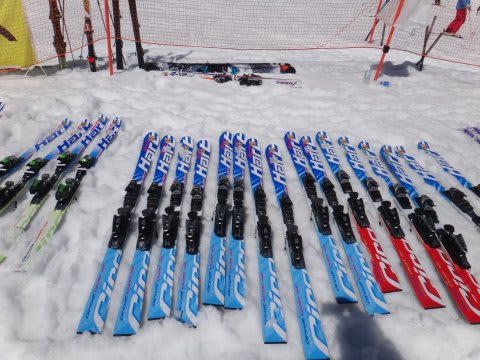

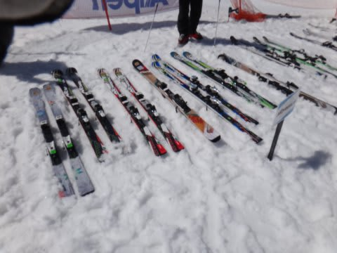

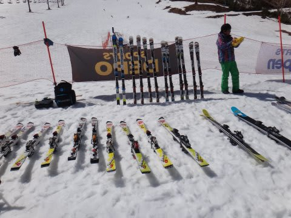

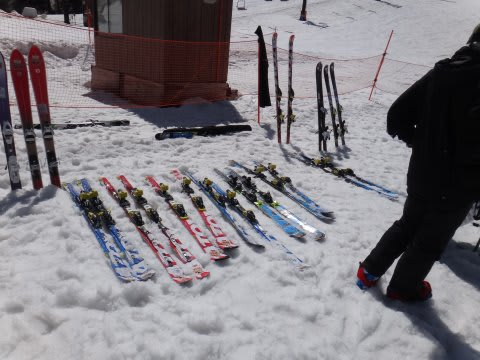

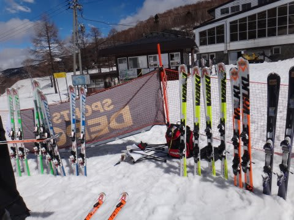

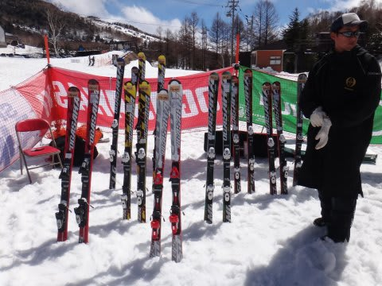

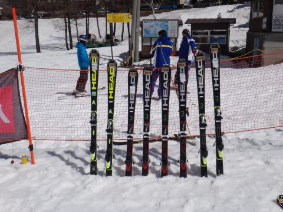

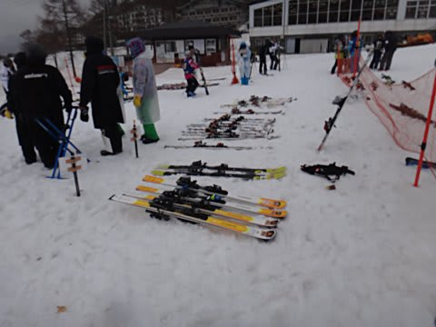

…ってことで．

これからまた試乗レポートが続きますが．

この日のコンディションは．

土曜はファミリースキー場のパーフェクターコース．

ざぶざぶ水をすったやわらかい雪で，細かい凹凸がある荒れた斜面．

日曜はダイヤモンドスキー場で，朝は重い雪がきれいに圧雪され，

比較的良好なコンディション．午後に向かって，典型的な春のゲレンデで，

ちょっと荒れていった感じ．

…といった状況でした．

んで．

いつもの注意をば…

このレポートを書いているのは，テククラも指導員資格も持っていない，

単なるレジャースキーヤーです．←ここ強調するところ

レジャースキーヤーの単なる感想ですから，

私がイマイチと思った板でも，他の人にとっては最高の板かもしれませんし，

私が絶賛した板でも，他の人にとって「なんじゃこりゃーっ！」って板かも知れません．

ってことで．

あくまで参考程度に読んでやってください…

では，まずはロシニョール編です．

どうぞ～

---

ROSSIGNOL

○ROSSIGNOL DEMO ALPHA Slant Nose R20 166cm

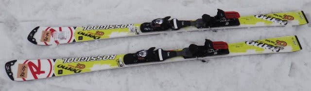

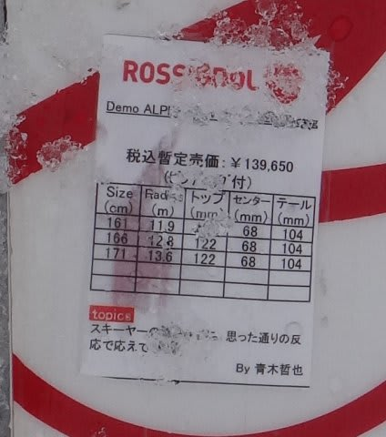

小回りベース基礎板．

このモデル，プレートの違いで2種類あるんですが．

しっかりしたプレートのR20プレート,

比較的マイルドなTPXプレートのうち，

こちらは強いR20プレートのモデルです．

＃なんだか，TPXプレートのモデルは正式名称「DEMO ALPHA SOFT Slant Nose」

＃って感じで，名前に『SOFT』が入ったみたいですが…分かりやすくするためかな？

で．R20プレートのこの板は．結構重い，どっしりした感じの板ですね～．

ちょっと傾けたところから，かっつりとエッジが食いつき，

しっかり小さいターン弧で回っていきます．

小さなサイドカーブのRに乗っていく，エッジグリップ小回り系板です．

かなりどっしりしていて，フレックスも強いので，高速安定性も十分高いです．

メタルの張りがつよく，返りは結構早い感じ．

トップとテールのエッジがしっかり効いてます．

張りが強く，前後動でトップとテールを押さえわけられるので，

トップを使う，テールを使うという動作はやりやすい感じ．

チューンナップの影響か，この板の性格なのか…ちょっとエッジの引っ掛かりが強く，

ずらしの快適度はそれほど高くなかったのが残念…

ひたすらサイドカーブに乗って滑っていく板ですね．

サイドカーブはかなり小さいので，小回り～中回りまで．

大回りはちょいときついかな．

うーん．

もう少し履いた感じに軽快感があればいいんですが．

ちょっと不整地で足にずっしり来る重みがあるのが惜しいか．
