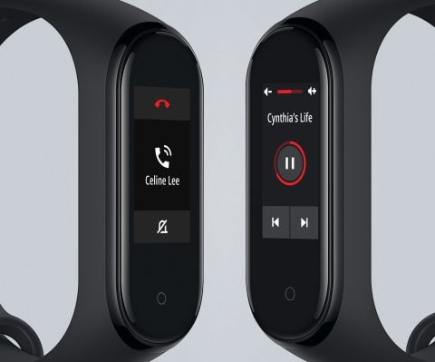

# スマートリストバンド（活動量＆心拍計＆スマホ通知），Xiami MiBand4を買ってみた・その1

📅 投稿日時: 2019-08-11 04:07:09

🏷️ カテゴリ: [PC,カメラ&小物](c0d8caed13e597efe97b661a8ae56bed0.md)

えー．

普段外出時にスマホをカバンに

入れっぱなしにしている妻．

電話やらLINEのメッセージに気づいて

くれないことが多かったのですが．

某焼額常連の方が，スキーの時に使っていた

スマートバンドが便利そうだったので．

これらの着信を教えてくれるスマート

バンドを買ってあげようか…

と思ったわけで．

それ自体が単体でいろんな測定・ログ機能やら

メモリーやらを持っているスマートウォッチと

違って．

スマホにログを残す形での活動量や歩数の記録と，

スマホ通知程度に機能を絞ったスマートリストバンド，

あるいはスマートバンドと呼ばれるものに

狙いを定めて，Amazonで調べると．

ふーむ．

格安のものは，2000円台から4000円くらいの

価格帯で，かなりいろんな種類のモノが

出ていますねぇ…

2000円台のモノでも，

着信通知，運動量＆心拍＆血圧計測…

等の基本機能が揃っているように

見えますけれども．

電池もちが悪いとか，スマホアプリの

日本語がひどくて意味が分からんとか．

アプリがスマホの電池を異常に食うとか．

あまり評判が良く無いようで…

とりあえず．

そんなにお高くなくて，

まともに使えそうなものを探して

みたところ…

これだ！

Xiaomiの，Mi Band4．

（[Xiaomiグローバルホームページ](https://www.mi.com/global/mi-smart-band-4/)より）

中国のスマホメーカーとして，

かつて中国シェア2位

（今はOppoとかに抜かれて4位だったかな？）

のXiaomi（シャオミ）．

実はスマートウォッチを作っていた

ようで…

その，Xiaomiが作る世界ベストセラーの

このMi bandシリーズ．

全世界に販売しており，国内でも店頭販売

している大手電気屋さんもあったりと，

世界的には，Apple watchより数が

出ているとのこと…

そして，初代Mi Bandから

2，3とモデルチェンジを

続けていて．

この6月末に，最新のMi Band4が

発売されたばかり！

このMiBandシリーズ．

歴史も長く，ユーザも多いので，

スマホのアプリもかなりこなれていて．

日本語化もバッチリ．

それどころか，公式アプリ以外にも，

いろいろなサードパーティー製アプリも

出ているほど．

とはいえ，まだ発売されたばかりで，

日本で公式に発売されていない

Mi Band4．

でも，Amazonでは，すでにいくつかの業者から

出品されていて，購入することができます．

今回は，Amazonセンターから配送となっていた，

MCclubという業者さんを選びました．

（このスクショでは4299円になってますが，私が買ったときは，4099円でした…）

いや，中国から配送となっている業者の場合．

グローバル版と言っておきながら中国版が

届いたり，

ひどい場合はXiaomi製ではない，似ても似つかぬ

偽物が届いたりするらしいので．

日本のAmazon配送センターからの配達になっていれば

安心だろうと…

さすが国内配送センターから送られるだけの

ことはあり．

注文の2日後には，ちゃんとモノが届きました～！

中国版ではなく，外箱に英語などの

多言語表記された，グローバル版が

ちゃんと届きました．

ってなことで．

こいつがどんな感じかのレポートは，

次回に続きます．

## 💬 コメント一覧

### 💬 コメント by (michi)
**タイトル**: Unknown
**投稿日**: 2019-08-11 08:17:26

自分はとりあえず着信だけわかれば良いと思って買ったのですが心拍計や歩数計などいろいろ着いてて面白いですよね。何よりいちいちスマホを出さなくてもLINEの内容などがすぐに確認できるのはホントに便利です。

### 💬 コメント by (Skier_S)
**タイトル**: >michiさま
**投稿日**: 2019-08-11 21:33:57

着信が分かるの，便利ですよね…

そのほかの心拍計や歩数計はオマケですけど，

これも面白くて遊んじゃいますよね．

4000円でこれなら，買って損はないと

思いました(笑)

