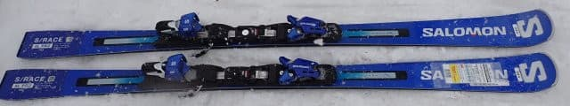
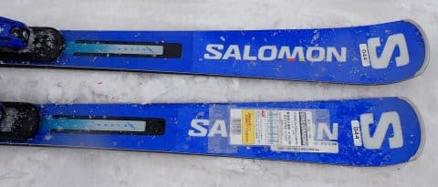
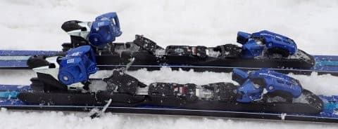
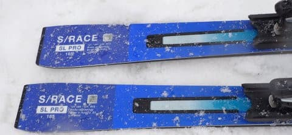
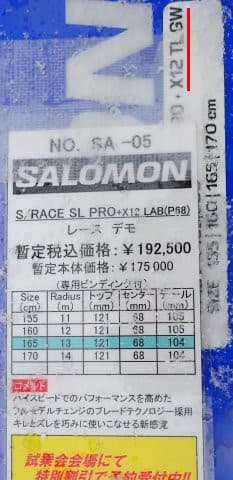
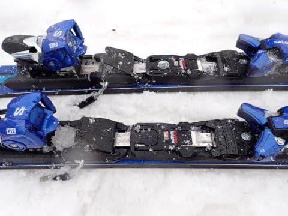

# 2024シーズンモデルのスキー板，試乗レポートその21…SALOMON SL PRO + X12 TL GW

📅 投稿日時: 2023-07-01 01:01:18

えー．

本日，ちょっと職場で長らく行ってなかった

部署に久々に顔を出したんですが．

会う人会う人から，あって一言めに

「え！？？痩せましたか？？」

と聞かれまくった，Skier_Sです．

…ええ．痩せましたよ．

数字上はすごい痩せましたよ…

痩せたか聞くときに，みんな

「Sさん仕事ご無体だから」

という一言を枕詞のようにつけていたので…

そんな一言をつけたくなるというのは，

皆さん心の中で

「痩せた」じゃなくて，「やつれた」

ように見えてたということですね（涙）

「痩せた？」は「やつれた？」のマイルド表現ですから…

最近ゆっくり食事をする時間があんまり

取れてないけど，何とか頑張って，

ベスト体重に戻すべく，あと3㎏は

太らないと…！！←ダイエットしてる人から刺されるよ

ってなことで．

本日も2024シーズンモデルのスキー板の試乗レポート．

本日はサロモン編です．

では，どうぞ～！

〇SALOMON SL PRO + X12 TL GW　165㎝

（X12 LABビンディングと書いてあるのは間違い．

　赤線で記したように，X12 TL GWビンディングが

　ついてます）

基礎小回り

以前，SL PROでも[X12 LABビンディング付きの
試乗レポート](e1e518dab6e345e4766baeb9f88a7878e.md)をお送りしましたが…

今度は，同じSL PROでも，X12 TL GWビンディング

がついた板の試乗になります．

板に貼ってある説明の紙にX12 LABと書いて

あって「間違えたか？？」と思いましたが．

板を見ると，ちゃんとX12 TL GWビンディングが

ついてます…

履いてみた感じ…

板自体はしっかりしていて，グリップ力は

そこそこあります．

優しいX12 TLビンディング版だから，

おそらく張りはちょっと弱まるかな？

と思ったけど．

結構しっかりとした張りがあり，

そこそこの重さも感じて，結構グリップ

してキレキレな滑りをしていきます．

板自体が強めなので，低速ではそこまで

たわまないけど…

そこそこスピードを出してくると板が

気持ちよくたわんでいき，トップと

テールのエッジがしっかり効いた感じで

ミドルターン程度のカービングをして

いきます．

スピードが低いところでも，ずらして

いった際の操作性が悪くないので，

意外と低速でずらして滑ることも可能．

そこそこのスピードを出せばキレキレ

中回りになっていき，

圧をかけていくとたわみが出てしっかり

小回りまで行けるし，

中回りから小回りまでの弧を自由に作って

行ける感じ．

返りがすごい早いわけではなく，比較的

穏やかに返ってくるので，小回り強制

マシーンではなく，ある程度の

オールラウンド性があります．

完全大回りは微妙ですが，中回りから

小回りまで，結構自由に行けます．

板の操作性は軽快だけど，板自体に

そこそこ重みがあるので，春の荒れた雪でも

意外と安定性があります．

板自体はしっかりしているけど，VAR

ビンディング付きほどガッツリしておらず，

ATOMICならS9i Proよりちょいとマイルド

かな～．

私には，もう少し強くてもいいかも…

まぁ，そういう人は，X12 LABビンディング版を

履けばちょうどいい感じ．

とりあえず，意外と低速でのずらしもやりやすいし，

それでいて，比較的低速からがっつりカービングに

入れていけるし．

意外と板がしっかりしているので，そこそこ

スピードを出しても小回り強制になっていくほど

たわみ切らないので，小回り～中回りの

自由度も高いし．

小回りベースとしては，ゲレンデで結構使いやすい

オールラウンド板だと思います！

VARビンディング版を履いても思ったけど．

SALOMON，なかなかやるじゃないか．

という板でした．

うん．昨シーズンからのSALOMON．

すごくよくなってる…
