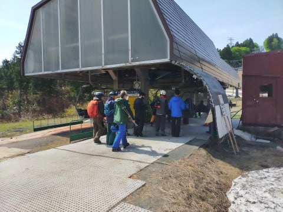
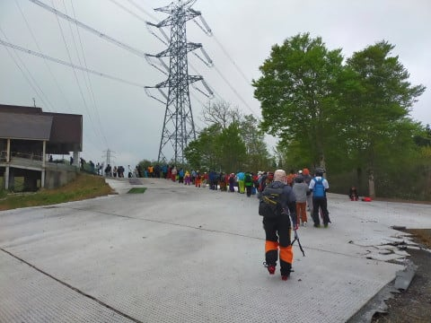

# 2021/5/15(土)のかぐらスキー場は激混み！…テクニカル終了．ジャイアントもほぼ終了．メインバーンも穴が開き始め(涙）

📅 投稿日時: 2021-05-16 03:21:49

🏷️ カテゴリ: [2021スキー滑走日記](c2b0fc073d6357d3b786f6ca655147f7d.md)

えー．

以前から予告されていた通り．

本日，熊の湯が終了してしまいました…

([熊の湯スキー場ホームページ](https://www.kumanoyu.co.jp/lift/)より)

最後の最後は，ちょっとヤバめ

だったようですが．

まぁ，本日で最後もやむなしという

感じだったのかな…(涙)

そして．

なんだかアライスキー場も，

16日の日曜を待たず，[15日の土曜で終了](https://www.lottehotel.com/arai-resort/ja/about/news/2021-05/2021-05-14.html)

になってしまい．

で．

横手山も，渋峠以外の横手山側のリフトが，

16日ですべて終わってしまうようです…(涙)

([志賀高原索道協会ホームページ，横手山リフト運行状況ページ](https://www.shigakogen-ski.com/live-lift-status/detail?place-id=22)より)

とりあえず．

この週末が終わると．

残るは月山ペアリフト，渋峠のペアリフト，

…そして，かぐらだけになるわけで…

そのかぐら．

本日15日土曜の状況は…

めちゃくちゃ混みました

ええ．

かなりすごい混雑でした…(泣）

まぁ，終日大体晴れ~うす曇り程度と，

天気が良かったのもありますが．

あさイチのロープウェー待ちが…

朝7時半の段階で，ほぼ1時間待ち（激涙）

なんということだ…っ！！

その次のクワッドリフトは，ほぼ待ちが

無かったものの…

その次に乗る，ゴンドラ側に下りる

ペアリフト．

こいつはちょっと待ちがあり…

まぁ，ゴンドラの待ちは搬器4-5台

ってところだったのですが．

あさイチのロープウェー1時間待ちが

効いて．

7:45くらいから並び始めて．

かぐらクワッドの山頂到着は，

10時を過ぎてました…(涙）

まさか．

ロープウェーの列に着いてから，

滑り初めまで2時間越えるとは…！！(驚愕)

そして．

クワッドリフトの待ちの列も

長かったよ…(泣）

終日，5-10分待ち．

午後は空くだろうなぁ…と思っていたのは

むちゃくちゃ甘く．

15:15の営業終了まで，5分待ちの列が

続いたという…

そして．

コース上も，人がかなり多いです(涙)

うむ．

今，生き残っているスキーヤーが

見事にここに寄せ集められている

感じですね…

いつも思うんだけど．

この時期のかぐらを爆撃したら，

日本のコアなスキーヤーのかなりの

割合を消すことができるんじゃない

だろうか…？←危険な発想

それくらい．

この時期も滑らないと死ぬ人たちが

集まってきている感が強い…

そして．

15:15のかぐらクワッド営業終了後の

帰りは…

一応，ゴンドラの下までは滑って

帰れることになっているものの…

ところどころ，結構やばい感じ．

ヤバいのがいやだから，ゴンドラで

下ろうとしたら…

こんな列が待ってます(またもや涙)

そして．

ゴンドラを下った後，ペアリフト＆

クワッドリフトの2本のリフトを乗り継がねば

ならないのですが．

ペアリフトの待ちが…

20分待ち(繰り返す涙）

リフトに乗るのを諦めて，

歩いて登る人も多数…

ペアリフトを降りた先のクワッドも…

並んでますね（ひたすら涙）

まぁ，最後のロープウェーは並ばずに

すぐ乗れたのが救いでしょうか…

ってなことで．

15:15に最後に山頂に上がってから．

駐車場の車に着いたのが，16:45と．

下山に1時間半…

いや．

今日のかぐら．

ゲレンデまでの往復に，時間がかかり

ました…

車を出てから車に戻るまで，9時間．

その間，滑ったのは5時間ちょい

それも，リフト待ちがずっと5-10分…(しめくくりの涙)

まぁ．

とはいえ．

メインバーンは，この時期に

これだけ雪がありますから…

さすがかぐら，大したものです！！

…まぁ，夕方になると，ごく一部

穴が開き始めてましたが…（ちょい涙）

で．

ジャイアントコースはとりつき部分と…

最後の部分が終わりかけていて．

真ん中はもう少し大丈夫そうだけど，

コブの底も抜けて来て楽しくないし…

ジャイアントは，もってあと1日かな？

テクニカルコースは残念ながら，

もう終わってます（涙）

ってな感じで．

今日のかぐらは，天気は良かったものの．

雪の滑りがあまり良くなく．

そして，予想をはるかに超えた混雑のため，

あまり楽しめない感じでした…．

ちょっと残念感が…

うーん．

やっぱり．

晴れの日より，雨の日の方が混まないし，

雪も滑るし，楽しめるかも？？？←いろいろ終わった発想だ…

## 💬 コメント一覧

### 💬 コメント by (ikkun)
**タイトル**: Unknown
**投稿日**: 2021-05-16 09:34:46

おはよーございます! ヤバいですね😱💦確かに狙われたらスキー用品の方々もあちらの世界に行ってしまいそうですね？   しかし情熱って素晴らしいなぁ✨私しには考えられない時間とお金が掛かりすぎかもです! 新井も昨日でしたか？ま行かないゲレンデではありますが( *´艸｀)  私し2本目チューンナップに出しました❗

### 💬 コメント by (yumi)
**タイトル**: Unknown
**投稿日**: 2021-05-16 11:46:32

Ｓさぁ～ん😁😅😢

きっと🙄かぐらか🙄横渋か🙄

迷った末の🤔選択だったのね😅

かぐらが🏔️混むのは 何となく想像出来ましたが❗️

ココまでとは・・・😱😱😱

今日の横手早朝は🏔️板も走って💨💨💨ご機嫌😃⤴️⤴️でしたぁ～🥰🥰🥰

### 💬 コメント by (Skier_S)
**タイトル**: 日曜は残念な天気
**投稿日**: 2021-05-17 03:01:33

＞ikkunさま

この時期のかぐらやかぐらが終わった後の月山は，

爆撃するとかなりのコアスキーヤーが抹消できます．

ヤバいです．ホントにスキー好きが集結してますよ…

＞yumiさま

いや…

実は今回訳ありでかぐらになりました．

また，帰りに長岡に寄ってきたので…

しかし，想像を超える混み方でしたよ！（涙）

