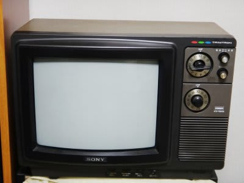

# パソコンに地デジチューナーGV-MVP/XS2入れてみた

📅 投稿日時: 2011-11-10 00:30:36

我が家の寝室のTV．

物持ちが異常に良い私は，こんなのを使ってたんですが…

アナログ放送が終わってしまい，残念なことについに使えなくなってしまいました．

新しいTVを買うのも癪に障るので．

寝室にあるPCに，地デジチューナーカード入れてやろうと画策したわけですな．

というわけで購入したのは，

I/O DATAの[GV-MVP/XS2](http://www.iodata.jp/product/av/tidegi/gv-mvpxs2/).

これで，

TV+HDDレコーダー+DVDレコーダーの3役こなしてくれればありがたいぞな，と．

…口コミでは安定性についてボロクソに書かれてますが．

コピー管理がいろいろややこしい地デジに関しては，どのチューナーカード

買っても似たようなもんだし．

何とかなるだろう，と．

無謀にもチャレンジしてみました．

…結果ですが．

インストールにかなり手こずりましな～

やっぱり．

まず．

本体と一緒についてくるCD-ROMに入っているドライバとソフト類ですが．

使えません．

このCD-ROM，即座に捨てましょう．

このCD-ROMのソフトをインストールすると，

初期設定ツールが走り，チャネルスキャンした後．

番組表の読み込みが始まるのですが…

何度やっても「番組表の読み込みに失敗しました」

と表示されます．

いろいろネットで調べると，

「チャネルスキャンをやり直せ」

だの，

「設定ファイルを消してやり直せ」

だの書かれていて，いろいろやってみましたが…

何度やっても番組表が読み込めない．

番組表がダウンロードできなければ，録画ができない．

単なるTVとしてしか使えないじゃないか（涙）

せっかくの録画機能が使えないとは…

頭にきたので，一旦ソフト類を全てアンインストール．

このアンインストールも，トラップがあります．

CD-ROMにあるアンインストールソフトを走らせるだけではダメで．

アンインストールソフトを走らせた後，Windowsの，

「プログラムの追加と削除」から，

「Windowsドライバパッケージ-I-O DATA DEVICE, INC.GV-MVP/XS」

と書かれているドライバパッケージを選んで，別途削除する必要があります．

その後，[最新のサポートソフト「Magic GT 5.07」](http://www.iodata.jp/lib/product/g/3821.htm)

をダウンロードして，こいつをインストールすると．

何の問題もなく初期化が終わって，番組表も読み込めました…

CDに入っているドライバ＆サポートソフトがおかしいようです．

…こ，これは．

…何のために製品にCD-ROMがついているんだ？？？

このCD-ROMのソフト，いらんぞ．

即座に捨てましょう．

最初から，最新サポートソフト落とせば苦労しなかったのに…

で．

これで終わったかと思いきや．

苦悩はまだ続く．

今度は．

録画した番組が見れない…

最初の1-2秒だけ音声が出て，その後真っ黒な画面が出て止まっちゃって，

再生できないんですけど…（涙）

いろいろトライしてみた結果．

録画モードをHRモード(H.264の圧縮)で録画した画像を見ようとすると．

ダメで．

非圧縮のDRモードにすれば，普通に再生できることが判明．

な，なんと…

…せっかくH.264のハードウェアエンコード機能を持ったカードを

買ったのに，非圧縮のDRモードでしか録画できなかったら意味ないじゃん！

うーん．

HDDを激しく消費するけど，DRモードで録画し続けるか？

…とも思ったけど．

せっかく高価なハードウェアエンコードのチューナーを

買ったので，意地でも動かしてやる！

と，いろいろ原因を推測すると．

とりあえず，録画はできているっぽい．

録画したものの再生ができていない．

再生でコケている．

H.264 再生にビデオカードのオーバーレイを使っていて．

んで，ビデオカードの動画再生支援を使っているっぽいので．

もしかすると，私のRadeon　HD4670のドライバが古いのがわるいのかな？

と．

[AMDのページ](http://support.amd.com/jp/Pages/AMDSupportHub.aspx)から，最新のドライバ，Catalyst software suite 11.10をダウンロードして，インストール．

すると…

映ったよ．無事．

ここまで，3日間かかった…

PC自作機4台目，BSD系OSやWindowsでこれまでに数多くの拡張カードやら

デバイスを使ってきたけど，最も手ごわいデバイスだったな…

しかし．

本来サポートしていないはずのデュアルディスプレイ環境でも無事動いたし．

これで，TVをがんがん録画したり，DVDに焼いたり，ネットを介して

DTCP-IP機器で見たり．

結構便利に使えてます．

## 💬 コメント一覧

### 💬 コメント by (せーちゃん)
**タイトル**: 助かりました
**投稿日**: 2012-04-10 18:00:39

こんにちは、始めまして。

今回初めてのTVキャプチャー・ボードにトライしてみました。

　売値が一万円弱と手頃でしたので偶然『GV-MVP/XS2』を入手しましたが、付属のCDROMを信じていたため少々手こずっていました。

地上デジタル放送だけ受信できればと思い、アンテナは簡単な『総ループ・アンテナ』を自作して接続してあったので、そちらの方から探りを入れ始めたので少々時間が掛ってしまい久しぶりに焦りを感じていましたが・・・、^^;

こちらのブログで、付属CDROMを使うな！　I/O　DATAのホームページのアップデートのプログラムを・・・、の下りを拝見して目の前が明るくなった次第。

一発で窮状を解消できました！！

ありがとうございます、大助かりです。　

手短ですが、お礼かたがたコメントさせて頂きます。

以上

### 💬 コメント by (Skier_S)
**タイトル**: 役立ってよかったです…
**投稿日**: 2012-04-11 00:43:02

いやー．

なかなか手ごわいカードでしたから…

おそらく，同じ悩みを持っている人が

いるだろうと思って，この記事を書きました．

この記事が役立ったなら幸いです．

また今後もこのブログをよろしくです…

