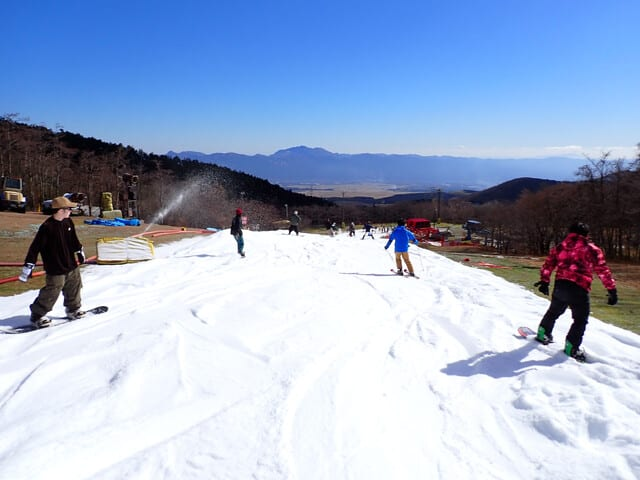
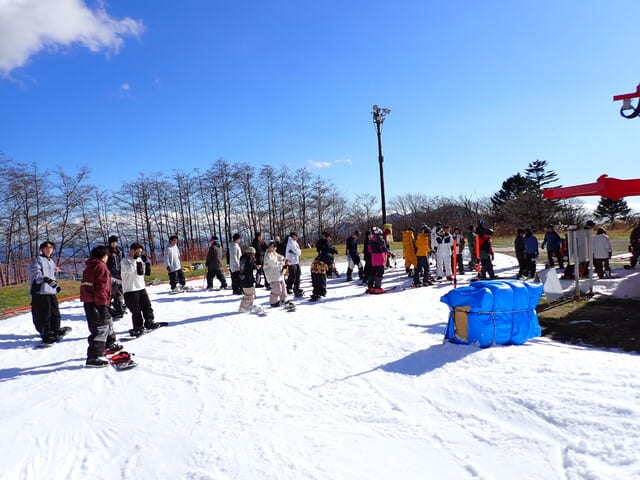
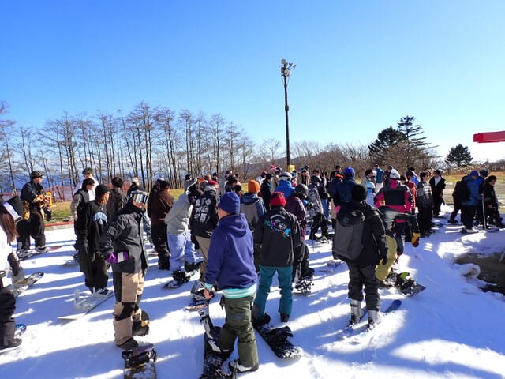
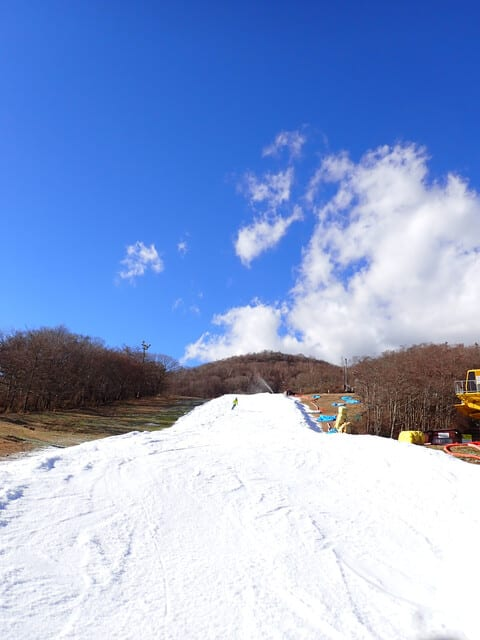
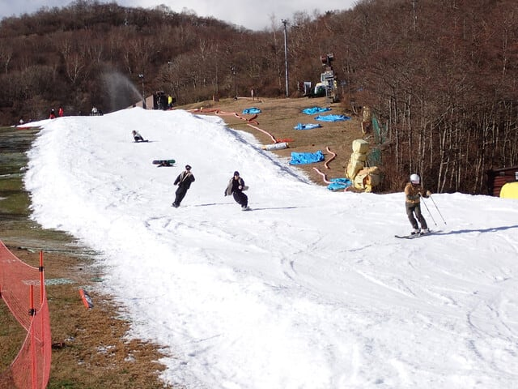

# 2024/11/30(金)イエティ速報レポート！…多くのスキー場がオープンしたからか人は少なめ．午後はリフトちょっと混んだけどコース幅も広がったよ

📅 投稿日時: 2024-12-01 01:20:19

どうやら本日，日本海側は風が強く，

かぐらは朝は高速リフトが動かず，

五竜もゴンドラが動かなかったようですが…

ただ，ここ数日の冷え込みのために

この週末の2日間で，スキー場が次々

オープンしてますよ～！！！

特に西風でも雪が積もる白馬方面は

そこそこの積雪があったようで，

次々オープンしています！

11月30日オープン

・白馬八方　パノラマ

・栂池　ハンの木ゲレンデ上部

・五竜　アルプス平

・野沢温泉　やまびこ第2

・志賀高原　高天ヶ原トリプル

・玉原　センター下部

12月1日オープン

・湯の丸　第5リフト

すでにオープンしているのは，

イエティ，軽井沢，志賀熊の湯・横手，菅平，かぐら，

鹿沢，ホワイトピア高鷲，高峰マウンテンパーク，

奥伊吹，ハンターマウンテン塩原…

といったあたりでしょうか．

このあと12/2，3の2日間はちょっと気温が

上がるものの，そのあとはそこまで気温が

上がらず，さらに12/6あたりからまた冷えて

くれそうなので…

来週末までには，確実にもっと多くのスキー場が

オープンしていきそうです…！！

ということで．

本来ならそろそろイエティに見切りをつけ，

高峰マウンテンパークにでも行きたかった

今週末ですが…

いろいろな都合により，今週もイエティへ

行くことになりました…(涙)

…いや．

いろいろな都合って．

まぁ，なんというか．

娘から．

「誕生日のお祝いに，御殿場アウトレットに

連れて行ってほしい」

と言われ…

娘のお願いだから仕方がない…と，

娘を御殿場アウトレットモールに連れて行った

ものの．

妻と娘を御殿場アウトレットに放置して

父親はイエティに滑りに行く

といういきさつで，今週はイエティで

滑らざるを得なくなったといういきさつ

です…←娘のリクエストに応えている優しい父親なのか，

娘をアウトレットに放置するひどい父親なのか，どっちだ？

ということで．

今日はアウトレットモールの営業終了近くまで

滞在していたので，帰宅するともういい時間…

だもんで，今日も帰宅日恒例の速報モードにて！

まず…

今日は御殿場アウトレットに寄ってからイエティに

行ったので，ゲレンデ到着は午前10時半過ぎ(泣)

まぁ，今日は天気もいいしもっと混んでるかと

思ったけど，午前中はそこまで混んでおらず，

コース幅も広がっていたこともあり，

先週より快適かも！！

コース幅は大体先週の倍かそれ以上．

雪の厚みもあり，雪が薄くなって地面が

見えるところは1か所もなし！

この1週間の冷え込みで，かなり造雪が

進んだ感じ…！！

リフトも午前中はそこまでひどく混まず…

待っても3分程度で済んでたけど．

午後1時以降はリフト待ちが増えて，

最大5分越えになってしまったけど…

それでもこのくらいの待ちなら，

11月のイエティとしては少ない方かな．

他のスキー場もオープンしたから，

人が分散したのかな…

天気は晴れ時々曇り．

気温自体は低めだったものの，日が射した

ので昼間は結構暖かく感じたかな．

寒がりでなければ薄手のジャケットがあれば

しのげるくらい．

コースは午後になってもそこまでひどく

荒れず，幅も広がり厚みも十分だし．

11月末と考えるとちょっと狭いけど．

先週までに比べれば一気に広がった感じで

コース途中の一時停止もなくなったし．

コース上での追い抜きもできるくらいに

なってきたし．

写真を見てもわかるように，紐コースに

人があふれてるって感じじゃなくなって

来ましたよ～！！

…ってなことで．

アウトレットの家族を迎えに行くため，

今日はナイター無しで切り上げなくては

なりませんでしたが…

まぁ，家族のお買い物ついでに寄った

おまけ的なスキーとしては，予想より

まともに滑れてよかったかな…

ってなことで．

明日また余力があれば，詳細レポート

やります～！！
