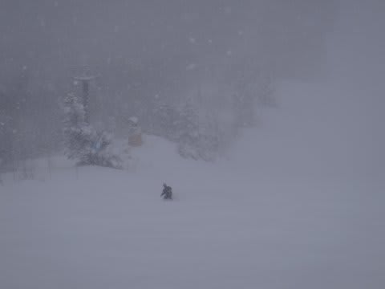

# 1月3日の志賀高原…ぱふぱふパウダー＆激さむ

📅 投稿日時: 2013-01-04 16:56:17

🏷️ カテゴリ: [2013スキー滑走日記](c91dbe557f9a69230b1600e48622fdd61.md)

えーっと．

実は昨日，ネットができない環境でして．

3日の状況がアップできませんでしたが…

とりあえず，昨日の3日の状況を速報．

朝からマイナス15度近くまで冷え込み．

積雪は20cmほど積もりましたっ！

朝は，非圧雪コースはブーツ上～脛ぐらいの軽いパウダー！

圧雪バーンも10cmほどのぱふぱふパウダーっ！

…でも．

終日天気が悪く，終日ふぶいて寒かったよ…

視界もイマイチ．

ゲレンデは，そこそこ人は多かったですが．

焼額第1ゴンドラは，5分以上待つことはなく．

午後は完全待ち時間0ってことで．

がんがん滑れましたね～．

(まったく人のいないゲレンデ)

この積雪で，ゲレンデ状況はかなり改善しましたよっ(喜）．

今日のゲレンデレポートは，深夜更新予定…
