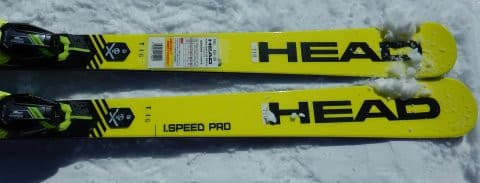
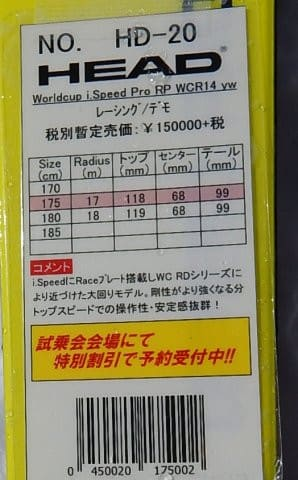

# 2020シーズンモデルのスキー板，試乗レポート…HEAD編その1

📅 投稿日時: 2019-04-17 00:54:37

えー．

この4月上旬は，奇跡の4月だったわけですが．

今週金曜日，4月19日の850hpa天気図を

見てみると…

えええ！？

赤い0℃線，また志賀より南まで

下がってますよ！？？

それどころか，水色の-6℃線が志賀高原に

近づいているのですが…っ！？？

そして．地上天気図では．

水色の降水域が志賀高原にかかっているので…

…これは．

また，金曜の昼間は雨っぽいけど．

金曜夜から雪になり，土曜の朝には

うっすら積雪があるかも…

さらに，土曜は予想より冷え込みそう．

まぁ，午後には緩んじゃうけど．

土曜の朝イチ，またうっすら新雪に

なるのかも…

（下地はガチガチになってそうだけど）

この週末，どんな天気になるかの詳細は．

また明日の週末の天気予想を

お待ちください…

ってなことで．

今日もスキー試乗レポートに行きますが．

今回はヘッド編2機種です．

では，どうぞ～！

○HEAD WorldCup REBELS iSL RD 165cm

SL競技用，基礎小回り

今シーズンまではSL競技用トップモデルとして，

他の競技用モデルと同じく，真っ白だったこの板．

来シーズンは，デモモデルとしての位置づけも

もたせるため，真っ白な板だけじゃなく，

他のデモモデルと同じネオンイエローの

カラーリングでも発売されるという，この板．

白い板とイエローの板とは，

色が違うだけで中身は全く同じ…

ということですが．

今回乗ったのは，派手な色の方です(笑)．

ビンディングはFF EVO16ですね．

滑ってみると．

…これは，過激だ…！

硬い斜面で履いたから，なおさらですが．

かなり強いグリップと，ものすごい早い，

強い返りがある板で．

スピードを上げていくと，硬い斜面で強烈に

トップからエッジが食らいついて行き．

トップがぐっとインに切れ込んで行って．

強烈な旋回力を発生します．

旋回したあと，強烈な板の反発力で

板が逆側にすっと走っていきます．

そうすると，今度は逆側のエッジが

トップから捉えて強烈な旋回が始まる…

という感じで．

かなり過激な小回りマシーンです．

板全体がたわんで旋回するというより，

トップがインへインへ切れ込んでいくような，

そういう旋回感覚．←私の普段履きのATOMICのSX比

硬い斜面をトップスピードで滑った時の

トップの食いつき，返りは最高．

スピードを上げて行っても，

どこまでも余裕をもってエッジが

食いついていくような板で．

自分の出せるスピード域では，

板の限界までは全然届かない感じ…

谷回りでの動かしやすさというより，

トップを抑えて行く量で旋回半径を

コントロールする感じで．

スピードを出していった時の

切れ切れ感はヤバいくらい．

ただ，谷回りで動かしやすいとか．

低速でコントロールしやすいとか．

そういうのを狙ってる板じゃないし．

さらに，大回りしても楽しくないので．

オールラウンドで使うのは厳しい

かも…

オールラウンド性がある，

気楽に履ける板ではないけど．

過激な小回りスペシャル板が欲しい人は．

これ，面白いかも…

○HEAD WorldCup REBELS　iSpeed PRO 175cm

基礎大回り

来シーズンは，ネオンイエローの基礎ラインとして，

iSL RD，iRace PRO, iSpeed PROの3機種が出るようですが．

これは最もラディウスが大きい，大回り向け

モデルです．

長さ175cmでR17ってのは．

ゲレンデ大回りとして使うにはちょうどいいくらいの

ラディウスですね…

ちなみに，この試乗板は，

FF DEMO 14とかいうビンディングが着いてましたが．

こんなビンディング，これまでありましたっけ？？

この板は，iSL RDの次に

続けて履いたのですが．

…これもかなり過激な板ですね…！

強烈なハイスピード＆ハイグリップマシンです．

どこまでもどこまでもスピードを出していっても，

まったくばたついたり板が逃げたりすることなく．

ビッタリ安定して，エッジがぴしーっと食いついて．

スーッと曲がっていきます…

この安定感と強烈なエッジグリップは，

私がロング用として履いている，

'15のころのSALOMON X-Raceに近い感じ…

荒れた斜面でも安定感があるし．

硬い斜面になれば，超ハイスピードロングターン

マシーンとして．

気持ちいいほどグリップして，しっかりした

張りがあって，どこまでも傾いて行けるという．

かなり過激で，危険なほど脳内麻薬が

出まくる，楽しい板です．

…ただ．

低速や柔らかい雪ではその本領を発揮

できないかもしれませんが．

雪が荒れていても，板にかなり安定感があるので．

多少バーンが荒れていようが，

しっかり足場が作れるバーンでなら．

その強烈なグリップ力と安定感で，

どこまでもロングで攻めていける，

そんな気分にさせる，過激な板でした．

いや…これ，気持ちいい．

来シーズンのHEAD.

iSL RDもiSpeed PROも．

かなりいいです…！

（スピードを求める人限定だけど）

## 💬 コメント一覧

### 💬 コメント by (ほっぽ)
**タイトル**: ASAMA試乗会
**投稿日**: 2019-04-18 22:08:47

Ｓさん

私もHEADの板、１本だけ借りました。

Worldcup　i.Race　RP　EVO14、１６５ｃｍという板です。

小回り系デモモデルだと思って借りましたが、

ブーツ下の張り、硬さが強く、私如きのレベルでは

全くたわむ感じがせず、ただ重い棒のような板でした。(^^;

Ｓさんのコメント見る限り、来期のHEADは

かなりスパルタンな仕様のようですね。

今週末は一の瀬ファミリーで試乗会ですね。

２日間とも試乗会メインでしょうか？

色んな板に乗って、コメント聞かせて下さい。

個人的にはHartのDEMO　SP、

ブルーモリスのS-POTION、B-POTION、

BLIZZARDのSRCとHRC、

この辺りのＳさん的なインプレッションを見てみたいと希望しておきます。(^^;

### 💬 コメント by (Skier_S)
**タイトル**: ほっぽさま
**投稿日**: 2019-04-19 00:13:04

i.RaceもEVO14が着いてるならProの方ですね…

黄色いやつですよね？

私はまだ履いてませんが，HEADの黄色いシリーズ．

iSLにしろ，iSPEEDにしろ，かなり過激なので．

iRaceも過激なんだと思います…おそらく．

iSPEEDは，人がいるゲレンデで履くのをためらうほどの

過激な板でしたから（笑）．

スピードを出さないと曲がらないし，楽しくありません…

今週末の試乗会は，コンディションが良さそうな土曜の午前，後は日曜の午後でそれぞれ7~8機種ずつ

乗れればいいかな～，と思ってます．

BlueMorisは私の試乗したいリストに載ってませんが，

BLIZZARDのSRCはすでにアサマで試乗済みです．

Hartも時間があれば乗ってみます…

