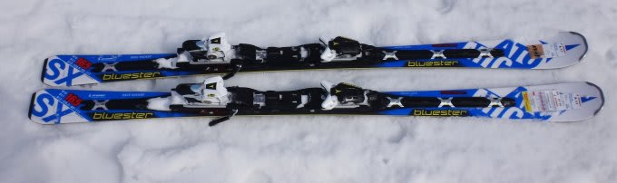
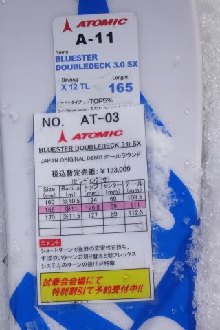
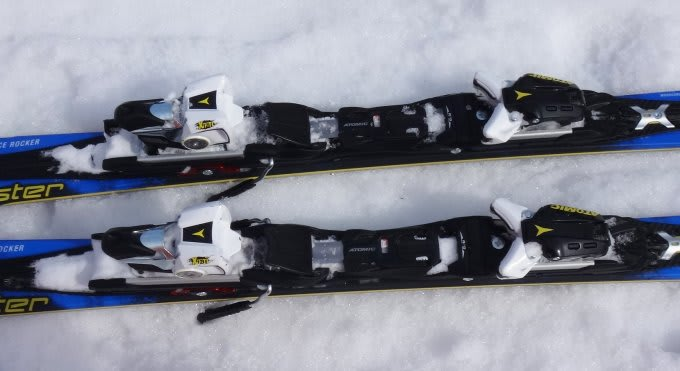
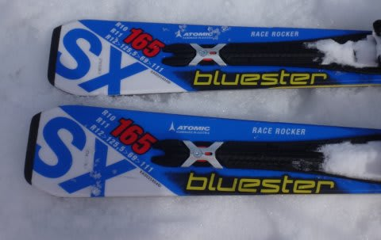
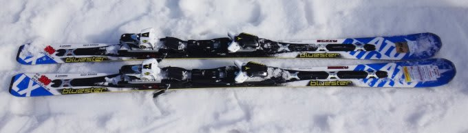
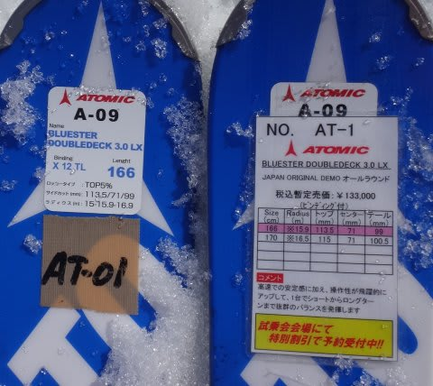
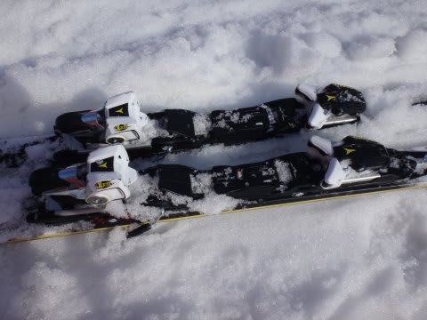

# 2015シーズンモデルのスキー試乗レポート第3回…ATOMIC編

📅 投稿日時: 2014-03-19 00:53:59

あー．

おまたせしました．

2014/2015シーズンのスキー板の試乗インプレッション．

第3回目の今日は，アトミックです．

試乗のコンディションなんかは，[こっち](ea0fd11e235cff467b2900de6709d0b20.md)を見てもらうとして．

では，本編へ…

○ATOMIC BLUESTER DOUBLEDECK 3.0 SX X12TL 165cm

基礎小回り．

私が今履いている，BLUESTER DEMO SXの後継機種ですが…

これは…っ！

気に入ったーーっ！

今年のSXよりも，さらに完成度が高まってる気が…

ちなみに，来シーズンモデルはビンディングが2種類．

しっかりタイトなX12VARと，ちょっとマイルドなX12TLが

選べます．

今年のSXは，タイトなX12VARしか選べないんですが…

来期モデルは，X12TLが標準になるみたいですね～．

X12VARを選ぶと，1万円ほど高くなるようで…

で，今回の試乗板は標準のX12TLの方です．

板のラディウスも，複合サイドカーブになり，

板に3種類のRが記載されてます…

トップよりテールの方がRが大きいみたいですね．

アッパーデッキの形も，これまでと変わってます．

で．

履いた感じは．

ずらしの自由度が上がったSXって感じで．

今年のSXにくらべ，低速でのコントロール性，ターン中に板を

動かす容易さがレベルアップしました．

ビンディングがVARからTLに変わったのが効いてるのかな？

今年のSXより，グリップを抑えたのかコントロール性が高くなり．

板をずらして谷回りで好きな位置に板を運ぶこともできて，

ずれずれ小回りもできるというのに．

当然，今年のSX同様，板のたわみを使ってトップからテールの

エッジの線に乗って，テールの強さを使って後半に板を走らせる

キレキレの小回りもでき．

キレキレのターンでも，傾き量によって自由に回転半径を

コントロールできます．

乗り手のコントロールできる範囲が広い感じ．

テールの張りも健在で，ターンの抜けもすごくいい．

振動吸収性は現行SXよりさらに改善されたか？

荒れたアイスバーンでも，荒れた感じが伝わりません．

さすがに最高速の張り付き感は，SALOMONのX－Raceに

一歩譲るけど…

自由度，動かしやすさ，扱いやすさはSXが上．

今回の試乗には出てなかった，VARのビンディング付きの

板にも乗ってみたい気もしますが．

私はX12TLで十分，と思いました…

○ATOMIC BLUESTER DOUBLEDECK 3.0 LX X12TL 166cm

基礎オールラウンド．

この板が，今シーズンのAXの後継機種になります．

この板も，ビンディングがX12TLとX12VARの2種類が選べ．

標準はマイルドなTLになります．

今回試乗したのはTLのモデル．

で．

今年のBLUESTER DEMO AXは，どちらかというと大回りメインの

板だったけど．

来シーズンのLXは，AXよりさらにオールラウンド性のキャラクターを

強めたらしく．

166cmが一押しの長さになるようです…

うーむ．

166cmって長さってこともあるけど．

確かに，AXより旋回半径が小さくなったかな…

LXって名前から，ロングターン志向の板に感じますが．

AXの方がロングターン性が強い感じ．

板のRはトップが15m，センター15.9m，テール16.9mの複合Rだけど．

板が短いのもあり，もう少し小さいRに感じるかな…

そして，ビンディングがTLってのもありそうですけど．

AXよりフレックスが優しく，返りもマイルド．

板全体が，トップからテールまできれいにグリップして，

傾きによって半径がコントロールできる感じ．

ただ，ビンディングがTLってのもあるのか，

フレックスにしなやかさがあるため，スピードを出して

いくと板が結構たわんでいき，大回りというより中回りに

なっていきます．

…ここで，たわんだ返りも，AXのようなビンビンした感じは

それほど強くなく．比較的優しく戻ってきます．

んで，SXほどの小回りの切れ味は出せないけど，

ずらしのコントロール性が結構あるので，小回りも

十分行けます．

振動吸収，安定性はSX同様，結構いいんだけど．

すごい縦に落としていける大回り特性も，官能的な小回りの

切れも…という，両方をねだるのは無理で．

ミドルターンが得意な，ちょうど中庸のオールラウンドな板です．

いや，オールラウンドとしては無難でいいんですが．

…よくできてる板なんだけど．

なんだか．

「これがほしい！」と思わせる

インパクトに欠けるのが，ちょっと残念．

LXは長さが166と170cmしかないので，大回りメインなら

FIS非対応のGS板，

REDSTER DOUBLEDECK 3.0「GS」にするか，

REDSTER DOUBLEDECK 3.0「XT」ってのがおすすめだそうです．

ちなみに，「GS」は，LXと中身は全く同じようで…

「GS」は166cmのほか，172cm，178cm，184cmがあります．

ビンディングはLXの標準モデルと同じく，X12TLがセットです．

「XT」は長さは175cmしかないけど，中身はFISモデルと同じで，

サイドカーブだけをR15.5mにした限定品のようで．

ビンディングも強めのX12VARがつきます．

ATOMICの人はXTが「おすすめ」とのこと．

うーむ．

XT，履いてみたいなぁ…

## 💬 コメント一覧

### 💬 コメント by (琵琶湖)
**タイトル**: 試乗会の特別割引かかく
**投稿日**: 2014-03-20 09:17:43

始めまして。いつも楽しく（羨ましく）拝見させて頂いてます。中々試乗会にいくチャンスがなく購入すれば、スキーに合わせた滑りになり自分に合ったスキーは試乗しなければと痛感しています。私が気になりますのは、画像の試乗会特別価格ですが13万のスキーはどれ位になるのでしょうか？

差し支えなければ教え頂けますでしょうか。

これからも楽しいレポート期待しています。

### 💬 コメント by (いか)
**タイトル**: Unknown
**投稿日**: 2014-03-20 22:48:15

やはり、SXの後継はよさそうなんですね…！

小回り板の有力候補ですが…高い(",_')

### 💬 コメント by (Skier_S)
**タイトル**: 琵琶湖さま
**投稿日**: 2014-03-20 22:53:06

ご愛読ありがとうございます～

試乗してフィーリングが合った板は，今の自分の

滑りにあった板をいいと感じてしまうんですよね…

ホントは違和感があった板の方が，これまでと違う

正しい滑りに導いてくれる板だった…という

経験もあるので，試乗はなかなか難しい

ところもあったり…（＾＾；

えー．13万の板ですが．

おそらく事前予約15％off+2000円割引，

くらいでしょうか…

事前にお店に行くのと，そんなに変わらないかと．

でも，試乗会に行くと2000円割引のチケットを

もらえるので，それだけお得になります…

### 💬 コメント by (Skier_S)
**タイトル**: いかさま
**投稿日**: 2014-03-20 22:55:51

いやー．

SX乗りとしては，来シーズンもSXでいい感じ．

でも，今季モデルよりちょっとマイルドになってます．

今のところ，購入第一候補なんですが…

…おっしゃる通り，高いので．

やっぱり来シーズンは，板を買わずに我慢する予定

＃我慢できるかな～

