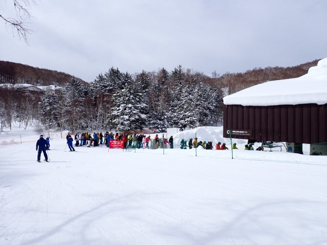
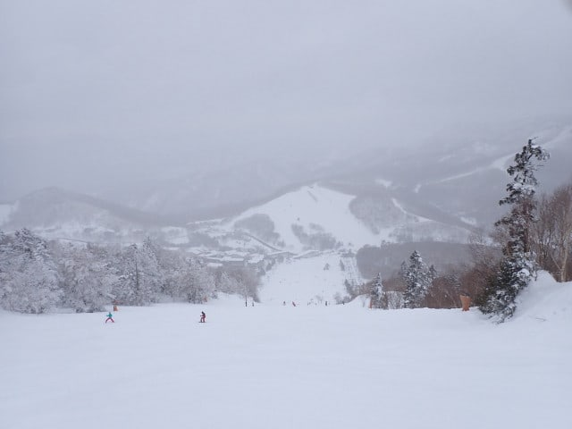
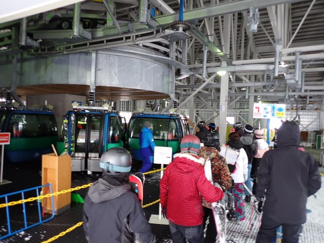

# 2025/3/8(土)の志賀高原は…薄曇り→曇り，朝イチは雪は良かったけど，コースによっては氷のコロコロが…

📅 投稿日時: 2025-03-09 00:13:06

🏷️ カテゴリ: [2025スキー滑走日記](cacd3fbf84d4a679ee61a5894c3f95e14.md)

ということで．

今日も志賀高原で滑ってました～！！

…で．

今日は朝は晴れ，午後から曇るかも…

という予想でしたが，

朝から薄曇り，午後は曇り＆時々小雪で．

午後は急斜面とかで下地のカリカリが

出てくるところがわずかにあるかもしれない

けど　

という予想が，昼頃から急斜面は結構な

範囲でカリカリが出てました…（泣）

まぁ，曇るかも…という予想ではあったし，

カリカリがちょっと出るかも…という

予想でもあったので．

完全に外したわけではないのですが…

ちょっと外した感じ(涙)

でも，朝は結構良かったですよ～！

とりあえず．

今日も朝8:30からの通常営業開始を狙って

焼額第1ゴンドラの開始待ち行列に並ぶ

わけですが．

ちょっと列は長めで，今日は混むかなと

覚悟…（実際はそんなに混まなかった）

朝イチのゴンドラで山頂に登ると…

山頂の気温は-8℃と，ほぼ予想の-9℃が

まぁほぼ正解！！

そして朝の天気は…

…

…ここはちょっと外したかな．

太陽は見えるものの，うっすら雲に

隠れた薄曇り（ちょい泣き）

でも．朝イチのバーンはいい感じの

シマシマ！！！

昨日40cm以上雪が積もっているから，

柔らかいバーンかな…と思ったら，

結構締まった感じの，スピードが乗る

楽しいシマシマですよ～っ！！！

ここは予想が当たった感じ…！！！

でも…

北アルプスはきれいに見えているものの．

雲が多くて，青空は見えず…

午前中早いうちは薄日が射して，バーンは

見やすかったけど．

昼前には早くも完全な曇り空になっちゃった

感じですね（泣）

ちょっと予想外したか…

でも，午前中はバーン状況も結構よく，

氷のコロコロがわずかに出てるところも

あったけど，人も少なく，基本的に

気持ちよく滑れました～！！

午前中は10時前後の30分ほど，第2高速がピークで

このくらい待つこともあったけど．

11時前にはガラガラになっていたし．

バーンも基本的にはフラットで，

氷のコロコロが時々あるのが惜しかった

ものの，快適に滑れましたよ～！！

ただ…

今日はなぜか珍しく，訳あって昼からしばらくは

焼額の重力圏を脱出し，一ノ瀬ファミリーへ

滑りに来ましたが…

うがーーー！

なんだ？？

一ノ瀬正面バーンは，カリカリバーンの上に

モサモサ雪山が乗った形の，かなり滑りにくい

凸凹バーンなのですが…！？？

正面バーン下半分は朝圧雪なので，

ちゃんとフラットな滑りやすいバーンだったけど…

でも，あまりにも正面バーンが滑りにくく．

パーフェクターコースに逃げたところ…

重い雪のブーツパフの新雪で．

…このコース，ここ数日圧雪されてないの

かな？？

単に新雪ってだけならいいんだけど…

新雪の中に氷のコロコロがいっぱいあって，

下地に硬い氷のコロコロが埋まった層が

あって…

すごい滑りにくい(泣)

ここ，2本目を滑ろうとは思えない…

さらに，修学旅行生の団体さんが入って

いるので，リフトはすごい混むし…

そのせいで，コースの人口密度も高めだし．

そして．

午後になると，時折雪がぱらつく天気に

なってきたんですが…！！(涙）

今日，気象庁の天気図では雪が降るって

言ってなかったよね？？←予想が外れたことを気象庁のせいにしてはいけない

ってな感じで．

どうも一ノ瀬ファミリーに歓迎されてない感じが

あったので．

早々に焼額へ戻りました…

いやー．

やっぱり焼額のほうが人口密度も少ないし．

一ノ瀬正面バーンほどボコボココロコロじゃ

ないし．

ゴンドラもガラガラだし．

わが住処ということもありますが，やはり

こっちのほうが私にはほっとする環境ですね…

とはいえ．

GSコースはちょっとボコボコで，

氷のコロコロがカリカリした感じで

板に引っかかるし…

オリンピックコースは一ノ瀬正面バーン

とほぼ同じ感じで，硬い下地の上にモサモサ

した凸凹が乗った感じで，ちょいと

滑りにくかったのが残念…

いや．

オリンピックコース，こんな感じの

氷の塊が全面に散らばっていて，

ちょいと滑りにくかった…（泣）

でも，パノラマやイーストコースは

比較的雪質も良く．

ところどころ氷のカリカリした感じが

あって，最高レベルの雪とまでは言え

なかったけど，ラストまで板が良く滑る

冷えた雪の，フラットなバーンをすべる

ことができたのでした…

うーん．

今日は天気も良くなり，雪質ももう少し

いいと期待したんだけど…（涙）

水曜の雨が惜しかった…

でも，昨日の雪がなかったら，全面アイス

バーン祭りで，もっと悲惨なコンディション

だったんだろうなぁ…

これから明日の朝まで，予想通り

うっすら雪が積もるかもしれないけど，

積雪はほとんどなさそうなので，

明日も下地の硬いところはちょっと

残りそうですが．

きれいに圧雪されて硬い下地が隠れた

朝のうちは，そこまでコロコロや硬い下地に

やられることなく滑れると思いますよ～！

ただ…朝はやっぱり予想通り曇りそうで．

晴れてくるのは午後からかな…

とりあえず．

明日も志賀高原で滑ってます～！

## 💬 コメント一覧

### 💬 コメント by (hapi44)
**タイトル**: Unknown
**投稿日**: 2025-03-08 23:06:33

やっと滑れて暴れなくて済んだのですね〜

焼額のブルーは明日にお預け？ですかね

朝イチのシマシマバーン…羨ましいです

私は来週までお預けです😂

明日も楽しんで‼️

### 💬 コメント by (すすむチヤン)
**タイトル**: Unknown
**投稿日**: 2025-03-09 06:35:23

詳しい情報ありがとう。きよう焼額で午後滑ります。

### 💬 コメント by (Skier_S)
**タイトル**: 無事帰宅
**投稿日**: 2025-03-10 00:26:08

＞hapi44さま

2週間ぶりに滑れましたよ～！！

今日は土曜よりずっと良かったです！

…でも，次の15，16日の週末は天気が悪そうです…

＞すすむチヤンさま

今日は焼額で滑ってらしたのでしょうか…？

午後は天気も良くよかったですね！！

### 💬 コメント by (富山県民)
**タイトル**: Unknown
**投稿日**: 2025-03-11 08:39:23

こんにちは。

3月8日の志賀高原は曇りだったのですね。

私は3月8日には福島県のネコママウンテンまで遠征しました。

天気は薄曇り時々晴れでした。

薄雲が多いものの磐梯山や猪苗代湖、吾妻連峰、飯豊山などの景色が綺麗でした。

ネコママウンテンは旧アルツ磐梯スキー場と旧裏磐梯猫魔スキー場が繋がって生まれ変わった巨大スキー場です。

ただ富山県から福島県のネコママウンテンはかなり遠かったです。

ちなみにネコママウンテンは早割1日券を事前に購入してました。

### 💬 コメント by (Skier_S)
**タイトル**: ＞富山県民さま
**投稿日**: 2025-03-12 00:44:18

土曜は残念ながら曇り空の一日で，雪もイマイチでした…

ネコマは晴れたんですか！！

しかし，富山県からネコマまで行かれるとは…！！？？

なぜネコマまで？？

### 💬 コメント by (富山県民)
**タイトル**: Unknown
**投稿日**: 2025-03-12 04:40:37

こんにちは。

3月8日のネコママウンテンですが天気は完全な晴天ではなく薄曇り時々晴れという感じでした。

3月8日にネコママウンテンに行った理由は今シーズンにはネコママウンテンの早割1日券を購入していてそれを消化するためです。

元々は蔵王とハシゴするのを前提でネコママウンテンの早割1日券を購入しました。

ただ急遽2月15日に蔵王に行くことになったために蔵王とネコママウンテンは別々に行くことになりました。

富山県からネコママウンテンはかなり遠かったです。

ただネコママウンテンもかなり巨大なスキー場でした。

先シーズンからはアルツ磐梯と裏磐梯猫魔が連絡リフトで繋がりネコママウンテンという巨大スキーリゾートに生まれ変わりました。

### 💬 コメント by (Skier_S)
**タイトル**: ＞富山県民さま
**投稿日**: 2025-03-13 01:49:52

あ，蔵王とハシゴする予定だったんですね…

でも，富山からわざわざ蔵王＆ネコマですか…

ネコママウンテン，アルツ磐梯とくっついて巨大化したのはうれしいですが，

アルツのゴンドラ復活させてほしい…

