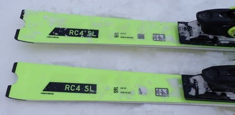

# 2025シーズンモデルのスキー板，試乗レポートその6… FISCHER RC4 WC SL

📅 投稿日時: 2024-05-24 04:18:09

やばい…

今日もこんな時間（泣）

そろそろ5月も末になると，4時を過ぎると

外が明るくなってくるんだよな…（涙）

今日も昼間，会議中に見事に意識を

失っていたので，今日こそは早く寝た

かったのに…

でも．

まだ仕事が終わってないけど寝る！！

今週末は月山に行くので，

土曜は1時半くらいに出発なのだ．

明日の夜は2時間寝られないのだ…

だから，今日はもう寝る！！←明日の仕事，大丈夫か…？？

…それでもBlogは書く！！えらい！！←普通ならこんな日にBlog書かずに，

月山もあさイチをあきらめて遅めに出発にすると思うぞ…

…ってなことで本題へ．

今日も2025シーズンモデルのスキー板の

試乗レポート．

今回もフィッシャー編です！！

〇FISCHER RC4 WC SL MEN 165cm

SL競技用

FISマークの付いた，ガチの競技用モデル．

まぁ，一般市販はプラスチックのMプレートを

着けた板で，本格的にレースに参加する人は

両側が金属で補強されたM/Bプレートを

使うと思うので…，

まぁ，一般市販されているのはホントの

トップSLというよりは優しめの仕様に

なりますか．

基本的に今シーズンモデルのキャリーオーバー

らしいですが，定価も昨年と同じで値上がり

してませんね…

でも．税込み24万越えか…

とりあえず，履いてみたところ…

いや！！いい！！

かつてのFISCHERらしい，

踏みごたえに粘りとしっとり感のある，

私の好きな感じの板です！

やはり競技用だけあって，結構張りが

強い感じですが．

突っ張るようなウッドコアの硬さと

いうより，雪面を捉えてたわんでいく

中で，粘りやコシを感じるような，

メタルコアの強めのバネ感を

感じる，張りの強さ．

そして，SL板らしい強めのグリップと，

強めの旋回力．

旋回力も，トップがカツンと食いついて

トップから向きを変えていくというより，

板のトップからエッジまでの長い線で

雪面を捉えてグリップして，

たわんだエッジに沿ってきれいに細い

シュプールを残しながら回っていく

という感じ．

旋回力は強めながらも，板のフレックスも

強めだし，角を立てた瞬間にトップが

食いついてクルクル回ってしまう板では

無いので．

たわませないように滑っていけば，

比較的縦目に落とせます．

たわみ量で回転弧を自由に作れる，

結構回転弧の自由度が高い板．

っていうか，あんまり力を使わないで

滑ると，普通の人ならミドルめのターンに

なるんじゃないかな？

そして，SL競技用名だけあり，板は軽快さ

というより，多少の重さを感じますが…

それだけ分安定感があり，スピード安定性も

バッチリ．

硬めの締まった斜面だと，ハイスピードで

がっつりグリップさせて，鬼のように深い

深回りカービングができるし．

深回りの時の板の返りが気持ちよく，

返りを利用して，スッと加速しながら

次のターンに入っていけるので…

脳内麻薬が出まくりのガッツリ深回り

小回りターンができます！！

そして．

荒れた斜面や，新雪が踏み散らされた

ような斜面でも，安定感が高いので

安心してまっすぐ突っ込んでいけるし．

意外にも，整地スペシャルじゃない感じ！

ただ，新雪が蹴散らされて荒れた，

柔らかい雪の斜面では板がたわませきれず，

ミドル気味のターンになっていきますが…

重さとグリップ力があるので力はいるものの，

ずらしのコントロールもやりやすく．

ミドルめのオールラウンドと考えれば，

結構いけるんじゃないかな？

SL用って言ってるけど，そこそこ体力が

ある人なら，十分ゲレンデ小回り用として

行けるな…

というより，スピードを出す・体力がある

人なら，ゲレンデ小回りベースのオール

ラウンド板として十分いいですね！！

うん．

単純に私の好みを言えば．

RC4 SC Proより，こっちの板の方が

好き…

## 💬 コメント一覧

### 💬 コメント by (愛読者)
**タイトル**: Unknown
**投稿日**: 2024-05-24 08:18:06

これこそメイドインオーストリアの板ですね。SさんのメイドインオーストリアのSC機が石ころ踏み用はもったいないなあ。Sさんに煽られてオーストリア製と期待して注文して、ウクライナ製のSCを買った者より。

### 💬 コメント by (Skier_S)
**タイトル**: ＞愛読者さま
**投稿日**: 2024-05-26 00:12:42

いやーー．

オーストリー製，いいですね～！！

でも，実は私のSCは石ころふみも昨シーズン終わりに買ったやつも，

どちらもウクライナ製なんです（ちょい涙）

