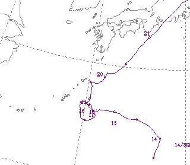
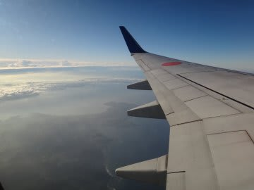
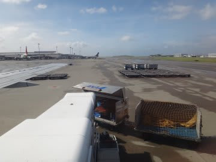
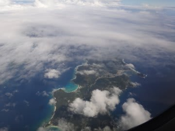
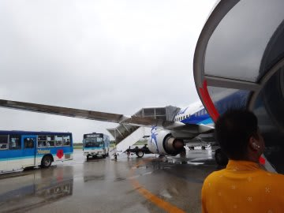
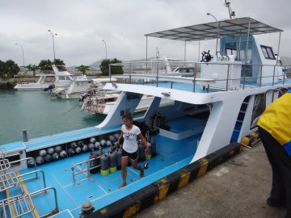
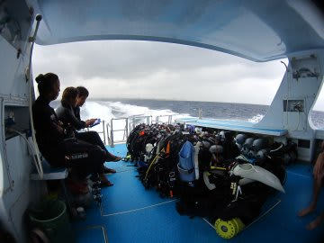

# 9月連休石垣島ダイビングレポート　その1

📅 投稿日時: 2011-10-16 02:38:02

えー．

9月って．

連休がありましたよね．

この連休を利用して，石垣島にダイビングに行ってきたんですが．

今回は娘の幼稚園の行事や私の休みの都合が上手く合わず．

どうしたわけか，私一人で行ってきました．

＃ひどい父親だ

現地では，ダイビングに行った以外は，一人寂しくホテルにこもっていたので．

今回のレポートは海を中心に，さっくりと行きましょうか…

--

というわけで．

9月．

…沖縄の9月といえば．

そう．ヤツです．

ヤツがやってくるシーズンです．

出発3日前から．

どうやら，当日台風が那覇をどんぴしゃ直撃しそう．

飛行機が飛ばなさそう…

台風を呼ぶ男と呼ばれる，私の本領発揮です．

（こんな本領発揮しなくてもいいから…(涙））

ってことでしたが．

どうしたわけかこの迷走台風15号．

この後，360度ぐるっと回ったかと思うと，向きを変えて…

(ホントに一周ぐるっと回っている…)

そして那覇から遠ざかる方向に移動して，

私が出発する日は，なんとか暴風圏に入らずに済んだ．と．

ふー．

ひやひやさせるなぁ．

んで．

当日朝．

無事，飛ぶことになった朝イチの那覇行きに乗り込みます．

乗り継ぎの那覇空港に着くと…

台風が接近していたというにもかかわらず，晴れてるじゃないですか．

これは，台風よりずっと遠い石垣島は，もういい天気に違いない！

と，期待して石垣行き飛行機に乗り込み…

朝10時半には石垣に到着！

人生9度目の石垣島上陸です．

いやーーーーー．

でも，子供が生まれてからは，はじめての石垣島上陸．

石垣島のダイビングは，1本毎に港に戻ってくるスタイルじゃないし，

子供をボートに乗せてくれるショップもないし，

私が日本で一番好きな八重山でのダイビング，子供が生まれてから

しばらく遠ざかってたんだよな～．

今回は，独りだし．

ぜひぜひ石垣にいきたい！

と．

私が「世界に誇れるダイビングエリア」だと思っている，

久しぶりの石垣ダイビングへやってきたわけだけど．

…しかし．

しかし．

なぜ，石垣は雨？

台風のぎりぎり暴風圏にいる那覇が晴れてて，

石垣は雨？？？

ど，どうしたことだ（泣）．

…ちょっとショックを受けつつ．

空港にピックアップに来ていたダイビングショップの船に

乗り込み，直接港へ．

港で，ダイビング器材をメッシュバッグに詰め込み，

しばし待っていると午前1本目を終えたダイビングボートが

やってくるので，乗り込む．と．

今回利用したショップは，子供が生まれる前はいつも愛用していた

ショップ．

ボートが大きく，異常に高速なので，波照間方面への遠征なども

サクサクこなせ，黒島方面などもあっという間に往復しちゃう．

ってのがお気に入りで愛用していましたが…

今回．4年ぶりに利用してみて．

船がさらに巨大化していたなぁ…

で．

今日は無理やり朝イチの飛行機に乗り込み．

午前中に石垣着，午前中からダイビング…

という強引スケジュールを組んだけど．

…なんだか．

台風から遠い石垣島でも．

台風の影響で，かなり強い北風．

海が荒れてるようで…

なので，普段めったに潜らない，風下になる島の南に

しか入れないと…

うーむ．

私も，石垣の南側は始めてだなぁ…

とりあえず海が荒れて，どんよりとした雲から小雨が降る中，

船は石垣島の南側へ．

確かに，こっち側はわりと波が低いですね．

ということで．

1本目の「ビッグドロップオフ」へエントリーです．
