# 1月17日土曜日の志賀高原は…冷えひえ終日雪降りの一日

📅 投稿日時: 2015-01-18 00:03:58

🏷️ カテゴリ: [2015スキー滑走日記](c09ea645cfc085f86dfcd80f49599dd89.md)

今日はですね～，

すごい寒い一日でしたよ…

とりあえず．

軽井沢近辺を過ぎたあたりから雪になり始め…

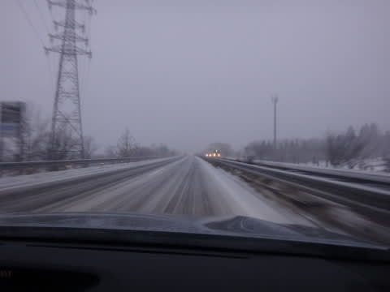

志賀高原への上り坂ではすごい降雪に．

…うむ．

これが，昨晩からの降雪なら今日はパフパフデーなんだけど．

残念ながら，朝から降り始めたばかりの雪なんだな…

ってことで．

焼額山に到着するわけですが…

ありゃりゃ？

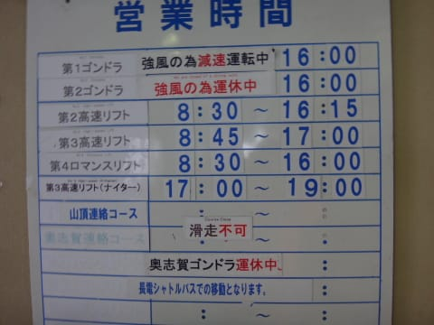

な，なんとっ！

強風で，第2ゴンドラも奥志賀ゴンドラも動いてないんですか…（涙）

でも，焼額第1ゴンドラは減速運転ながら動いているので，

ちょっと安心．

んで，第1ゴンドラで山頂へ出ると…

ふーむ．

朝の山頂の気温はマイナス9度と，そこそこ冷えてはいるものの．

すごい冷えひえではないなぁ．

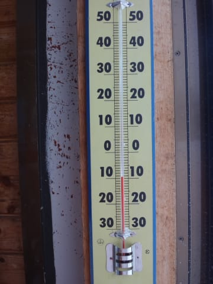

天気は雪降りで…

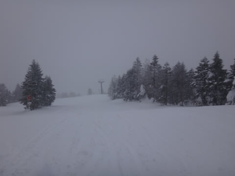

雪質は，圧雪の上にうっすらと，新雪が乗ってる状況．

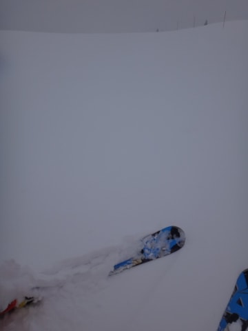

ふむ．

あまり期待はできないけど．

ちょっくらオリンピックコースへ出てみますか…

と，行ってみたところ．

…やっぱり，朝からの降りだったので積雪は

それほどでもなく，ブーツパフってところ．

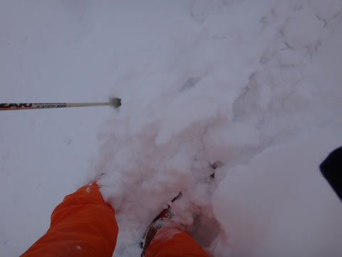

圧雪コースとそんなに大差ない程度かな．

とりあえず，朝から雪はがんがん降り続け．

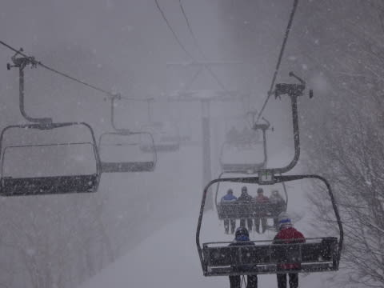

天気も良くないので，コース上に人は少なく．

結構すいていて快適だったけど…

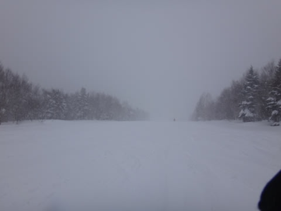

ただ．

第2ゴンドラが動いてないので，第1ゴンドラに人が集中して，

朝10時半からの一瞬，ゴンドラ待ちが発生したのが，

ちと残念．

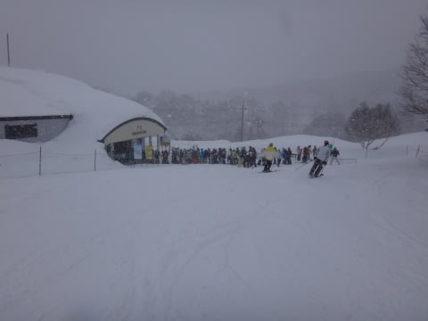

…とはいえ．

11時過ぎにはまったくゴンドラ待ち0になっていて．

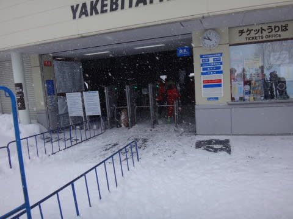

結局，今日，ゴンドラ待ちがあったのはほんとに一瞬だけ．

後はまったく待ちなしの快適状態！

ゲレンデはガラガラというほどまでは行かないけど，1月の

週末としては人が少なめで…

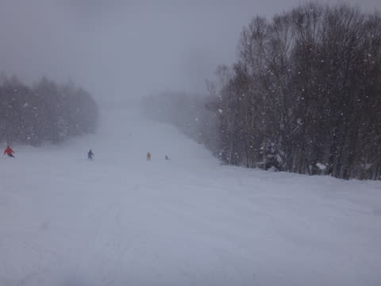

んで，雪ががんがん降り続けるので，人が少ないコースは

すぐに新雪が積もっていくほどでしたね～．

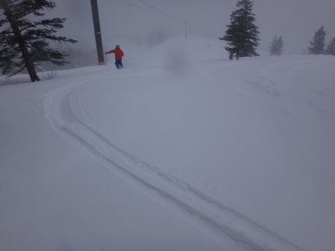

…この写真，朝の1本目じゃないですよ．

午後の写真です…

ってことで．

いやー．

人が少なめで，思ったほどコブにもならず．

結構快適に飛ばせるなぁ…

と，気持ちよく滑っていたけれど．

昼ごろにはだんだん気温が低く，風も強くなっていき…

なぜか，昼間の山頂温度計の気温がマイナス12度！

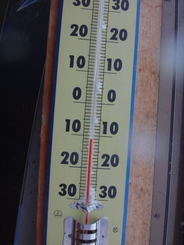

昼間ですよ，真昼間．

朝より気温が3度以上下がってるって，どういうこと？？

あまりの寒さに，私も滑る意欲を失いかけるほどで…←そ，そんなことがあるのかっ！！？？

リフトでの吹きさらしだと，この風雪でたぶん死んじゃう．

ゴンドラ様さま…って感じでした．

結局，今日は終日強い風雪が続き．

第2ゴンドラも動かずじまいだったけど．

死ぬほど寒かったおかげで，雪質もよく．

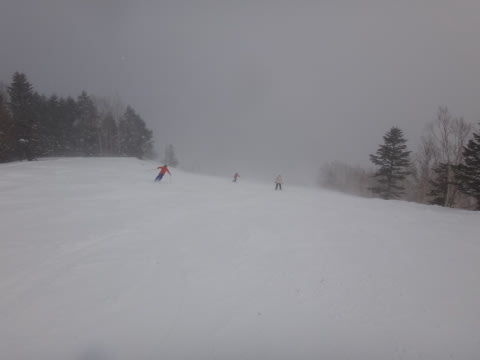

ゲレンデの人も少なかったので，

好き放題滑れた上，ゲレンデもでこぼこになることなく，

結構飛ばせたし．

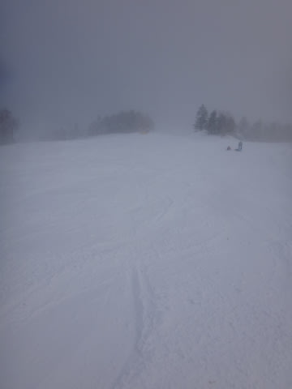

まぁ，寒かった点を除けば，楽しめた一日だったかな～．

で．

雪は夜もひたすら降り続け．

今週も，ナイターが数cmとはいえ，新雪状態で．

数本滑ると前のシュプールが消えるほどの積雪だったので．

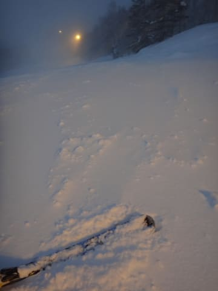

…明日の朝は，間違いなくパフパフデーになりますよっ！！！

…少なくともひざパフ．

運がよければ，腰パフくらいまで行ってくれるかな～．

冷えてるので雪質もいいはずだし．

昼前には晴れてきそうだし．

明日は絶好のスキー日和になるはずっ！！！
