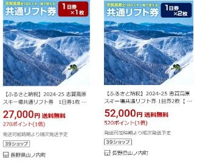
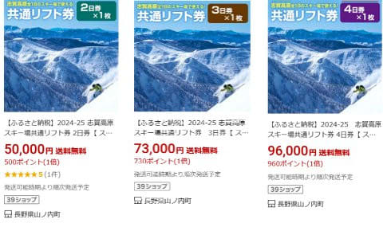
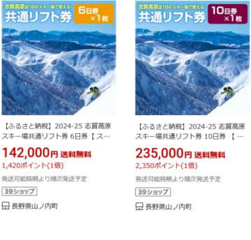
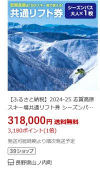
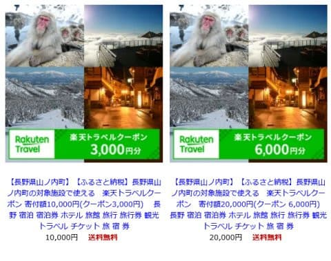

# ふるさと納税で志賀高原スキー場のリフト券が返礼品でもらえるよ！納税27000円で全山共通1日券，50000円で2日券，318000円でシーズン券！

📅 投稿日時: 2024-10-10 02:19:36

🏷️ カテゴリ: [日記](cc4b5682fb7b8b144980957a978653fb0.md)

ってなことで．

そろそろふるさと納税をどうしようか

考えている人は多いかと思いますが…

このBlogを読んでいるスキーヤーの皆さんは，

スキーヤーらしく，スキーに関するふるさと

納税をしたいと考えているはずです…

普通のスキーヤーなら，スキー関係の

ふるさと納税をするはず…！！←勝手な決めつけ

そういうことですので．

スキーヤーとしては気になる，スキー関係の

返礼品があるふるさと納税ですが．

今年もいつも通り，山ノ内町のふるさと納税

返礼品として，志賀高原スキー場の

全山共通リフト券がリストに出てきました～！

…例年10月1日に追加になるんですが．

今年も10月1日からリストに追加され，

納税額が明らかになりました…

ってなことで．

山ノ内町のふるさと納税の返礼品リストを

見てみますが．

（以下は[楽天ふるさと納税サイト](https://search.rakuten.co.jp/search/mall/%E3%83%AA%E3%83%95%E3%83%88%E5%88%B8/?sid=369051)参照）

志賀高原スキー場の全山共通券の返礼品．

納税27,000円で1日券1枚，

52,000円で1日券2枚ですか…

1日券の窓口料金は8,000円ですが，

納税額に対する返礼品割合は

1日券1枚なら29.6％，

1日券2枚なら30.7％．

1日券2枚にした方が，1枚よりちょっと

お得になるんですね…

返礼品割合が30％超えるけど，

窓口料金8000円じゃなく，Web料金

7500円で計算しているのかな？

そうすると，返礼品割合は

1日券1枚で27.8％，

1日券2枚なら28.8％ですね．

そして，2日券以上も返礼品として

準備されています！

2日券は納税額50,000円

（2日券Web料金12,000円…返礼品割合28.4％）

3日券は納税額73,000円

（3日券Web料金21,200円…返礼品割合29.0％）

4日券は納税額96,000円，

（4日券Web料金28,200円…返礼品割合29.4％）

と，こちらも日数が伸びればちょっとずつ

お得になっている感じですね．

あと，6，10日券ですが

6日券は納税額142,000円

（6日券Web料金42,200円…返礼品割合29.7％）

10日券は納税額235,000円

（3日券Web料金70,200円…返礼品割合29.9％）

と，10日券になるとほぼ上限30％に達しますね．

ちなみに，5，7，8，9日券はふるさと納税での

返礼品として準備されてないようです…

そして，全山共通シーズン券ですが．

通常価格99,000円（超早割89,000円早割94,000円）

で，納税額が…

なんと318,000円！！

返礼品割合は，31.1％と，30％を越えますね～！！

10/1～10/31申し込みの早割94,000円と比べれば

29.6％なので，こっちで計算しているのかな？？

あとは，山の内町の宿泊補助券もふるさと納税で

申し込めます～！

1万円宿泊補助が納税40,000円，

2万円宿泊補助が納税80,000円，

3万円宿泊補助が納税110,000円，

5万円宿泊補助が納税180,000円，

10万円宿泊補助が納税360,000円です！

うーん．1万，2万だと返礼品割合が

25%程度で，率がちょっと低めですね．

あと，楽天サイトだと，楽天宿泊クーポンも

申し込めて．

これは3000円宿泊補助なら納税1万円，

6000円宿泊補助なら納税2万円…と，

ぴったり返礼品割合が30％．

楽天提携の宿でしか使えないけど，

率としてはこっちの方がいいです！

ってなことで．

地方税を地元ではなく，山ノ内町を応援

するために納税すれば，山ノ内町が潤う

だけじゃなく，自分たちにもリフト券や

宿泊補助になって帰ってくるので…

志賀高原に行く人は，山ノ内町にふるさと納税

してみるのもいいかも…！？？
