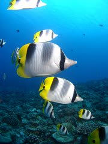

# 夏モードにチェンジ！

📅 投稿日時: 2011-06-30 01:13:19

🏷️ カテゴリ: [日記](cc4b5682fb7b8b144980957a978653fb0.md)

ということで．

前回予告したとおり．

今回の更新から夏モードになります．

夏モードってなんじゃいな？

…と思われるでしょうが．

スキーが終わると，私のもうひとつの趣味がスタートします．

もうひとつの趣味…それは，潜ること．

あー．

地下に潜るんじゃないですよ．地下に．

スキーが終わったから，地面に潜って，しばらく夏眠する

わけじゃないですから．お間違えないように．

海です．

海に潜るんです．

タンク背負って．

…昔は，月山で滑り終わった次の週から，近場の海に行ったりしたものですが．

子連れになって最近では，潜りに行くのは年に数回の遠征のみになってきました．

ということで．

次のダイビング遠征まではしばらく間があるので．

明日からは，昨年度子連れで行ったダイビング遠征の

体験記なぞ，書いてみようと思います…

## 💬 コメント一覧

### 💬 コメント by (森田勝里)
**タイトル**: 羨ましい！
**投稿日**: 2011-06-30 20:24:03

潜りは小学生の頃（笑）憧れましたが経済的事情で断念、今となっては目が悪いし日焼けに弱いのでそれっきりです。

夏モードはスキーに備えて週末ランニングの日々です。向上心からではなく、ゲレンデで脚力の衰えを実感して始めたランニングですが（笑）。

### 💬 コメント by (Skier_S)
**タイトル**: オフシーズンは…
**投稿日**: 2011-07-01 00:29:19

夏はランニング！

えらいですね～

私はレジャースキーヤーなので，オフトレは全く無縁です（笑）．

脚力の衰えがあろうが，所詮遊びですので，滑って体力をつける以外の努力は…．

