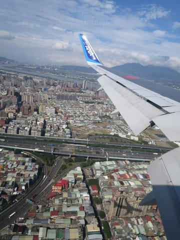

# 志賀高原は，22日の朝さえ乗りきれば23日まで雨は降らなさそう…そして，24日朝はかなり積もるかも！！？？

📅 投稿日時: 2018-12-22 02:12:26

🏷️ カテゴリ: [日記](cc4b5682fb7b8b144980957a978653fb0.md)

どうやら本日．

奥志賀のゴンドラと第2，第3高速ペアが動いて．

奥志賀はほぼ全面可能になったようですね…

奥志賀に行った方からのコメントによると．

雪質は結構いいみたいですね．

ただ，ゴンドラ側のダウンヒルコースはまだ

ちょっと積雪が足りなさそうな感じですが．

…そして，

22日からは，焼額第1ゴンドラ，高天ヶ原クワッド，

一ノ瀬ファミリークワッド（天狗コースのみ），

蓮池・丸池・サンバレー・発哺ブナ平・一の瀬ダイヤモンド・

一の瀬山の神，熊の湯第3クワッド，

23日は寺子屋がオープンです！

…が．

東館，西舘，ジャイアント，タンネの森や，

一ノ瀬ファミリー天狗コース以外は，

まだオープン未定のようです（涙）

この時期になって，まだ滑れないゲレンデが

こんなにあるなんて…

まぁ．

土曜から，ダイヤと山の神が動くので．

一ノ瀬と焼額・奥志賀方面がつながり．

ようやっと志賀高原らしくなってくるかな…

という感じですね．

…で．

明日からの3連休．

Skier_Sはまた志賀高原を滑っているんだろう

と，思っているでしょうが．

…なぜか現在，某国へ出張中です（涙）

金曜の朝5時過ぎに，[前のBlog記事](e998ec55902799bf26cc2ed74dad8833a.md)を書いた直後に空港に向かい．

昼過ぎに某国へ到着．

夕方から打ち合わせをやって．

ついさっき，ホテルへ戻ってきました（涙）

…そして．

明日の朝にホテルを出て日本へ戻る，弾丸出張です（泣）

ってなわけで．

明日の土曜，志賀高原へいけません…（激涙）

だのに．

土曜は，ホテルを出て家に帰るだけの移動日なので，

勤務扱いにならないというこの不条理さ…（泣）．

あぁ…

出勤扱いでもないのに．

仕事のために，焼額第1ゴンドラのオープン日に

焼額を滑れないなんて…っ！！

くやしぃ．悔しすぎる…っ！！！

とりあえず．

今日は，本日の打ち合わせ資料を完成させるために，

徹夜明けなので←というより，飛行機の中でも資料を作り続けて，

「必殺・できたことにする」という呪文を使ったのではなかったっけか？

もう寝ます…

明日は，死んだように飛行機で寝よう…

そして，日曜からは焼額に復活です！！

…で．

ここで終わるのもさみしいので．

3連休の天気の最終予想をば…

まず．

22日．

雨がぱらつきそう…

と予想しましたが．

気温が上がる前，早朝のうちはなんとか

雪になってくれそうで．

そして，気温が上がる前，朝には止んで

くれそうなので．

うまくいけば，雨にならずに済みそう…

雨になったとしても，短時間で済むかな．

昼間は+3度くらいまで気温が上がりそうだけど．

昼は降らないでいてくれそうなので．

雪が壊滅的に解けちゃうことはなさそうです…！

23日は…ちょっと微妙な感じ．

曇り空で，朝は0度をちょっと下回るくらいかな．

やっぱりこの日も気温は高く，昼間は+3度くらいまで

気温が上がりそう．

午後，リフト営業終了前後に，ぱらぱらと雨が

降り始めるかも…

でも，通常営業の間はおそらく降らずにもって

くれそうな予感…！

雨はすぐに雪に変わって，夜の間

降り続きそう…

24日はひえひえ雪降り！

寒いし，吹雪っぽいかもしれないけど．

23日夜から朝までに，結構新雪が積もってそうな予感…

20cm，ブーツパフくらいは行ってくれそう！

そして，この日は終日ひえひえ雪降りです！！

ってなことで．

意外と22，23日は，志賀高原はそれほどひどい

コンディションにならなさそうだし．

24日は積もりそうなので．

この3連休，当初予想よりはよさそう…

これで，22，23日に，雨が降らずに済めば．

水曜段階の天気図を考えると，奇跡といえる

レベルなので．

その時は，

皆さんの狂ったような踊りが神に通じた

と信じましょう…！！

では，明日志賀高原に行く人は，1ゴン営業開始を

楽しんできてください…（恨めしそうな目）

## 💬 コメント一覧

### 💬 コメント by (FCAMEL)
**タイトル**: 踊りに来てます
**投稿日**: 2018-12-22 03:07:57

日付が変わった頃に志賀に到着。

思ったより雪ありますね、気温妙に高いです。

本日不在は残念ですが、明日明後日ヤケビ覗きます！

### 💬 コメント by (Goku)
**タイトル**: 濃霧
**投稿日**: 2018-12-22 09:16:23

出張お疲れ様です。

今日の志賀高原、濃霧で何もの見えません(T_T)

イチゴン、無事動いています‼

替わりに、朝礼やっておきました～(笑)

### 💬 コメント by (komu)
**タイトル**: 雨降ってない
**投稿日**: 2018-12-22 11:36:26

良かった〜

雪も意外といい感じ

### 💬 コメント by (若杉勲71)
**タイトル**: 志賀高原情報
**投稿日**: 2018-12-22 17:44:24

朝は気温0℃ぜんごで、毎日登っている私が、最高にスリップする路面でした。皆さん警戒されていたようで、意外とスムーズに行けました。

奥志賀エキスパートは、綺麗に整地されて霧さえなければ最高でしたよ。二時間程すると緩んできたので、ゆみりんさん共々リタイアしました。

明日はヤケビです。よろしくお願いします。

### 💬 コメント by (Skier_S)
**タイトル**: 明日は焼額に復活！
**投稿日**: 2018-12-22 23:32:13

＞FCAMELさま

久々の志賀高原復活ですね！

明日明後日，1ゴングルグルしてますので，

ぜひお会いしましょう～

…1ゴンの状況がひどかったら他に行くかもしれませんが…

＞Gokuさま

今日はガスにやられたようですね…

1ゴン朝礼は盛況だったでしょうか．

明日1ゴンに復活しますので，よろしくお願いします～！

＞komuさま

今日も志賀だったんですか…

水曜段階の天気図から考えれば，奇跡レベルの

コンディションの良さだと思います．

一日雨でも不思議じゃなかったですから…

＞若杉さま

明日も朝は路面ヤバそうなので，気を付けて行かないと

いけませんね…

で，奥志賀も良かったんですね！

明日は積雪が無いのでコンディションはちょっと微妙ですが，

月曜は良くなるはず！

そして，来週水曜からはドサドサ降りますよ～！！

あした焼額でお会いしましょう！

