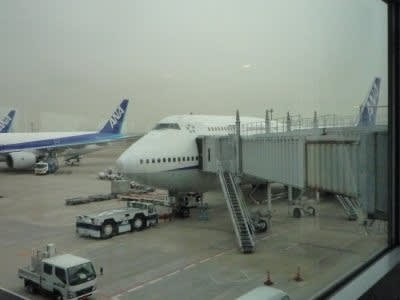
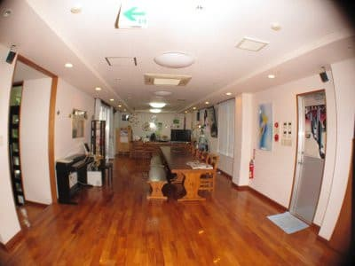

# 2010年7月，2歳の子連れで座間味でダイビング！その1…いざ沖縄へ

📅 投稿日時: 2021-09-17 01:45:32

🏷️ カテゴリ: [ダイビング日記](ce3a7a8d424d112fce83ee85c81a0e344.md)

という感じで．

カメラテストのために（？）向かった沖縄は

座間味．

いやー．慶良間は4年ぶりですね～．

座間味は…うーん．8年ぶりくらいか？

で，朝7：45の飛行機で沖縄へ向かいますが．

娘，今年に入って飛行機で旅行するのは

すでに3回目．

よく考えると，3月に北海道，7月に沖縄．

今年で子供の飛行機代がタダになるのが

最後の年というのもあって．

「今のうちに」というところもあるんですが．

…日本を北から南までいきまくってるなぁ…

2歳児だというのに…

で，去年は1歳児までの国際線無料が

最後の年というのもあり，国内2回だけ

じゃなく，海外までも行っているから，

…もう飛行機はベテラン（？）です．

空港に着いたとたん，飛行機を見て，

「ひこーき，ひこーき！早く飛行機乗ろうよ～」

と言う娘．

…おまえ，飛行機好きすぎなんだけど…

（今は無きNHのB4）

でも，いつものパターンで，飛行機に

乗るとすぐ寝ちゃうんですけどね…

というわけで，起きるころには那覇空港着．

もう，飛行機でぐずるとか，そういう

心配まったくなしです．

んで，妻は子供も抱っこしてるし．

ダイビング機材をすべて抱えて移動しているので，

空港からはちょっと贅沢だけど，

タクシーで泊港まで行こうかと思ったところ…

娘が，空港から見えるモノレールを見て．

「モノレールだー．モノレール乗りたい，

乗りたい，のーりーたーいー！」

と熱望．

あの～．荷物，重いんですけど．．．．．．

しかしお姫様のリクエストとあれば逆らえません．

重い荷物を抱えて，えっちらおっちら

モノレールで泊港へ移動．

で，泊港へ着いて，クイーン座間味の乗り場に行くと…

今度は船を見て，

「お船だー！お船乗りたい，のーるーっ！！！！」

…

…お前…ホントに乗り物なら何でも

好きだな～…

乗ってすぐはご機嫌だったのですが…

しかし．

この船がくせもの．

この日，かなり波が高く，かなりいい感じで

乗客はシェイクされました．

娘はゲロゲロ．

完全に昼ごはんをリバースしてしまった後，

「きぼちわるい～」

と青白い顔で半泣き．

…そんな1時間の苦行の後，14：10座間味着．

ううううーーーん．

帰りもこの船に乗らないといけないんだけど…

嫌がって「もう乗らない」とか言わないかな～．

ちょっと心配．

しかし，陸上に上がると…

5分ですっかり元通りに戻ってました．

回復，早！

んで，宿の車でピックアップしてもらい…

車で1-2分もかからない宿に到着！

その後，ゆっくり荷物を開く

暇もなく，速攻で器材準備＆着替え

だけ済ませると…

即座に午後の1本ダイビングへ！！

朝発，午後座間味着で，それで

その日に潜るので．

かなり忙しいスケジュールですが…

まず1本目のこのダイビング，

私がもぐって，妻は子守番です．

妻と一緒に港まで私を見送りに来た娘．

ニューカメラと器材を抱えてダイビング

ボートに乗り込む私を見て，

「お船乗りたい～！これ乗る～！！

私もこれ乗るの～！！！！」

娘よ…20分ほど前まで，船でゲロゲロ

してたばかりじゃないか．

だというのに…

お前はホントに乗り物が好きなんだなぁ…．

しかし当然，船は娘を置いて出港．

置いていかれた娘が激泣きしている声を背中に受けつつ，

座間味の1本目に向かうのであった．

（われわれの船を指差し，「あれに乗りたい～」と

泣いてる娘．よっぽど乗りたかったんだなぁ…）

## 💬 コメント一覧

### 💬 コメント by (ゴン太＠SALLOT CLUB)
**タイトル**: 乗り物とは
**投稿日**: 2021-09-18 00:15:19

お嬢様、数年後には、

リフトやゴンドラやスキーという乗り物に、

乗りたい乗りたいと成長され、

まさに血は争えないということですね。

### 💬 コメント by (Skier_S)
**タイトル**: ＞ゴン太さま
**投稿日**: 2021-09-18 15:05:38

親を見て子は育つんだなぁ…

という感じですね（笑）．

でも，この時は小さかった娘ももう中学生．

部活も始まり，昨シーズンは正月しか一緒にスキー行けてません…

### 💬 コメント by (新米パパさん)
**タイトル**: Unknown
**投稿日**: 2021-09-19 12:09:09

S様、2歳のお子さんがいらっしゃるのかと感心しましたが、10年前の話なんですね。

もう、座間味も渡嘉敷もメジャーになり珊瑚も白化してみる影ないですよ。

志賀高原も10年前と全然変わりましたか？

### 💬 コメント by (Skier_S)
**タイトル**: ＞新米パパさま
**投稿日**: 2021-09-19 22:01:04

いや～．これはかなり昔の話です…

座間味も最近はちょっと残念な感じになってきているところもありますが，

でもまだ八重山に比べれば，白化の影響はかなりマシかと…

石垣は壊滅状態なので（涙）

志賀高原，この10年では大きく変わってませんが，15年前と比べると動いているリフトがかなり減って，寂しくなってます…（泣）

