# 2021/11/28(日)，2022シーズンオープン翌日のアサマ2000で滑ってきたよ！…ガラガラだったけど手ごわいカチカチバーン

📅 投稿日時: 2021-11-30 01:07:39

えー．

本日まで冷え冷えデーが続き．

スキー場も次々オープンしたわけですが…

志賀高原も，明後日から一の瀬ファミリーが

オープンするようですし．

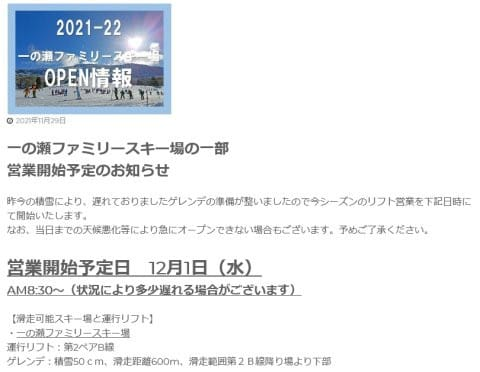

([志賀高原中央エリアホームページ](http://shigakogen.co.jp/archives/13073)より）

昨日下半分だけオープンした高天ヶ原も，

下半分だけじゃなく上側，NHKバーンも

圧雪が始まり，

運がよければ12月11日の予定より早く

クワッドが動くんじゃないか？

という期待を抱かせる状況ですし．

(中央エリアがそんな気の利いたことをするとは思えないけど…)

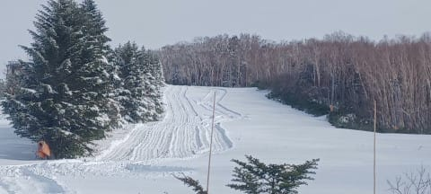

焼額山も真っ白になり．

12月4日には第2高速もオープンするのでは？？

と思わせる状況だし．

手前に見えてる，予定では11月27日オープンだった

一の瀬ダイヤも，もう一降りあれば

オープンできそうだよな？

って感じに見えるし…

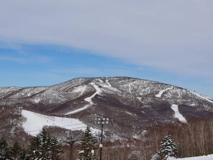

おこみん特派員から送られてきた横手山の

状況をみても．

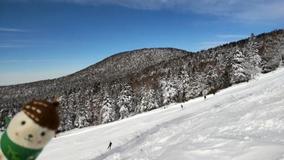

コースは全面的に真っ白で．

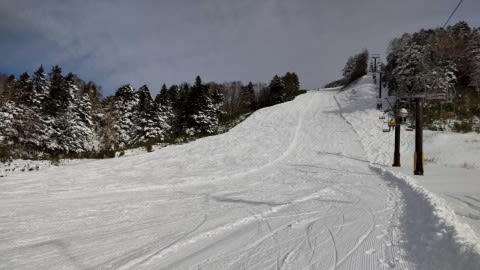

コース脇の新雪を滑っても，

石ころを踏む心配はほぼ無いよ，

ってことだったし…

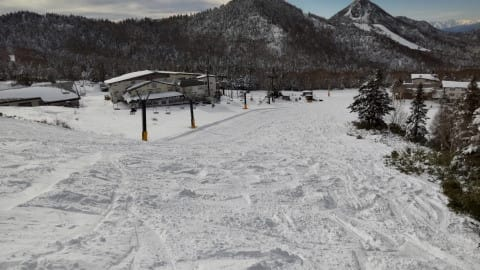

横手山はさらに明日から，第1，第4の他に，

第2トリプルが動き出すようで．

…この冷え冷え期間に積もった雪のおかげで，

ついに高速リフトが営業開始です！

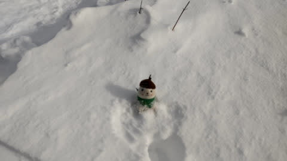

（おこみん，冷たそう…）

ってな冷え冷え期間だったわけですが．

どうも，30日の午後から気温が上がり始め．

30日の夜には激烈な南風が吹く，高温

荒れ荒れ天気になりそうです(涙）

でも，気温が高い30日の夜は，そんなに

雨は降らず…

1日の早朝，冷え込んでからドサドサ

降りそうな感じです…！

また降ります！

雪です！！

そこそこ積もります！！！

白馬やかぐらはかなり積もりそう…

うーむ．

このまま行ってくれれば，

また4日にかなり積もりそうだから…

12月4日の週末，特に5日は，

いい感じになりそう…！

ってな感じで．

当初予定から遅れたけれども，この冷え冷え

祭りのおかげで，なんとか27日にオープン

できたアサマ2000．

昨日速報しましたが，オープン翌日の28日に

滑ってきたので，詳細レポートです！

えー．

まず．

あさイチのアサマ2000への道ですが…

すでに佐久ICを降りたところから

路面積雪が始まっていて．

アサマへの登り坂は最初から完全に雪道．

途中で登れなくなっている車があるほどの，

ところどころテュルンテュルンになっている

積雪路でした…

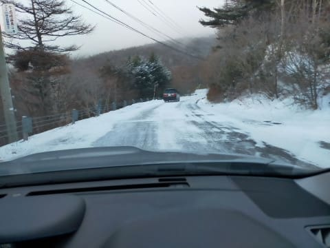

ってな感じの積雪路を乗り越えて，

やってきました，久しぶりのアサマ2000！！

昨シーズンは滑ってないので，実に

2シーズンぶり…！

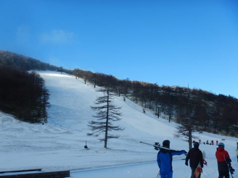

営業は8:30～15:00まで．

リフト1日券は，12月17日まで￥3500と

お得な料金になってます！

でも…

コースが滑れるのは，旧ステージ2

（今はダイビングコースと呼ぶらしい…)

の，コース幅半分だけ．

…まぁ，ここ数年，11月の週末にまともに

オープンできなかったことを考えると…

今年はマシな方かもしれませんね．

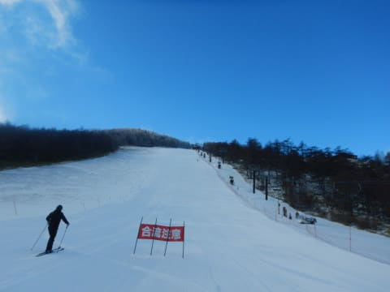

雪は，5～10cmの天然雪が積もっていて…

…これは，アサマ2000にしてはいい

コンディションではなかろうか？？

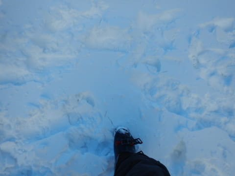

朝8:30のオープン前は，結構な人がリフトに

並んでいました…

これは，今日は混むのかな？

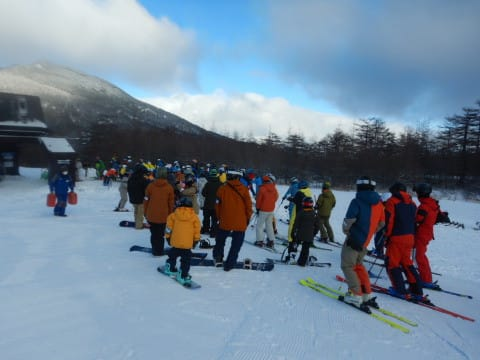

ってなことで．

8:30に営業開始！

…今日一番のスキーヤーがゲレンデを

降りていきますが…

うはーーー！！

気持ちよさそうっ！！

…早く，早く自分も滑らせろ～！！

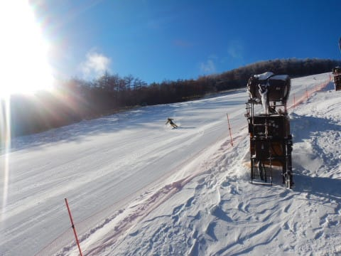

で．

山頂へ着くと…

うほーー！！

シマシマッ！

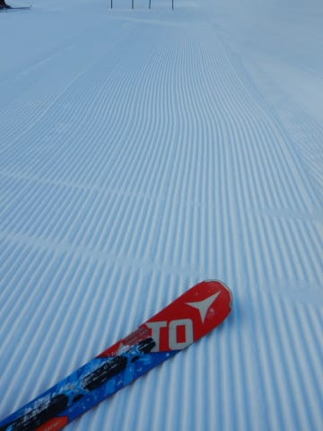

では．

晴天のシマシマバーン，いただきます！！

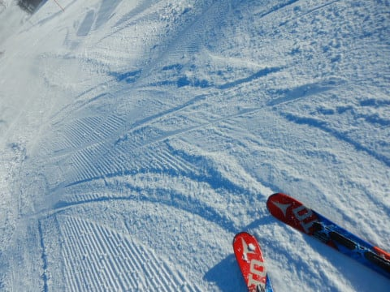

天然雪が乗って柔らかいはず！！

…と思っていたバーンは．

天然雪が止んだ後に人工雪を乗せたようで，

人工雪っぽい，結構締まった硬めのバーン

だったけど…

でも．

今シーズン初めての，幅の広い中斜面！

うおおおお！！

ちがう！Yetiとは違うよ！！！

スキー場って，やっぱり斜度がないとっ！！

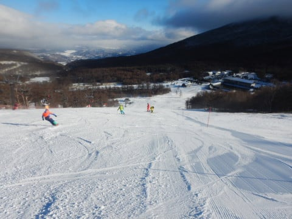

ってな感じで．

ピカピカ晴天のもと，しっかり締まった

シマシマバーンを滑ることができ．

「あぁ…やっと本当のスキーができた…」

と，感動の涙でむせび泣く，

興奮のYeti以外の初滑りを済ませた

わけですが．

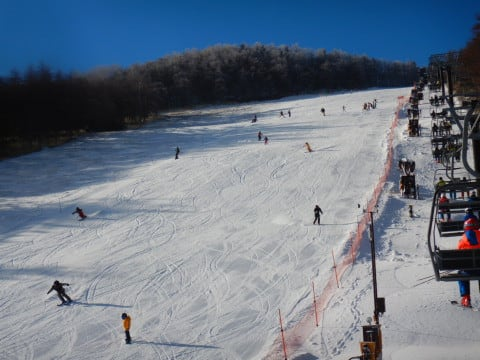

あさイチのリフト待ちがそこそこあったので，

「今日は混むだろうなぁ…」

と思っていたところ．

意外なことに，朝10時にはリフト待ち時間が

かなり短くなり…

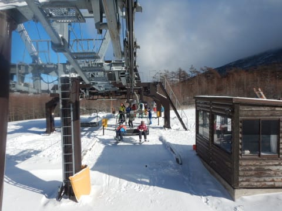

なぜか，昼前にはほぼ待ち0に！

午後はせいぜい待ってリフト搬器3-4台，

タイミングによっては待ち0で飛び乗れる

ガラガラ具合！！

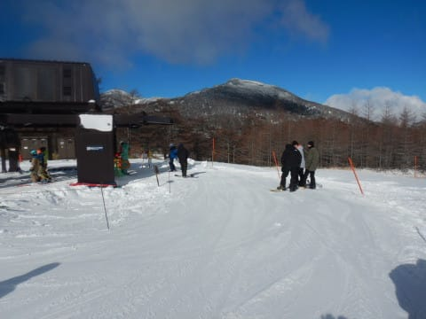

…ただ．

なぜ，午後にガラガラになっていくか

というと．

昼前には，大勢のスキーヤーで念入りに

磨かれたゲレンデは，その表面の危険な

ツルツルさを徐々に増していき…

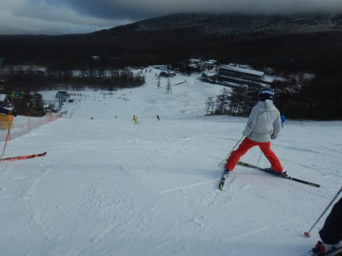

昼ごろには，エッジを立ててない板だと

命の危機を感じるほどの，デンジャラス

ツルツルエリアがところどころに現れて…

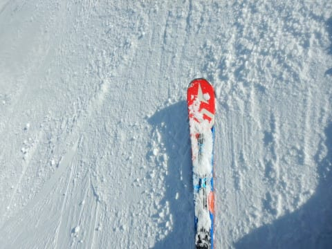

そして．

午後1時になると．

そうです．

アサマ2000恒例の，ツルツル小回りレーンが

仕上がっていきます…

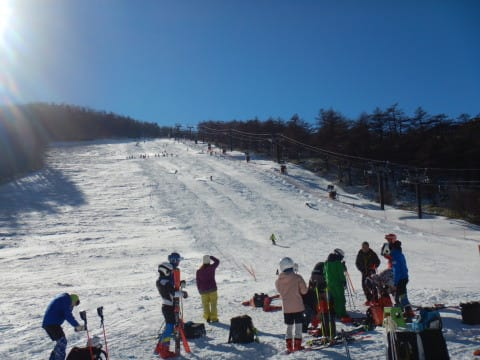

こうなると，ごく一般的な感性を持った

一般スキーヤーは，楽しむどころじゃ

なくなってくるので…

人が減っていき，リフト待ちが無くなっていく

ということですね（涙）

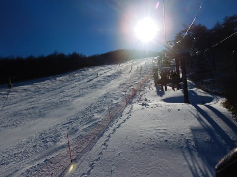

でも．

今シーズンが始まって，もう1か月以上

Yetiの激混み廊下の緩斜面だけを，

ひたすら滑っていた私にとっては…

つるつるだろうが小回りレーンだろうが，

小回りレーンの間にモサモサ雪が溜まって

コブになってようが．

Yeti修行バーン(廊下)よりは100倍楽しいのだ！！

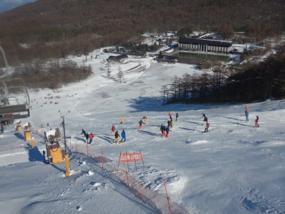

さらに．

完全北斜面のアサマ2000のこのバーン．

午後2時を過ぎると，日が陰って見にくくなり…

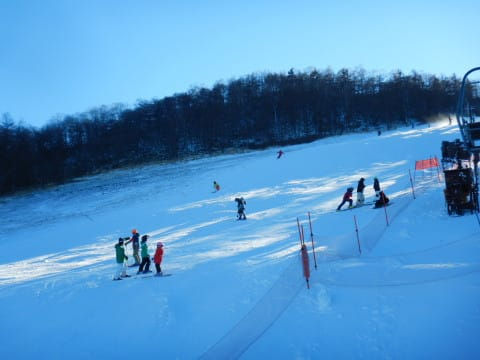

最後は完全に日が山陰に沈んでしまい，

どこがツルツルでどこが凸凹かすごく

見にくくて分かりにくい日陰斜面を，

「それでも，Yetiより楽しい～！！」

と．

15時のリフトストップまで滑り続けたの

でした…

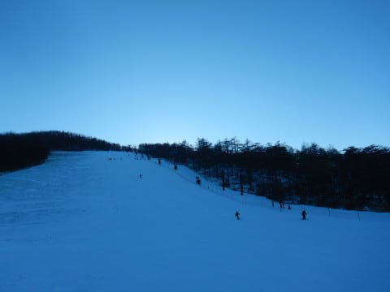

いやー．

午前11時頃までは結構楽しかったけど．

久しぶりにアサマ2000の硬いバーンの

洗礼をうけました…

エッジが丸まった板では絶対滑れない

手ごわいバーンだったけど．

自分の板はそこそこエッジが立ててあった

ので何とかなったし．

何よりも今シーズン初めて，

ちゃんとした幅のある中～急斜面を

滑れたので．

こんな状況でも，

今日は一日楽しかった

と思えた，Skier_Sだったのでした…

## 💬 コメント一覧

### 💬 コメント by (レインボー74)
**タイトル**: Unknown
**投稿日**: 2021-11-30 16:44:17

水曜日の野沢情報

空いてました。スタートの長坂ゴンドラは100人くらい。嬉しい！少ない！

視界良好、雪質良好。

でも、日頃志賀を見続けている我らにとって、圧雪の悪さがすごーく残念。縦に大きな段差が至るところに！とばせない。

野沢にとっては、オフピステが命だからなのかなあ。でもまずまず基本練習を楽しめました。クロアチアの人も新蕎麦が食べたいようなので、昼前に終了。

明日からあちこちで遊べるので、選択が悩ましい！

### 💬 コメント by (m&t m)
**タイトル**: Unknown
**投稿日**: 2021-11-30 23:04:47

我々のホーム、アサマでSさんをお迎え出来ず残念でした

アサマは小諸側で積雪になる冬型の天気だと、道路もゲレンデもスケートリンクになる可能性が高いです（四駆にスタッドレス必須です）

でも、アサマでSさんが楽しめて良かったです=(^.^)=

### 💬 コメント by (Skier_S)
**タイトル**: 志賀高原も雨（涙）
**投稿日**: 2021-12-01 02:50:00

＞レインボー74さま

野沢，圧雪ちょっとひどいですね…

でも，雪質が良かったようですし．何より混んでなかったのがいいですね～！

明日からは志賀シーズン券も使えますよね．

明日は志賀ですよね．たぶん．

＞m&t mさま

もう，ツルツル絶叫バーンでしたが，絶叫バーンなら絶叫バーンなりに

楽しめました…

いい練習になりましたよ！←あくまでポジティブ

