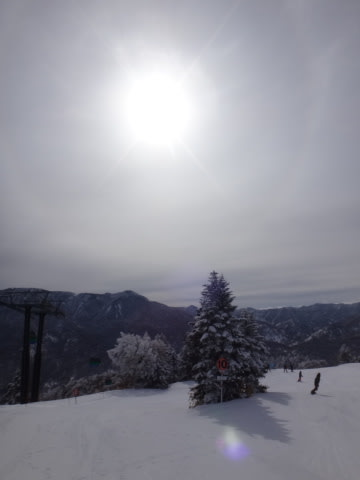
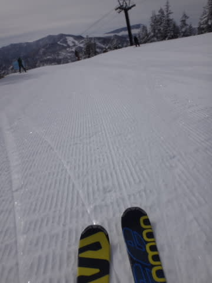
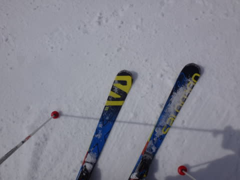
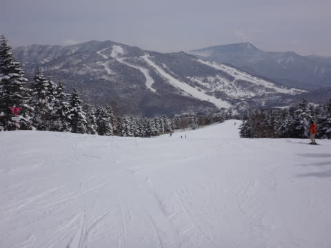
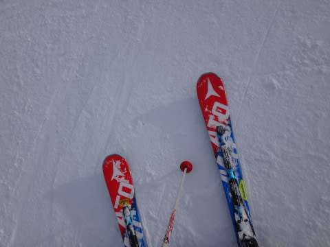
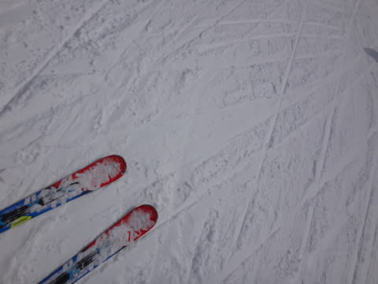
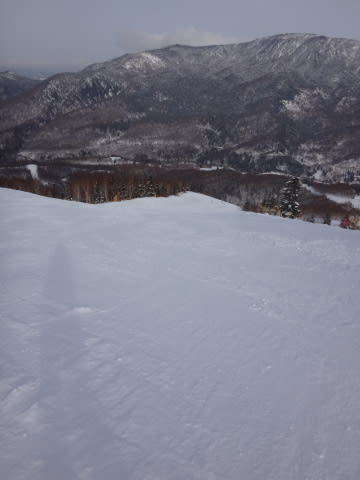
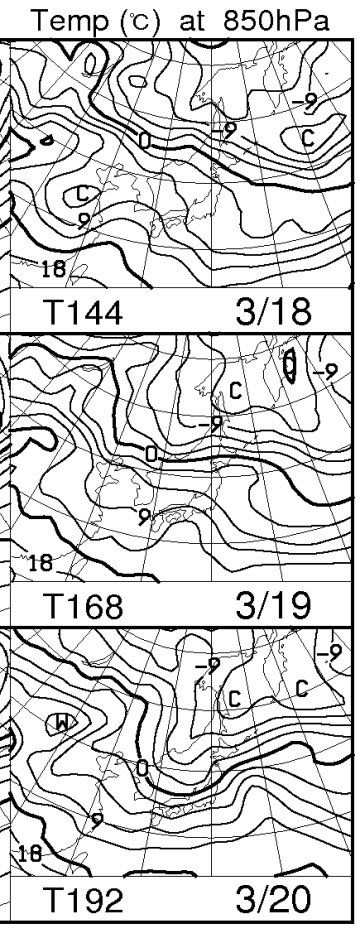

# 3月13日，日曜の志賀高原速報モード…アイスバーンがところどころにあったものの，結構いいコンディション

📅 投稿日時: 2016-03-14 01:46:19

本日．

16:00の焼額ラストゴンドラにぎりぎりで飛び乗って．

そのあとも急ぎ車で移動し，

16:50まで営業している一の瀬で最後の25分間を

滑ってしまったSkier_Sです…

ってことで．

志賀高原を出たのが遅かったので，いつも通りの

深夜帰宅パターン…（涙）．

だもんで．

今日はいつも通りの速報モードで…

えー．

うす曇りで始まった本日．

…気温も結構冷え冷えで．

今日も，朝イチはしっかり締まった圧雪バーン！！

いや，最高っ！

2日連続，ハイスピード圧雪バーンが

楽しめる朝でした～！！

天気は曇ったり晴れたりで，

それほど強い日差しが続かなかったので…

昼ごろになっても，意外といい雪！

人も少なく，気持ちよく滑れましたよ～！

さすがに午後になると，ところどころ固い下地が

出てきちゃったけど…

でも．

固い下地が出てきたところ以外は．

夕方まで，結構いい雪をキープ！

バーンがしっかりしていたので，

夕方の営業終了まで，バーンはほぼフラットなままで，

いい感じのハイスピードバーンがずっと続きました～！！

ってことで．

いや．楽しめた．

今日は夕方まで，気持ちよくかっ飛ばせた

一日だったのでした…

…でも．

でも．

来週末，19日の週末は…

…

…現時点で，あまり多くは語りません…（涙）．

こんな冷え冷えは，今週末がラストなのか…？（泣）．

追伸

マルハバさま：今回は一緒に滑れなくて残念でした…

昼間もお互い一人ではなかったので，一緒に滑れな

かったのが残念です…

また次の機会に！

aquraさま：今日はラストゴンドラにきわどいタイミングだったので，

あまりゆっくりお話しできず申し訳なかったです…

あれからかっ飛ばしたおかげで，

また今日も(笑)ぎりぎりラストゴンドラに間に合いました～！

＃ゴンドラ係の人に「今日もぎりぎりですね…」と（^^;

また来週以降，ご一緒しましょう…！

## 💬 コメント一覧

### 💬 コメント by (aqura)
**タイトル**: ようやくお会いできました
**投稿日**: 2016-03-14 02:09:41

ようやくお会いできました。あの後カットんで行く後姿、かっこよかっいたです。

実は、あの後ニアミスしているんですよ。

新座料金所通過後、外環へ行くため左車線の渋滞の中にいた私の横をSkier_Sさまは、中央車線を走行して行きました。私は、山を下りるのに1時間ほどかかっているのに、なぜいま頃…？。

まだ、あの後も滑っていたのですね…

かなり変わった大きな車の私です

### 💬 コメント by (マルハバ)
**タイトル**: それでも・・・
**投稿日**: 2016-03-14 18:36:13

3年連続でお目にかかれて良かったです♪

今回は新ウエアに関する情報がなかった為

Sさん１ゴン乗り場で私のすぐ横いらしたのに

迷って声を掛けそびれてしまいましたよ・・

サロモンを手に乗り場ゲートをくぐるSさんでしたが、

山頂に降り立った時はあれっ？アトミック？

イリュージョンかっ？？

でもこれで確信！慌てて追いかけて

講習中？に失礼した次第です。

ヤケビナイターは思わせぶりなことを云ってしまい

申し訳ございませんでした。

こちらこそ

またの機会に宜しくお願いいたします！

### 💬 コメント by (Goku)
**タイトル**: Unknown
**投稿日**: 2016-03-14 18:37:00

お～かなり良かったようですね～。

いいな～（土曜日飲み過ぎで寝坊、起きたら9時でした）

それにしてもこの気温は・・・

せっかく今日雪が降ったというのに・・・ざんねん。

しかし、これ見て気温が高くなるというのが分かる自分に感心しています（笑）

### 💬 コメント by (Skier_S)
**タイトル**: みなさんお疲れ様でした
**投稿日**: 2016-03-15 01:09:27

＞aquraさま

いやーーー．

ようやくお会いできましたね～！！

でも，私の滑りをかっこいいなんて言ってくださるとは…

そんなこと言ってくれるのは，うちの娘とaquraさまくらいです（笑）．

特徴がある滑りとはよく言われますが…（＾＾；

しかし，関越道の荒れだけ車がいる中で，よく

私の車だってわかりましたね…

大きな車って，もしかしたらキャンパーですか？？？

＞マルハバさま

いやーー．

私はBlog上は謎のスキーヤー（？）ということで，

ウェアは晒してませんので…

＃板は写りまくりですが(笑)

今シーズンはもう志賀には来れなさそうですか？

また次の機会に，一緒に滑らせてくださいねっ！！

＞Gokuさま

いや，土曜日と同じ程度に良かったですよ～！！！

日曜も，かなりいい感じでしたよ～！！！！

今週末は，ちょいと残念な感じになりそうなので，

やっぱり今シーズン最後の冷え冷えだったかも…

しかし．

このBlog読者は，だんだん天気図が読めるように

なってくるのかもしれません(笑)

