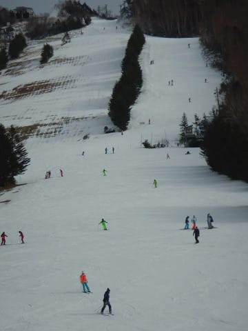
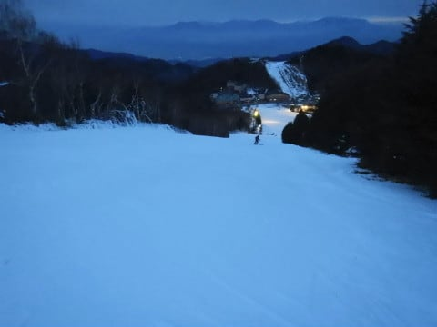

# 2019/12/22(日)の志賀高原スキー場，速報レポート！…雪が足りないながらも，滑れるエリアはわずかに拡大．滑走は人工雪エリアのみで焼額のゴンドラはまだまだ…

📅 投稿日時: 2019-12-23 02:12:15

🏷️ カテゴリ: [2020スキー滑走日記](c282e9230de179e245c7334eabeb0a3b3.md)

ということで．

本日も志賀高原に行ってきたわけですが．

いつも通り，帰宅は深夜11時近く．

それから板の手入れやらなんやらで

もう深夜1時じゃないですか（涙）

だもんで，今日の志賀高原レポート，

日曜深夜恒例の速報モードにて！

えー．

まず．

本日もすっきり晴れの天気で始まった朝．

昨日から晴れ続けているということは．

当然のごとく，

昨晩からの積雪は全く無かった

ということです（涙）．

晴れなくていいから雪を…（切望）

見ての通り，人工降雪が無い

ゲレンデ外は茶色い土が

まだ見えてます（泣）．

とはいえ．

あさイチのゲレンデは，人工降雪に

圧雪がかかった，いい感じの

シマシマバーン！！

だったけど．

あっという間に，全面殺人コロコロ

バーンと化していったのですが…（泣）

そして．

コロコロバーンになっただけでなく．

朝10時ごろになると…

なんだ，これはっ！！

コース上，ありえない人口密度に

なってきました…っ！！

そして，当然の結果として．

リフトも，ゲートの外まで列が着く待ちに…（泣）

輸送力の高い第2クワッドが，最大5分待ち

まで行きました（涙）．

まぁ，輸送力が高いので，これでも

リフト待ち5分あるかないか，という

我慢できるレベルだったのが救いですが．

悲惨だったのは，第4ロマンス側，

サウスコース．

コース状況は，第2高速の唐松コースよりも

フラットでコロコロも少なく良かったのですが…

コース上の人口密度はこちらも高く．

そして，リフト待ちがすごいことに…

一見列が短く見えますが，輸送力の低い

ペアリフトなので，これで10分待ち．

今日は午前中は，最大20分待ちまで

行ったようです…（泣）．

もう，昼になると唐松コースはボコボコだし．

ボコボコにはなっていないサウスコースを

滑ろうと思うと，第4ロマンスが午後になっても

10分待ちだし…（涙）

どうしよう…

…

…

あれ？？

ここはどこだ？？

これは…

焼額に忠誠を誓っている人物が

来てはいけない場所ではないか…？？

ってなことで．

今日の午後は，

本日オープンした，高天ヶ原クワッドに

やってきました～！！

滑れるのは，上部はNHKバーンのみですが．

ほぼコースいっぱい可能．

下部はそこそこ広い範囲が滑れて．

…そして．

焼額と違い，人がすごく少ない…

さらに．

リフトも飛び乗り！！

…ただ．

コースは完全人工雪の，ちょいと固めの

バーンです．

カチカチ青氷というより，

人工雪が磨かれた感じの，

エッジが円いとヤバい感じの

バーン．

エッジがしっかり研いであって，

固めのバーンが大丈夫な人じゃないと

手ごわい感じでした…

けど．

硬い斜面が大丈夫な人にとっては．

コース上ガラガラ最高！

リフト待ち0最高！

フラットバーン最高！

…な感じで．

すっかり日が暮れる，営業終了16:30まで

滑り倒したのでした…

しかし．

雪が足りない…（涙）

本日，丸池と高天ヶ原が人工雪で

オープンしましたが．

滑れるのは…

横手山第1，第5（唯一の天然雪オープン）

熊の湯第2ペア，第3クワッド

サンバレークワッド

丸池トリプル

高天ヶ原クワッド，トリプル，ペア

一の瀬ファミリーペア

一の瀬ダイヤモンドクワッド

焼額第2高速，第4ロマンス

…これだけです．

12月22日でこれだけ…（涙）

激烈に雪が少ない2016シーズンでも，

12月23日に焼額第2ゴンドラが

動いたことを考えると．

40年ぶりの小雪だった2016シーズンを

超える激烈雪不足

ということではないですか…っ！！！

でも，

しかし．

今，降ってます．

志賀高原は，降ってますっ！！

（[北信建設事務所ホームページ](http://hokushin-camera.org/)より)

…ただ．

この雪も明日の朝，リフト営業開始の

頃には止んでそうですが（涙）

でも．

24日（火）の地上天気図を見ると．

…うむ？

水色の降水域が志賀高原にかかっている

ように見えますね…？

そして，この日の850hpa気温図を見ると．

0℃線は太平洋側，志賀には水色の-6℃線

がかかるくらいだから．

かなりいい感じの冷え込みの雪に

なりそう…！

とりあえず．23日深夜から24日朝にかけて，

ちょっと積もりそうな予感…！

ここで，ゴンドラが動くほど積もって

くれることを祈るばかり…っ！！

そして．

そのあとは，27日にもう一回降りそう…！！

なんですが．

27日以外，

25，26日と28，29日は．

志賀高原にはほぼ積雪はなさそう…（激涙）

とりあえず．

この年末休みまでの雪が降りそうなチャンスは，

22日夜～23日朝

23日夜～24日朝

27日

の3回．

この3回で．全山オープンできる積雪に

なるのか…？？？

（焼額ゴンドラは動くだろうけど…

　全山は無理っぽいなぁ…）

## 💬 コメント一覧

### 💬 コメント by (若杉勲72)
**タイトル**: Unknown
**投稿日**: 2019-12-23 10:57:43

志賀高原情報です。今日は10センチ新雪。四ロマは快適ですが、某大国初心者集団により、リフトは超ノロノロ、ストップ多発。歩けない初心者と、他への気遣いゼロの国民性のため、行列ができているのに無人のリフトが連続する不可思議さに、粘りで名を馳すレインボーでさえ、10時前にリタイアせざるをえませんでした。

3日毎に某大国客を入れ替えるツアーを、2月までずっと続けるようですよ。やけびも大国の手にわたってしまつた感があります。ゴンドラが動けば問題ないけど。

今、来られるなら、多分熊の湯がベストかと思います。

### 💬 コメント by (musi)
**タイトル**: Unknown
**投稿日**: 2019-12-23 12:40:42

昨シーズンも、雪を求めて夏油高原スキー場まで遠征したのですが、まさか今年も行く事になるとは。全面オープン中ですが、硬めのバーンが多くて実質的シーズンインなので、土曜は子供と一緒に慎重に滑って来ました。日曜は、土曜午後からの雪で、着雪の良いコースはそこそこ楽しめました。

6時5分東京発の新幹線で10時半には滑り始められるので、志賀から浮気するのもありですよ。

大陸の隣人達も早く洗練されると良いのですがね、スキー場潰れても困るけど、イライラしたくないなぁ。

### 💬 コメント by (カンタロス)
**タイトル**: Unknown
**投稿日**: 2019-12-23 17:37:22

志賀高原、すごい事になっているようですね。大陸の方とはあまり同じゲレンデで滑りたくないですね…

スキー場のルールやマナーがまだ浸透していない感じですからね。だんだん、わかってくるのだとは思いますが…

着々と滑走エリアの増えている、かぐらスキー場に明日、明後日と行って来ます。

焼額山への忠誠心の固まりのS様はこの時期かぐらへは行かないと思いますが、一応状況も報告する予定です。

### 💬 コメント by (なるなる)
**タイトル**: Unknown
**投稿日**: 2019-12-23 21:03:25

昨日は少しご一緒させていただき、ありがとうございました。

まさか、高天ヶ原にいらっしゃるとは思いませんでした。

今日は、昨日からの積雪で、茶色だったところは全て白色になり木にも雪が付き、志賀高原らしい景色になりました。

焼額も高天ヶ原から見ただけはハイシーズンと変わらず。実際に滑れるかは別問題なんでしょうけど…

今日の朝は超超超良かったです。

ただ、平日なのに滑れる所が限られるのか、時間が経つにつれ人も増えて、ゲレンデは荒れていき、午後は私の手には負えなくなりレインボー?で終了にしました。

午後は昨日の方が良かったと思います。

しかし、昼頃のだけかんば、大国集団に占領されてえらいことになっていました。

道路渡れば、静かにゆっくりとランチ出来るので良いですが…

### 💬 コメント by (Skier_S)
**タイトル**: 雪よ降れ…積もれ！！
**投稿日**: 2019-12-24 03:07:51

>若杉さま

10cmでも，積もってよかったです…

しかし，この週末に思いましたが，大陸からのインバウンドのゲストが増えましたね…

営業するリフトが増えて，初心者が乗るリフトと上級者が乗るリフトが分かれるまでは

この状況が続きそうですね…

＞musiさま

夏油行かれましたか！

現状でコンディションがベストに近いスキー場みたいですね…

一度行ってみたいと思いながらも，志賀高原のシーズン券があるのと

志賀高原に行かないとなんだか落ち着かないので．

行くチャンスが無いんですよね…

＞カンタロスさま

かぐらは結構状態が良くなってきているみたいですね！

ただ，混みそうですが…

ぜひ，どんなだったか状況教えてください～！

＞なるなるさま

いや…

ついつい高天ヶ原に浮気しちゃいました（笑）．

でも，あの日は高天ヶ原がベストだった気がします．

朝は良かったのですね…

雪不足にもかかわらず，やってきた甲斐があったのではないでしょうか（笑）．

また，志賀高原でお会いしましょう！

