# 昨日は死んでた…4月1＆2日，二日分の志賀高原特派員レポート！…そして今更だけど土日の天気は？

📅 投稿日時: 2021-04-03 00:02:08

えー．

昨日は死んでました．

いつも通り，死んでました．

日付変更線を突破した電話会議で言われた一言．

「明日朝までに対応を…」

えーっと．もう日付変更線超えてるから，

明日の朝っていうのは，今から30時間後ぐらいで

いいんですよね

という必殺ボケをかましてスルーしようかと

思いましたが．

ボケて会社人生が崩れるとスキーに行けないので．

必死に朝までに仕上げた自分を誉めてあげたい…

ってなことで．

昨日は更新もコメントも返信もできずすみません．

だもんで，今日は4月1日と2日，二日分の

特派員レポートです！

えー．まずは4月1日分．

4月に入り，焼額第1ゴンドラの営業は終わって

しまったわけですが．

安定のおこみん写真ですね(笑)．

特派員は奥志賀スタートだったようです．

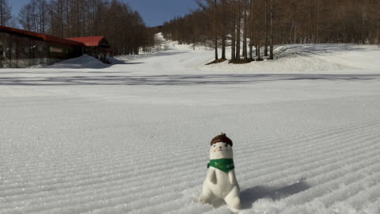

すっきり晴天で．

そして，朝から+4℃と気温が高かった

ようで…(涙）

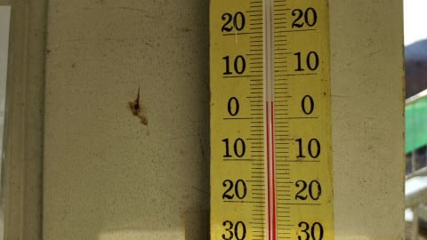

でも，早朝気温が冷えたのか，

朝イチは結構カリカリバーン！

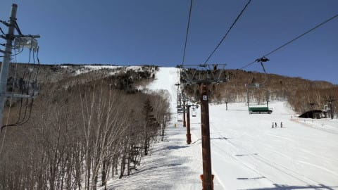

でも，日が当たるところはすぐに

緩み始め…

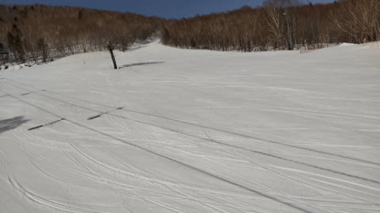

朝10時には，奥志賀エキスパートコースは

かなりザクザクになっていたようです…

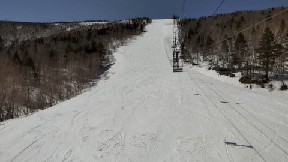

ザブザブというより，ザラメ状のザクザク

雪ですね，これは．

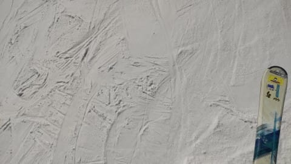

でも，昼間の気温は+7℃を超えて．

さらに晴天となると…

うん．

バーンややっぱり緩んでいきますね…

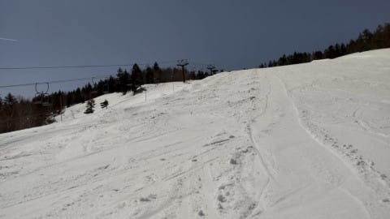

昼近くには，やはりもう雪が緩みきった

ようです…

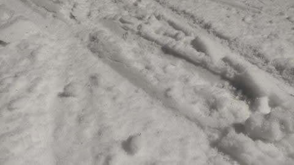

しかし．

焼額オリンピックコース．

雪がまだ全面についていて，とてももう

営業が終わっていると思えませんね…

もったいない！！

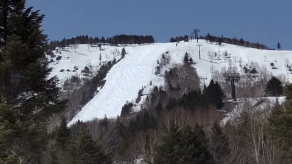

とは言うものの．

奥志賀も雪寄せが始まったようですし．

GWまで営業に向けた準備が着実に進んで

いるようですね…！

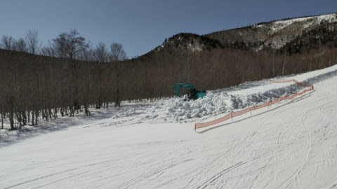

で．

続いては4月2日分．

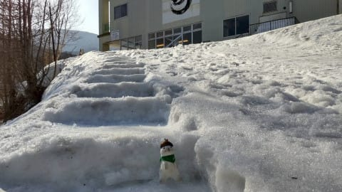

あさイチの奥志賀山麓では，

気温は+7℃以上と…

これは，異常に暖かいですね(泣）

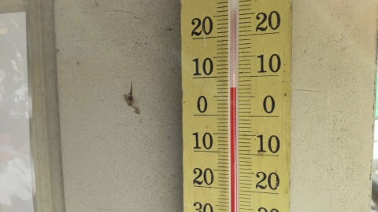

今日も晴天！

朝はシマシマバーンですが，

あさイチから雪はしっとりしていたようで…

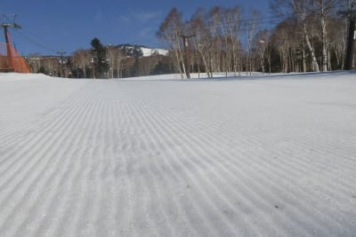

1本目はシマシマで良かったようですが．

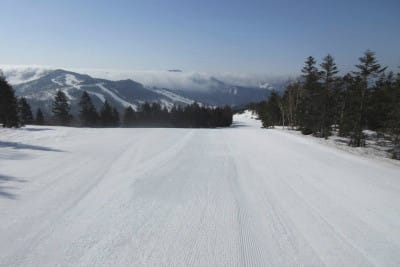

すぐに雪は緩んじゃったようです…(涙）

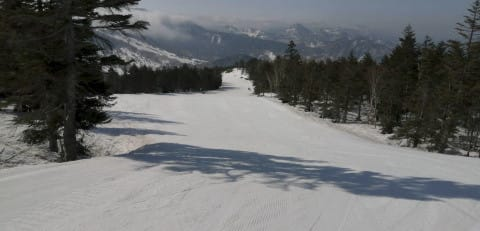

一の瀬方面は，10時過ぎくらいまでは

そこそこいい感じだったようですが…

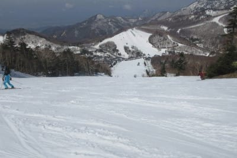

一の瀬も高天ヶ原も，昼前には結構重い

雪になっちゃったようです．

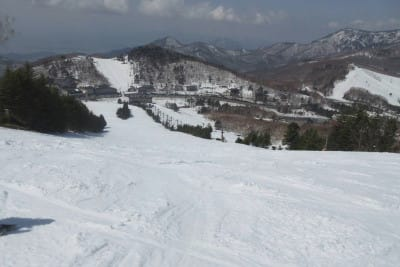

これだけ気温が高いと，日差しが

むしろ恨めしい…

でも，高温なわりに雪は張り付くことが無く，

結構滑りがいい雪だったようなので．

そこが救いかな！

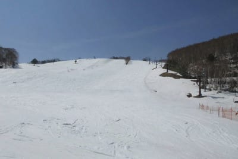

やっぱり，午後にはザクザクボコボコに

なって，疲れる雪になっていったようですが…

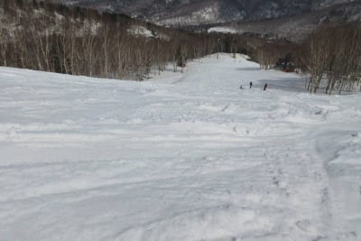

でも，ラストリフトの時間まで，雪が張り付く

こともなく．

滑りがいい雪をキープしてくれたようです！

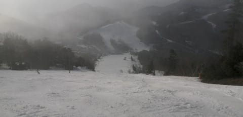

先日の黄砂の影響を心配したけど．

雪が滑ってくれるようで一安心…

で．

この週末の天気ですが．

土曜は一日晴れそうですね．

朝から気温はプラスで，

昼間の気温は+10℃近くになり．

ザブザブ春雪になりそうですが…

そして．日曜は朝は曇り．

この日も朝からプラス気温なので，

朝から雪は緩いと思います…

そして．

午後に来ます．

また，液体が…(涙）

降り始めは早くて昼ごろ．

遅ければリフト終了ごろ…

という，また先週のリプレイかと

思うような予想ですが．

風は強くないので，リフトは

止まらないです！

しかし…これで日曜営業時間中に

雨が降ると．

5週連続の週末雨

ですね(泣）

ここしばらく，呪われてる…（激涙）

## 💬 コメント一覧

### 💬 コメント by (Northfox)
**タイトル**: やはり死んでいましたか．．．
**投稿日**: 2021-04-03 10:11:04

凄まじい激務ですね😢

随分前ですが．．．さぁそろそろ帰るか、という22時過ぎの会社に得意先から電話がかかってきて、資料を用意してほしいとのこと。いつ頃必要でしょうか？と訊いたら「明日の朝で大丈夫です👍」というのを思い出しました。😫

昔は酷かった、というかS様は今もその状況なんですね。

### 💬 コメント by (AK)
**タイトル**: Unknown
**投稿日**: 2021-04-03 13:10:58

S様ご無体が続いているようですね…夜中12時過ぎまで会議で朝迄の仕事をぶち込まれるなんて一体どんな仕事なのか、年収1億貰わないと割に合わないですね。

最近は特派員様方の情報でゴンドラ混みを避け志賀を敬遠してたのですが日曜日久しぶりに志賀へ行く予定です。

午前中勝負一ノ瀬寺子屋狙って行きます。

ご挨拶できればよろしくお願いします。

### 💬 コメント by (ikkun)
**タイトル**: Unknown
**投稿日**: 2021-04-03 19:51:18

あー我がゲレンデも28日強風に結構な雨「去年も……俺雨男だからなあ(・・;)」と準指導員試験の為に教えてを頂いた指導員様しかしそれも迷信ですからと慰めました(笑)三日間午前中のお得意様お子様を５人さんの違うゲレンデでレッスンでしたさすがに土曜混み混みでした❗しかし改めてちびっこの笑顔はいいなあ😆

### 💬 コメント by (Skier_S)
**タイトル**: 雪が減ったよ…（涙）
**投稿日**: 2021-04-04 02:46:14

＞Northfoxさま

「明日の朝で大丈夫です」って，全然大丈夫じゃないですよね（笑）．

何とか今週はスキーに来れましたが，今後もどうなることやら…

＞AKさま

確かに，年収1億もらえるならやってられますが，

年収1億より

スキーができる生活の方がありがたい…

今日は一日焼額張り付きでした．

明日は熊の湯で試乗予定なので寺小屋には行けないと思います…

>ikkunさま

5週間連続で週末雨ですから（涙）

雨男伝説を信じたくもあります…

雨はいいから，雪が降ってほしいです…

