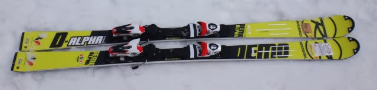
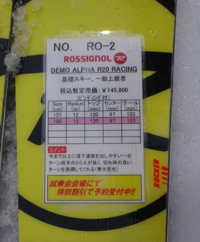
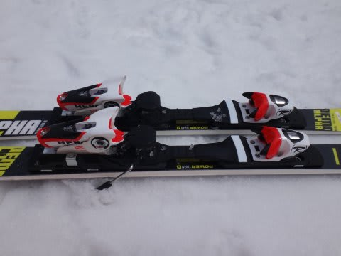
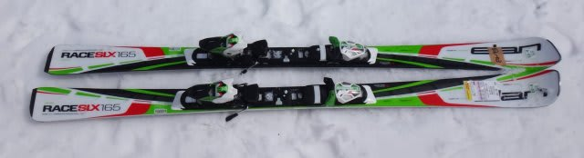
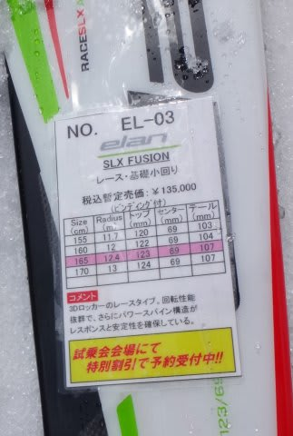

# 2015シーズンモデルのスキー試乗レポート第9回…ROSSIGNOL＆ELAN編

📅 投稿日時: 2014-04-04 01:58:55

🏷️ カテゴリ: [スキー板試乗](c0bd8048615710cee890e403a36cc9a2b.md)

えー．

どうやら，今晩の志賀高原．

雨が降っているようですが．

金曜からは雪になりますので，ご安心を．

金曜の夜から土曜にかけては，この時期としては

かなり恵まれた冷え冷えの雪が積もりますよ～！

…で，土日とも．

予想通り，冷え冷えなんですが．

日曜に，日が射すかどうかはまだ微妙で．

土日とも，雪が降ったり雲が切れたり，目まぐるしい

天気かな～．

でも，「真冬か？」って寒い週末になりますよ～！！

ってことで．

今日も試乗のレポート，行きます！

今回は，ロシニョールとエランです．

では，どうぞ～！

--

ROSSIGNOL DEMO ALPHA R20 RACING 165cm

基礎小回り．

これは，強い．

フレックスが強い．

DEMO ALPHAは，強いR20プレートが付いたモデルと，

比較的ソフトなTPXプレートのついた「ソフト」タイプの

2モデルがありますが．

こっちは，R20のついた，強いほうです．

かなりフレックスが強く，脚力がないとたわませられないです．

スピードが出ない領域では，サイドカーブに乗って

エッジの線で曲がっていく感じ．

スピードが出ていくと，たわませることができるけど．

かなり実用スピードは高い．

グリップも強く，サイドカーブは結構きついので，スピードを出していくと

小回りになっていきます．

コア材がかなり強い，トップのSL競技用に近い．

この板の性能を出し切るスピードレンジは，けっこう高め．

履いた感じも結構どっしりしているので，普段のゲレンデ履きには，

ちょっときついか…

DEMO　ALPHA　SOFTがあるから，ゲレンデ履きはそっちで…って

感じでしょうか．

R20プレートの方はかなり強力な板になっている感じ…．

ELAN RACE SLX FUSION 165cm

SL競技用．

これは…

強烈な小回りスペシャル．

板がすさまじいほど回る．

いや，回したくなくてもあり得ないくらい回る．

上体をフォールラインにキープしてまっすぐ滑っていくと，

下半身は勝手に板に回されて小回りしていってしまうような．

超オートマチックで自動的に小回りをさせてくれる，

小回り強制マシーン．

大回りは絶対無理です（笑）．

競技用で，ここまで回っていいの？？？

上体をまっすぐ落としていけば，しっかりエッジの線に乗って，

板が体の下で全自動でに左右に入れ替わっていってくれる感じで．

…ある意味，面白いけど．

一日この板を履いていたら，すごい疲れるかも…
