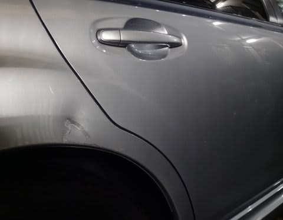
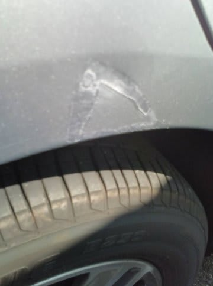
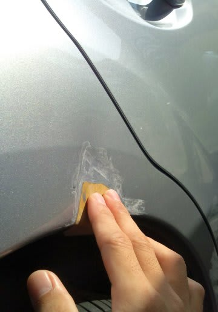
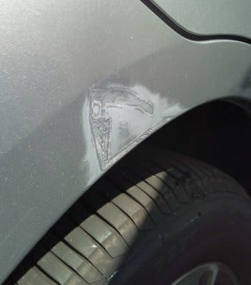
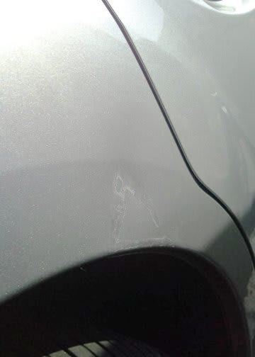
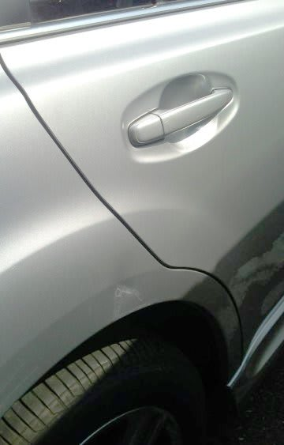

# そして，レガシィ君の傷を処置してみた

📅 投稿日時: 2014-10-31 01:40:12

ということで．

悲しくも駐車場で当て逃げされたらしい，

我がレガシィ君．

とりあえず．

貧乏金なしの我が家．

モノの修理にはお金をかけず，

最大限自分で直す！

…ってのが，基本なわけで．

…だけど．

これだけの傷だと．

完治は無理だなぁ…（涙）．

まぁ，ちょっと目立たないくらいには

頑張ってみましょう…

と．

とりあえず，タッチアップペイントを

カー用品屋さんで買ってきて．

んで．

塗ってみました．

…ダメだよ．

…ぜんぜん，ダメだ．

まだ，目立つ…

だもんで．

1000番→2000番と，サンドペーパーで磨いてみて．

ちょっと表面を滑らかにしてみて…

そのあと，必死に，

コンパウンドで磨いてみました．

…

でも．

…頑張ってはみたものの．

…こ，この程度が，限界か…

塗装が剥げた部分をもう少し広範囲にサンドペーパーで

磨いて，塗装はがれの段差をなくしてからスプレー吹き

すれば，もう少し目立たなくなるのかもしれないけど．

…凹んじゃってるのもあるし．

筆塗りタッチアップペイントでこの程度なら，

良しとしておこう…（ちょっと涙）．

