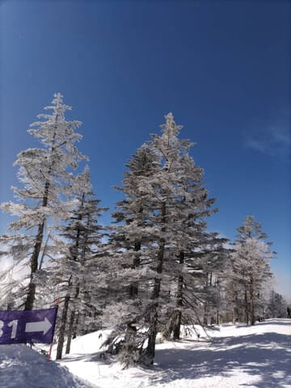
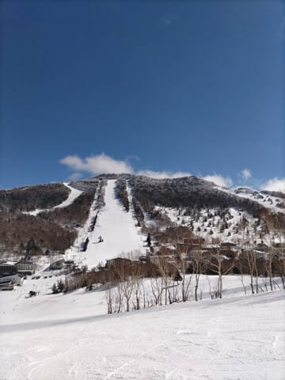
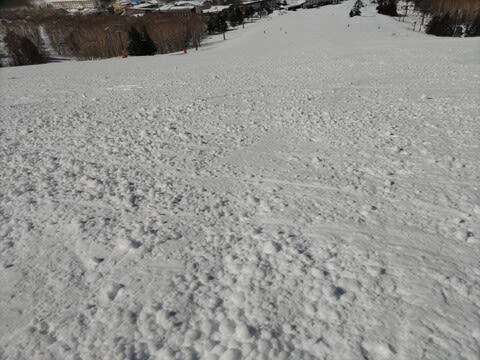

# 2月16日(金)の志賀高原スキー場は積雪数㎝，雨で固まった後に冷えてガチガチアイスバーンの下地(涙)．土曜はかなり固めバーン覚悟，日曜昼間は高温で緩むか．

📅 投稿日時: 2024-02-17 00:21:59

えー．

今週は，かなりきわどい感じがありながらも．

何とか土日でスキーに行くことにしました…

いや，仕事が終わってないので，スキーに

行って大丈夫かどうかかなり微妙ですが…

まぁ，火曜締め切りの仕事だから，

日曜夜と月曜の自分に期待して，

とりあえず週末はスキーに行く！！←壊滅する予感しかない

昨日，おとといの2日間，一日はBlogも

書けず，ほとんど布団で寝ずに

頑張ったから，ご褒美にスキーに行くのだ！！！

…と，思っていたら．

本日の志賀高原．晴天ながら

気温が冷えたらしく…

あさイチは-9℃，昼間もマイナスキープ

だったようで…

昨日の夜の雨で融けた雪がマイナス10℃

近い低温で冷やされた，かなりのガリガリ

バーンだったらしく…

夜中からの雪でアイスバーンが覆われる

ことを期待したけど，積雪はわずか

数㎝で，バーンは固め＆広い範囲で

殺人コロコロ大量発生のかなり辛い

バーン状況だったようです…

あぁ…

先週末まではいいコンディションだった

のに…(涙)

で．

週末の予想は大体昨日と同じで，

土曜：晴れ．朝は放射冷却で-7℃

　くらいか，

　朝から気温が上がり，昼間は0℃を

　越えてくる．

　朝からかなり固めのバーン，

　ところどころコロコロあり(涙)．

　昼間は南斜面はちょっと緩んで

　滑りやすくなる．

日曜：この日も終日晴れ．

　朝は-3℃程度だけど，

　ぐんぐん気温が上がる．

　あさイチバーンは固め．

　南斜面はちょっとコロコロが出るか？

　昼間は+5℃くらいまで上がりそう．

　強い日差しですぐに雪が緩み，

　日差しが強い南斜面は春スキー

　のようなざぶざぶ雪に．

　西～北斜面はしばらくは固めを

　キープするかもしれないけど，

　午後はやっぱり緩む．

という感じでしょうか…

うーん．

とても2月の週末と思えない天気図で，

見てがっかりしてますが…

まぁ，晴れた春スキーだと思えば

晴天でいいのかも．

でも．

さらに来週は20～22日まで，

梅雨のような雨空が続きそうなので…

来週はさらにコンディション悪化する

可能性が…（涙）

なので．

今週は最高と言えないまでも，

今のうちに滑っておいた方が

良いのかも…

で．

もう深夜12時半だよ（泣）

あと3時間後に出発です…

3時間寝られない（涙）

こんな睡眠不足で，300㎞運転して

志賀高原に無事に行けるのか？？←そこまでしてスキーに行くか？？

とりあえず，今週末も志賀高原で

お会いしましょう～！
