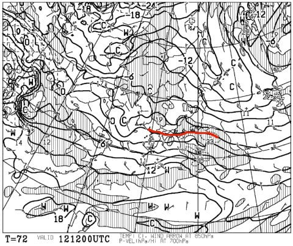
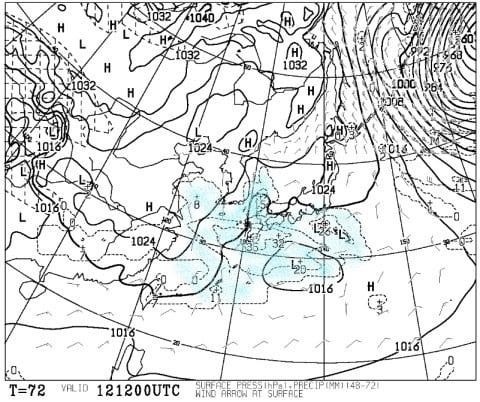
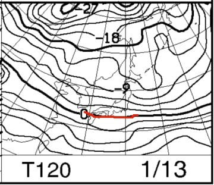
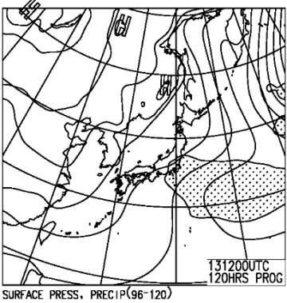
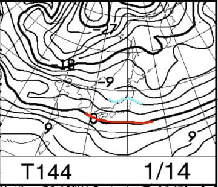
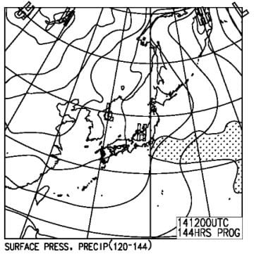
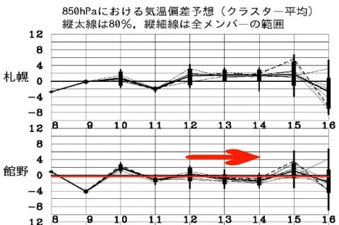

# 1月12,13,14日の3連休の志賀高原スキー場の天気は…晴れ～曇りで，積雪はなさそう．吹雪いたりせず，穏やかな日が続きそう

📅 投稿日時: 2019-01-10 03:04:58

えー．

やはり，今日の志賀高原．

予想通り，かなり積もったようですね…！

焼額のウェブページを見ると．

新雪が50cmほど積もったように

書いてありましたね．

ちょっと吹雪いたようですけど，

朝のパウダーは楽しかったん

でしょうね…（滑れた人をうらやむ目）

明日はいい天気になりそうで．

最高のスキー日和だと思います…

そして．

10日夜から11日朝にかけても，

ちょっとだけ積もりそうです．

5～10cm程度かな．

…しかし，そのあとはしばらく雪が

降らなさそうな気配…

ってなことで．

今日は水曜深夜恒例，週末の天気予想です！

…とりあえず，今週末は3連休なので．

月曜日までの予想をしてみましょうか…

まず．

土曜日12日の850hpa気温図ですが．

赤い0℃線は太平洋側まで下がってますが．

志賀高原は－3℃線がかかっている程度

なので．

志賀高原に－9℃線や－12℃線がかかっていた，

冷え冷えの正月前後と比べると，気温が

高めですね…

とはいえ．

0℃を超えてないので．

雨が降るとか，雪が解けるとかそういうレベルの

高温ではなく．

焼額山頂では，昼間の最高気温が0℃を下回る程度…

という．

スキー場として過ごしやすく，冷えすぎて

いない感じでしょうか…

で．

土曜の地上天気図は．

水色に塗った降水域は，西日本から

太平洋側のみ．

志賀にはかかっていないので．

雪は降らなさそうです…

というか．

朝は晴れそう．

午後から雲が増えていく感じかな…

この日は，気温も冷えすぎず．

天気も晴れそうで．

あさイチは最高圧雪が楽しめるかな！

そして．

3連休中日の日曜ですが．

850hpa図は…

うむ．

この日も0℃線は太平洋側まで南下してます．

志賀高原は－3℃線がかかるかどうか，

というレベルなので．

土曜と同じくらいの気温ですね．

で．

地上天気図を見ると…

網掛けの降水域が志賀にかかっていないので．

この日も雪は降らなさそう．

昼間は雲が多めかな…

最後は，3連休最終日の850hpa図ですが．

うーむ．

この日は，土日よりちょいと冷えますか．

水色の－6℃線が志賀高原に近づいてますね…

朝の放射冷却が入らなければ，

朝は－8～9℃程度かな．

で，地上天気図を見ると．

網掛けの降水域が志賀にかかっていないので．

この日も雪は降らなさそうだけど…

でも，晴れるか曇るかは，まだ微妙な所．

とりあえず，この3連休．

雪は全く降らなさそうです．

3連休の最後の方は，雪が薄い急斜面とかは，

ちょっとカリカリした感じのバーンに

なっていくかも…

ってな感じで，まとめると．

3連休初日土曜日：朝はおそらく晴れ．

　晴れれば放射冷却で－10℃程度まで冷え込むか…

　朝イチは最高シマシマ圧雪！

　昼間の気温は0℃近くまで上がり，

　それほど寒くない．

　午後は雲が増えていくか…

　でも，雪は降らない．

　雪質は終日いい感じを保って，

　午後は多少荒れるかもしれないけど，

　新雪が積もってないのでひどい凸凹には

　ならなさそうかな．

　かなりいいコンディションの一日になりそう．

中日日曜日：この日は終日曇り空かな…

　この日も，雪は降らない．

　朝は-5～6℃程度．

　朝イチシマシマは，良く締まった

　最高のコンディション．

　昼間は土曜と同じ，0℃近くまで上がる，

　それほど寒くない一日．

　この日も雪質は終日いい感じを保って

　くれそう．

　人が多いから，午後はやっぱりゲレンデは

　荒れてくる．

　人が多い急斜面は，削れて硬いバーンに

　なっていくかも…

最終日月曜日：この日は，曇るか晴れるか微妙．

　とりあえず，雪は降らない．

　朝の放射冷却が入らなければ，

　朝は－8～9℃程度かな．

　朝イチは，かなりしっかり締まった，

　ハイスピードシマシマバーンになりそう！

　昼間の最高気温は-3℃程度．

　木曜朝以降，雪が降ってないので

　ゲレンデは締まり気味．

　急斜面なんかでは，硬めの下地が出てきそう．

　雪は締まっているし，3連休最終日は

　午後はガラガラだから，夕方まで結構な

　フラットバーンをキープするんじゃないかな～．

ってな感じで．

パウダーには恵まれなさそうな3日間で…

これすなわち，まったく雪が降らなさ

そうな3日間ということなので．

寺子屋や東館など，ちょっと雪が薄いゲレンデは

厳しくなっていくかも…

でも，吹雪いたりすることもなさそうだし．

凍死するかと思うほど寒いこともないだろうし．

比較的穏やかな，スキーにちょうどいい3日間に

なるんじゃないかな～．

とりあえず．

一か月予想では，10日以降に高温が

予想されてましたが．

こんな感じで，10日以降も平年並みの

気温で推移してくれそうなので．

そんなに雪も悪くならないだろうから．

結構いい感じの3連休になるんじゃないかな．

曇りじゃなく，晴れてくれれば最高なんだけ

どな～．
