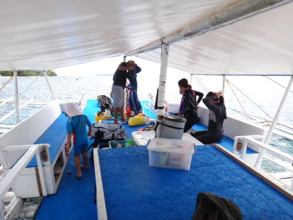
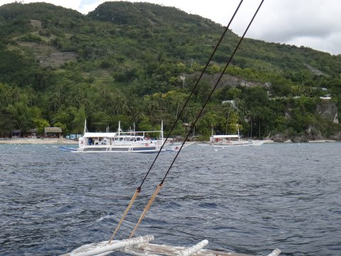

# 2013年11月　フィリピン・オスロブ　子連れでジンベエを見るぞっ！　その5

📅 投稿日時: 2014-07-10 00:34:50

ってわけで．

今回は，妻がダイビングで．

私が娘とシュノーケリングと相成ったわけですが．

（ホテルの外観）

このショップでの，オスロブのジンベエツアーの基本は…

朝イチにオスロブへ行って，まずはジンベエダイブorシュノーケリング，

そのあと，スミロンへ移動し，1ダイブorシュノーケリング，

それからスミロン島海岸でお弁当を食べて，

昼過ぎにショップへ帰着…

…というパターン．

オスロブにジンベエが来るのは午前中だけらしく，

オスロブツアーは午前だけらしいんですね～．

んで．

オスロブツアーからの帰着後．

希望者はオプションの午後のボートで

1本潜りに行ける…という感じ．

今回．

私が午前中は2本ともシュノーケリングで

娘の世話，

その代り．

午後は妻は娘とホテルに残り，

私一人で午後のダイビング…

とゆーことに落ち着きました．

（ダイビングショップ前の景色）

何にしろ，今回．

『突発性ジンベエを見たくてガマンできない病』

の治癒が，超最高最優先のミッションなので．

午前のジンベエダイブは妻に潜ってもらい．

…そして．

ミッションが完了し，病気が治癒された（はずの）

午後には，代わりに私が潜りに行きましょうね～！

というパターン．

ということで．

ショップでは，かんたんなブリーフィングを受けます．

「ジンベエには触らない」

「ジンベエが向こうから近づいてきても，避ける！」

「ダイバーは必ず着底．中層禁止」

「フラッシュ撮影禁止」

って感じの，極めて基礎的な説明を受けたあとは．

ショップ前からこんな感じの小舟に乗って

沖に泊まっているバンカーボートに向かいます．

フィリピンで潜るのは，Cカードとった

直後以来だなぁ…

バンカーボートはそれ以来ですな．

バンカーボートの上は結構広いなぁ…

前に乗ったボートは遅かったけど，こいつはそこそこ速いですな～

…しかし．

船に乗る姿がサマになっている娘だこと…

娘も，ジンベエシュノーケリングに向け，

ライフベストを着せてもらいました．

（ライフベスト要らないんだけど…とちょっと不機嫌な娘）

…まぁ，うちに娘はベストは要らない気もするけど．

他の大人のシュノーケラーもみんな着てるし，

とりあえず着ておいてもらいましょう…

ってことで．

ルビリゾートから，30分ほどでオスロブ到着です！

さぁ．

ジンベエ様，いるかな～？？
