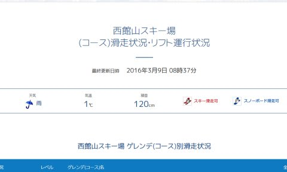
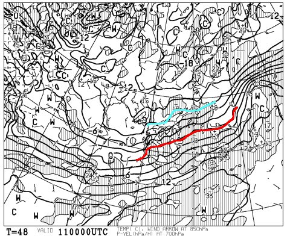
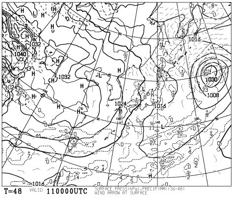
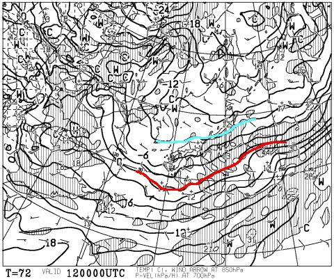
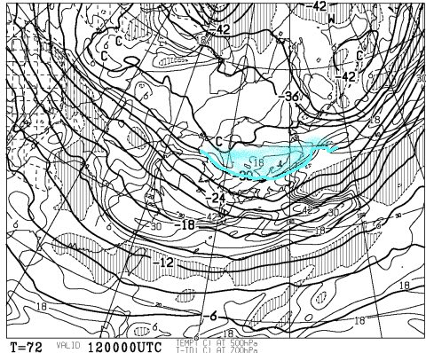
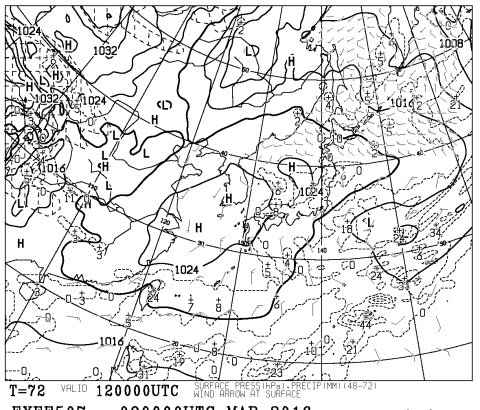
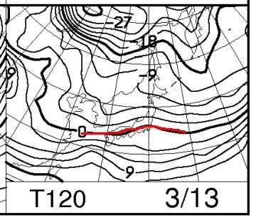
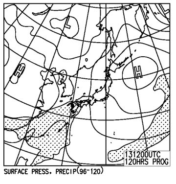

# 今週末の志賀高原の天気は…土曜は冷えていい天気！．．．なれども．雪が積もらない…（涙）．

📅 投稿日時: 2016-03-10 00:58:05

ってことで．

本日，水曜日ですが．

…なんだか，朝は志賀高原でも．

残念ながら標高が低いところは雨だったようで…（涙）

[焼額も，午前中はみぞれ](https://www.facebook.com/yakebitaiyama/photos/a.133097176785637.26773.116999658395389/948913415204005/?type=3&theater)だったようです（泣）．

雪が…雪が解けていく…（激泣）．

でも．

かなり冷え込む予想の，明日以降．

冷え冷え雪が降って，今週末のゲレンデ状況は

改善するのか？？

…というあたりを，予想してみましょう…

まず．明日10日は．

うーむ．

全く，雪が降らなさそうですね…（涙）．

そして，金曜11日の850hpa気温予想ですが．

ふむ．0℃線ははるか南．

志賀高原は-6℃線と，青く印した-9℃線に挟まれてます．

これは．

朝イチは，-10℃クラスまで冷えそうな，

この時期としてはかなりいい感じの予想ですね…！！

で．

金曜の地上天気図を見ると．

…なんだか，すごい微妙…

きれいな冬型になってくれず．

雪はちらつくかもしれないけど，

そんなに積もるほど降る天気図じゃないんですけど…（涙）．

なぜ…なぜ，今シーズンは冷えると降らないんだろう…（泣）．

そして，土曜だ．

12日，土曜の朝9時の850hpa気温図を見てみると…

をを！冷えてる！

志賀高原には-9℃線がかかってます！

これは，2月のトップシーズン並み．

チョーいい感じの冷え込みで，朝は-13℃とか，

そのくらいまで冷えそう！

なんてったって，500hpa図では…

こんな感じで．

そこそこの雪の目安である，青くマークした-30℃の

寒気が下りてきてます！

3月としては，結構恵まれた感じ！

…と，すごく期待して，土曜の地上天気図を見てみると…

ううううううーーーむ……び，微妙だ…

きれいな冬型じゃなく，新潟の北に微妙な高気圧が…

こいつが邪魔をして，あんまり雪が降らなさそう…（涙）．

朝まで雪がちらつくかもしれないけど…

それほど大量に積もる感じじゃないよ（泣）．

なぜ…

なぜ，3月にしてはすごい冷えなのに．

雪が積もらないんだ…？？（残念）．

で．

日曜13日の850hpa気温を見てみると．

まぁ，0℃線は東海地方ぐらいなので．

志賀高原はボチボチの冷えかな．

地上天気図は，こんな感じで…

高気圧に覆われるので，朝から晴れそう．

うーーん．日曜も，全く積雪は期待できず…（泣）．

だもんで．

この週末の天気をまとめると．

土曜：前の日からうっすら積雪があるかな…

　　道路は凍結＆積雪路面になりそうなので，注意！

　　天気は，曇り時々雪がちらつき，その合間に晴れ間も覗くような，

　　コロコロ変わる天気．午後は晴れ間が増えていくかも…

　　朝は-10℃以下の，超冷え冷え．

　　朝イチのゲレンデは，冷え冷えのいい雪が圧雪され，

　　その上に冷え冷え雪がうっすら積もった感じで．

　　Goodコンディション！！

　　午後に向かって，上に乗った柔らかい雪がはがされ，下地の

　　固いバーンがコンニチハしてくるかな…

　　とりあえず，終日冷え冷え，寒い一日です！

日曜：朝から終日晴れそう．前日からの積雪は無く，朝は-10℃近くまで冷える．

　　朝イチは締まった圧雪の，快適ハイスピードバーンが楽しめるかな…

　　午前中から気温が上がっていくけど，プラス気温まで行かない．

　　でも，強い日差しで南斜面は雪が緩み気味になるかも…

　　日差しがあたらない斜面は冷えたまま．

　　昼ごろには，また下地に固い斜面が出てくるかな…

…という感じで．

冷え冷えになるものの，積雪が期待できなさそうなこの週末（涙）．

固い下地に悩まされなければいいんだけど…

とりあえず．

ここは．

引き続き，休まず止まらず

11日に奇跡の積雪があって

週末は最高のコンディションに復活する踊り

を，ひたすら踊り続けます．

きっと，土曜にはいい雪になっているに違いない…

いや．

いい雪になるはずだっ！！！

## 💬 コメント一覧

### 💬 コメント by (いか)
**タイトル**: Unknown
**投稿日**: 2016-03-10 21:07:47

今週末はやっと冷えるんですね...、なんで私がいけない週末に...

はっ、行かないと冷える...ということで埋められないように気を付けないと(笑)

冷え冷えの締まったバーンの大回り、楽しんでください！

### 💬 コメント by (Skier_S)
**タイトル**: いかさま
**投稿日**: 2016-03-10 23:50:17

いや…

今週末，冷えますけど．

あんまり積もらなさそうなので…

ヘタするとまた全面アイスバーン祭りに

なりかねない状況です（涙）．

まぁ，今もちょっと雪が降っているようなので，

完全アイスバーンにはならないかな～，と

思ってますが…

とりあえず，冷え冷えバーン滑ってきます！

