# 3月16，17日の週末の志賀高原スキー場の天気は…土日とも晴れそうだけど，気温も上がるよ(涙)　まぁ3月の春スキーと思えばのんびり晴天で滑れるかな．

📅 投稿日時: 2024-03-14 02:17:24

えー．

本日の志賀高原．

特派員からの写真はなかったのですが…

焼額山のライブカメラを見ると．

朝は40cm近く積もったようですね…！！

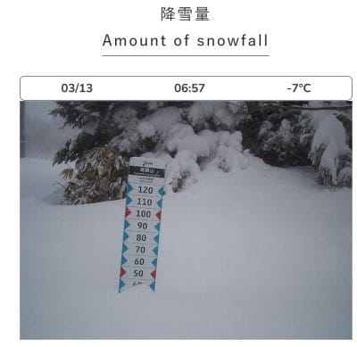

（[焼額山スキー場ライブカメラページ](https://www.princehotels.co.jp/ski/shiga/livecamera/)より）

焼額山のFacebookも積雪40～50㎝と

書かれていますね～！！

…でも，本日は強風で第2ゴンドラは

終日運休だったようです．

第1ゴンドラは動いたけど，減速運転

が続いたみたいですね…

北風なので，奥志賀ゴンドラはヤバいかと

思ったけど，焼額は大丈夫だろうと思って

ました…

第2ゴンドラが止まるほどとは予想できなかった…

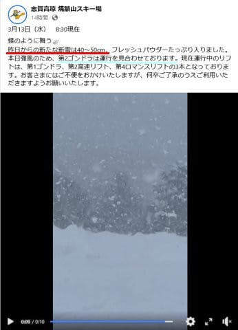

（[焼額山スキー場Facebook](https://www.facebook.com/yakebitaiyama/videos/2130005227352472)より）

ちなみに．

これだけ降ったのに，焼額山のライブカメラ

を見ると…

今晩も，人工降雪を打っているようです！！

うーん．

これだけ天然雪が積もったのに，まだ人工

降雪を打ち続けるとは…！

とりあえず，何とかちょっとでも営業期間を

伸ばそうというこの努力…！！

素晴らしい…！

ってな感じで，先週に引き続きまた

そこそこの雪の入荷があった志賀高原．

このままいいコンディションで週末まで

盛ってくれるのか？？

いつも通り，天気図を見て占ってみましょうか…

まず，14日(木)の850hPa図を見てみると…

うーーん．

志賀高原には水色の-3℃線がかかる程度

なので．

この時期としてはちょっと気温が高め．

これで日が射すと，ちょいと昼間は

雪質が緩むかも…という気温．

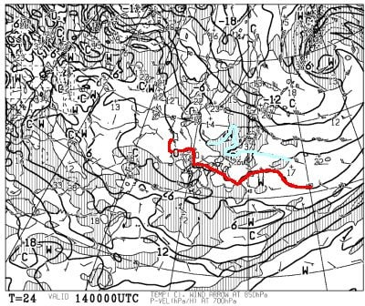

そして，この日の地上天気図は…

うーーーーん．

高気圧が西から広がってくるので，

基本的に晴れそうですね．

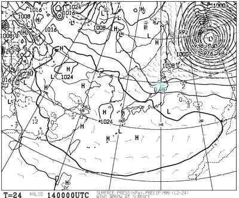

ただ，この日，14日木曜は

850hPaの気温は高いけど．

500hPaの気温が，そこそこの雪の

目安となる赤い-30℃線が志賀に

近づいているので…

基本的に晴れそうなんだけど，

もしかすると時折雪雲が飛んできて

パラパラと一瞬雪が降るタイミングも

あるかも？？

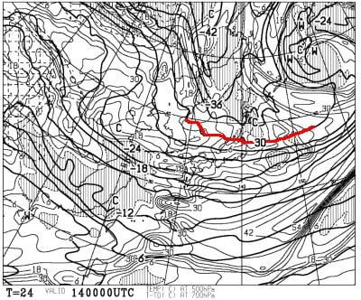

そして次の日，15日(金)の850hPa図を

見てみると…

あーー．

赤い0℃線が志賀に近づいてる…(涙)

これは，日差しがあると雪が緩む

気温ですね．

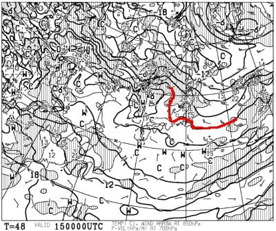

で，この日の地上天気図は．

引き続き高気圧が停滞するし，

西風なので…

明らかに志賀高原は晴れそうで．

昼頃から，重い春の雪になりそうな

予感…

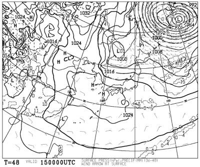

続いて，肝心な週末，16日(土)の850hPa気温

を見ると．

あふーーん．

赤い0℃線が志賀にかかるくらいの勢い…(涙)

まだ赤い0℃線が志賀より南にあれば，

日差しがなければ雪質はキープして

くれるんだけど…

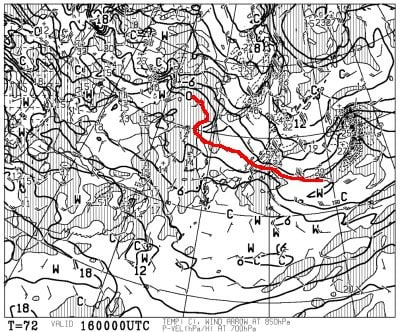

日差しがあるのかないのか？

この日の地上天気図を見ると…

ダメですね．

高気圧に見事に覆われ晴れそうです．

いや，晴れてくれるのはいいんだけど．

雪は春の雪になっていきますね…(泣)

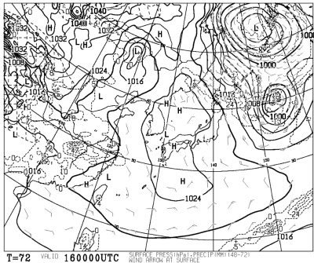

で．

最後に17日(日)の850hPa気温を見ると．

うううーーーん．

この日も微妙に，赤い0℃線が志賀より

わずかに北に行ってるっぽい…

この日も気温がちょっと上がりそうで，

日差しがなければいいけど，日が当たると

危なそう…

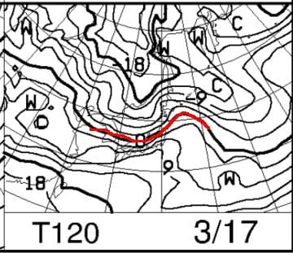

日曜の地上天気図は．

西から網掛けの降水域が近づいて

いるけど．志賀高原にはかかって

いないので…

朝のうちは晴れ，午後はくもりか…

ただ，まだこの日の予想ばらつきは

大きいので，日曜の予想はまだ不正確です．

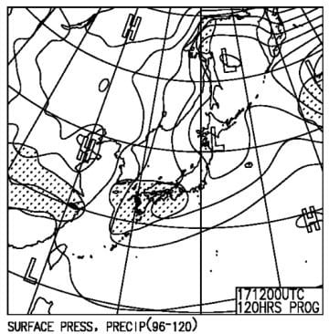

ってな感じで．

まとめると…

14日(木)：おそらく朝から晴れ．

　朝の気温は-5℃くらい．

　天気は晴れ，雲が飛んできて

　雪がわずかにぱらつく一瞬があるかも．

　あさイチは最高のシマシマ！

　ただ，昼間は0℃近くまで気温が

　上がり，日差しが当たる南斜面は

　雪が緩む

15日(金)：終日晴れ！

　朝の気温は-4℃程度．

　あさイチは冷え冷えの締まったバーン

　だけど，前日日当たりが良かった

　ところはコロコロ発生注意報．

　昼間は気温が上がり，

　日当たりが良いバーンは午前中，

　悪いバーンも昼過ぎには重い湿った

　雪になっていく

16日(土)：この日も終日晴れ！！

　朝のうちは雲が多いかも．

　あさイチの気温は-5℃程度？

　朝は締まり気味のシマシマバーン．

　だけど，すぐに崩れてコロコロ

　バーンになっていきそう．

　昼に向かって気温が上がり，

　昼間は山頂でもプラス気温．

　さらに日差しも強いので，

　コロコロは緩んですぐにつぶれて

　ちょっと重めの3月らしい雪に

　なっていく．

　午後は重い雪が凸凹になって

　行きそう…

17日(日)：朝は晴れ．

　あさイチの気温は…まだ予想が

　難しい．-3℃くらいか？

　あさイチは固めに締まったハイスピード

　バーン．

　日差しで表面が緩み，エッジが効く

　いい感じの硬め斜面になるかも．

　昼間はかなり気温が上がり，

　午前中から表面がしっとりした雪に．

　昼頃には全面ザクザクした3月の

　雪になっていく．

　もしかしたら，午後は天気が崩れて

　行くか…

　まだ午後の天気がどうなるかは

　予想ばらつきが大きく読めない．

といった感じでしょうか…

まぁ，日曜の午後がどうなるかまだ

正しく読めないけど．

土日とも基本的に天気は良さそうです…！

…天気がいい代わりに，日差しで雪が

緩みそうですが（ちょい涙）

まぁ，もう3月だし，春スキーで

季節相応の雪だと思えば，いい天気で

楽しめそうな週末です．

…で．

週末以降の来週，18日以降ですが…

下の図を見てわかるように，

今週末15，16日と平年比+4℃くらいに

なるのに対し．

なんと．

来週月曜の18日以降，少なくとも20日に

かけて，今度は平年比-4℃くらいに

冷えそうです…！！！

すばらしい…っ！！

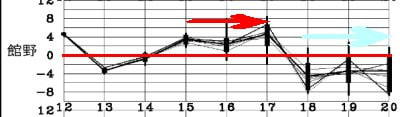

おそらく，18日以降，しばらく雪降りの日が

続いて…

来週1週間は，今週よりも雪が積もりそう！！

いや…

これ，来週も積雪が期待できます！！

2月のうちは，

3月いっぱいまで雪がもつのか？

…というくらいに心配していた

積雪量の少なさだったけど，

これなら3月いっぱいは雪は問題なく

もちますよ～！！

このまま，4月もそこそこ冷えてくれることを

期待…！！

## 💬 コメント一覧

### 💬 コメント by (地元民)
**タイトル**: Unknown
**投稿日**: 2024-03-14 02:39:21

郷も午前いっぱい雪降りでした。なかなかの降りっぷりでしたよ。

3月に入って、山ではト━タルで200㌢くらいは降ってんじゃないですかね?

でも、積雪量が170〜180㌢で、いっこうに増えないのはなぜ?

### 💬 コメント by (Skier_S)
**タイトル**: ＞地元民さま
**投稿日**: 2024-03-15 02:57:28

3月に入ってから，2月よりよっぽど積もってますよね…

でも，志賀もやっぱり例年に比べれば少ないです（涙）

今の感じだとGWは厳しいですね…

来週積もってもう少し回復しそうですが，4月も冷えてほしい…

