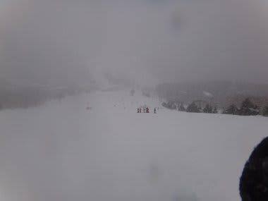

# ３月17日土曜日の志賀高原速報

📅 投稿日時: 2012-03-17 23:11:25

🏷️ カテゴリ: [2012スキー滑走日記](cca3a0e9524e0203150f790b1fc3c71ad.md)

…雨，でした．

いや，朝のうちは雪だったんっですがね．

…雨だと言い切っていた私の天気予報は，この部分で

外れてるんですが．

雪って言っても，ウェアにつくとびしょびしょになる雪．

さらに．今日は強風で焼額ゴンドラは2本とも終日運休．

第2高速も午前中は止まり，午後には第3高速も止まりました．

昼には，完全に雨に…

ザーザーぶりではないですが，結構降りました…

もう，春ですね…(涙)

午後5時ごろには止みました．

今は降ってません．

明日は晴れるかな？？
