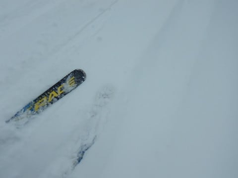
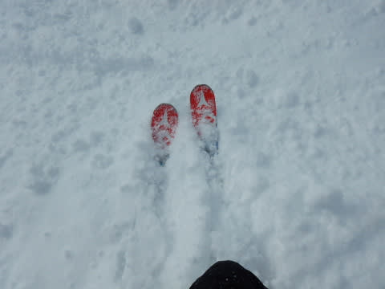

# 2019/2/10(日)，3連休中日の志賀高原スキー場は…激混み，そのせいで雪は激荒れ．悲しい一日（涙）

📅 投稿日時: 2019-02-10 23:36:45

🏷️ カテゴリ: [2019スキー滑走日記](c3e4496fc0fb7f9c17ff21214a35b1ace.md)

ということで．

3連休中日も，志賀高原スキー場を滑っていた

わけですが．

…今日は，悲惨でした（涙）

とりあえず．

今日の朝は，意外と雪が積もりましたよ…

　朝は10cm弱，うっすら新雪が積もっている．

と書きましたが．

予想より多めの，20㎝程度積もった

ようですね…

で．

いつも通り，朝イチの焼額第1ゴンドラに

並びますが．

すでにいつもより人が多く，

今日は混みそうな気配…

さらに．

朝は，奥志賀はゴンドラ，リフトとも

ほとんど止まっていたので…

これは．

奥志賀から人がいっぱい流れてきて，

さらに混みそうな予感…（涙）

とりあえず，山頂に出ると．

うむ．気温は-14℃近くと，冷え冷えですな．

　朝の気温は-15℃クラスの激冷え．

と書いた通りの気温ですね…

で．

朝の天気も，

　朝は雪が降っていて，

と書いた通りの雪降りで．

そして，ゲレンデは…

をを！

圧雪コースも新雪だよ！！

どうやら，圧雪後にかなり積もったようで．

圧雪の上に，10㎝近い，軽い新雪が！

これは，新雪狙いのオリンピックコースへ

行かねば！！

と，行ってみると…

ふむ．

ブーツ～脛パフですね！

それほど深くないので，

底付きするけど．

軽くて滑りやすい新雪！！

下地がかなり硬くてツルツルで

むずかしめだけど…

雪はすごく軽いので，気持ちよく

雪煙が上がるよ！

⁻15℃クラスの冷え冷え，トップシーズンの

最高雪質の新雪は…

すごく軽くて．

最初の3本ほどは，最高！

って感じで滑れたけど…

でも．

すぐに柔らかい雪ははがれて．

ところどころ，下地の硬いのが

顔を出してくると…

一気に高難易度バーンと化してきます（涙）

そのせいで．

ツルツル＆新雪が入り乱れる高難易度

バーンに苦心する人，多数…

だもんで．

オリンピックコースに見切りをつけ，

GSコースに行ってみると．

さすが3連休中日…

朝10時前というのに，すごい人口密度（泣）

そして．

その結果として．

…うぎゃーーー！！！

1ゴン，すごい列なんですが！！！

公式発表，15分待ちですか…（涙）

これはたまらん（泣）

奥志賀がオープンしたという情報をGetしたので．

まだ人が流れていないだろう，

奥志賀へ瞬間移動！←全然瞬間じゃないから

やってきたエキスパートコースは，積雪15㎝ほど，

ブーツパフってところでしょうか…

朝の強風での運転見合わせから

営業開始したばっかりの，

ガラガラバーンはいい感じ！

…だったけど．

奥志賀エキスパートコースも．

数本滑ると．

激荒れ凸凹＆ところどころツルツル＆殺人コロコロの

3重苦バーンに…（涙）

でも．

奥志賀第2高速は，減速運転ながら．

せいぜい最大2-3分待ち程度の，

それ程ひどい待ちじゃなかったのが

よかったかな…

恐ろしいことに．

このとき，奥志賀ゴンドラは

45分待ちだったようで…(恐怖）

その情報が入っていたので．

奥志賀ゴンドラ側のエキスパートコースには

下りず．

昼休みタイムには，もうイチゴンの混雑も

解消されてるだろう…

と，昼前に焼額に戻ると．

予想通り，ゴンドラ待ちはせいぜいゲートの

外に出るかどうかの，2-3分待ちレベルに短縮化！

よーし．

これならいいぞ…！

と，焼額のGSコースに飛び込むと．

…

……

…なにこれ（泣）

すごいコブコブなんですが…（激涙）

そして．

コブコブなだけじゃなく．

コブの谷間には，ツルツルカチカチ氷が．

「おいでやす」

とお出迎えしてくれます（泣）．

そして．

凸凹＆ツルツルなだけじゃなく．

かなりの人口密度を避けながら

滑らなきゃならないので…

…はっきり言いましょう．

楽しくない

さすが3連休中日．

いつもなら人が減る夕方になっても…

人口密度は下がらず．

コースは全面，凸凹＆ツルツル氷地獄と

化していきます…（涙）

そして，

いつもなら，夕方は飛び乗りなのに．

ゴンドラも，夕方までそこそこ人が

いましたね～…

さらに．

いつもなら午後はガラガラな第2高速も．

午後3時ごろになっても，かなりの列が

ついているのですが！？？？

で…

焼額から一の瀬に帰る一の瀬山の神の

リフト．

…これ，何分待ちだろう…

ってな感じで．

最後の最後まで，激混みで．

ツルツル＆凸凹バーンにやられた，

3連休中日でしたが…（涙）

今日積もった，上に乗っている雪は．

柔らかくて最高雪質だっただけに．

ちょっと残念な感じ…（涙）

…と，悲しみながらも．

凸凹ツルツル激混みバーンを，夕方の

日が暮れ始める，

リフト営業終了時間まで，

ひたすら滑り続けたのでした…

…そして．

はいはいはいはい．

お約束ですよ．

まだ終わりませんよ．

今日もナイターに行ってきましたよ～．

今日は，ダイヤモンドナイターに繰り出しました！

ダイヤモンドナイターは…

うひょう！！！！

シマシマっ！

一の瀬クオリティの，ちょっと荒れた

キャタピラ跡が残るような圧雪だけど…

柔らかい雪が圧雪された，

気持ちいいシマシマバーン！！

いつものナイターよりは人が多かったものの．

昼間の混雑に比べれば天国のような

ガラガラバーンを．

シマシマを切り刻みながら，ラストまで

満喫したのでした…

ってなわけで

ナイターで昼間のストレスは多少発散できましたが．

うーむ．

やっぱり，3連休中日は混むなぁ…

しかし．

年に1回とか，2回しかスキーに来ないような，

こういう3連休とかだけに来る人は．

「スキー場って，こんなに混んでるんだ…！」

と．

大いなる誤解をして帰ってしまうのではないかと，

余計な心配をしてしまうSkier_Sなのだった…

## 💬 コメント一覧

### 💬 コメント by (かず)
**タイトル**: Unknown
**投稿日**: 2019-02-11 00:01:12

今週もパスしました　Sさんが楽しくないゲレンデコンディションなんて恐ろしいですよ　来週こそ行きたいですが　アイスバーンはほぼ変わらなそうですね…

### 💬 コメント by (みかんの国から)
**タイトル**: Unknown
**投稿日**: 2019-02-11 00:21:24

こんばんは！初めてです！

ナイターでお会いできて感激でした！

お札大事にしますね。

デモに会えるよりきちょうでしたよ〜

デモはいっぱいいるけどSさんはたった一人でですからね！

1〜2年に一度くらいしか志賀に来れません、

今日でも十分楽しかったです。

確かにもう少し状況良ければですね。

ありがとうございました！

しかし滑るのが速かった…

### 💬 コメント by (ほっぽ)
**タイトル**: ２／１０
**投稿日**: 2019-02-11 06:06:03

Ｓさん

ｙａｍａさん、Ｇｏｋｕさんにはご挨拶できましたが、Ｓさんは見かけませんでした。

板は確認したのですが。(^^;

昨日は混みましたね。

サンバレーまで旅に出ましたが、高天ヶ原よりサンバレー側はリフトもゲレンデも空いてました。

最終日の今日もヤケビスタートで滑りますので

見かけたらご挨拶させて頂きます。

http://www2.tokai.or.jp/nana_hoppo/

### 💬 コメント by (若杉勲41 嘘です)
**タイトル**: Unknown
**投稿日**: 2019-02-11 19:02:52

あの後、たんねからファミリーに出たとたん、凄まじい２つの物体が・・・。ほっぽさんと二人、見ましたよ。私達はその後白樺、三高から見事にレインボーしました。今は宴たけなわですが、まだ滑っておられるのでしょうか。凄すぎです。

### 💬 コメント by (いか)
**タイトル**: Unknown
**投稿日**: 2019-02-11 21:14:06

どこも、連休中日とだけあって凄まじい混雑だったようですね。日曜日は、ホームの白馬エリアを飛び出して、関温泉に行ってみましたが、午前中のリフトは10-15分待ちでした…。その分、腰まである新雪をオーバーヘッドで浴び放題でした(笑)

本日は、早めに帰ってきて、神田でSX四郎くんを確保しました。私のSXもずいぶん繁殖しました。(笑) 来週末の土曜日は、志賀にお邪魔しますので、また見かけたらよろしくお願いします〜

### 💬 コメント by (komu)
**タイトル**: Unknown
**投稿日**: 2019-02-11 21:34:52

西館山は多少混んでるかな、って感じでしたが快適に滑れましたね。

息子がこんすけサマから20000mクラブのステッカーをもらったと言って喜んでました。この場をお借りして御礼申し上げます。

### 💬 コメント by (はっち)
**タイトル**: どんなコンディションでも
**投稿日**: 2019-02-11 23:39:57

滑ることができないよりはマシです。。。😢

### 💬 コメント by (Skier_S)
**タイトル**: 最終日は良かったよ
**投稿日**: 2019-02-12 02:24:22

＞かずさま

このあとは，14日朝まで毎日10cmくらいずつ

積もりそうなので．

とりあえず，今週末はひどいアイスバーンは

隠れてくれるとは思います．

でも，どっさりパウダーはしばらくなさそうです…

＞みかんの国からさま

日曜ナイターではお世話になりました～！

遠くからお疲れ様でした．

私ごときに会えたことで喜んでもらえるとは，

なんだか申し訳ない気分でいっぱいですが，

志賀高原を楽しんでもらえたなら良かったです．

…どうでもいいのですが，あの日のナイターは

ゴールドステッカー保持者が私含め4人

滑っているという，かなりのゴールド率の高い

ゲレンデでした(笑)．

今シーズン，また志賀にいらっしゃるようなら

またお会いしましょう～！

＞ほっぽさま

今日は爆走集団に完全に同化してましたね(笑)．

来週はいらっしゃらないとのことでしたので，

また再来週，爆走軍団にご参加ください(^^;

＞若杉さま

今日はやっとお会いできました～！！

何度もお待たせしてすみませんでした．

しかし，ホントにタイミングが合いませんでしたね…

3連休初日も奥志賀スタートで，何度もお姿を

お見かけしていたのですが…

来週以降も焼額をグルグルしていますので，

またお会いしましょう～！

＞いかさま

え？

ええええ！！？？？

四朗君購入ですかっ！！？？

私の他にも，SXを4セット購入する人がいようとは…

なぜ，このBlogの読者の方は，こんな濃い人ばかり

集まるのでしょうか(笑)．

今はもう三郎君が活動中なのでしょうか？？

＞komuさま

あら？

志賀にいらっしゃったのですか！？？

全然お見かけしませんでしたね…

しかし，息子さんはKonSukeさんをご存知だったんですか？？

KonSukeさんから直々にお札を受け取れるなんて，

ラッキーでしたね…

＞はっちさま

骨折，ご愁傷様です…

でも，かなり早く治癒するようですね．

今シーズン中には復活できそうな感じなのでしょうか…？

私も昔，スキーで手を骨折し，手術したことがありますが．

退院した翌週には手を固定して，ゲレンデで滑ってました(笑)．

