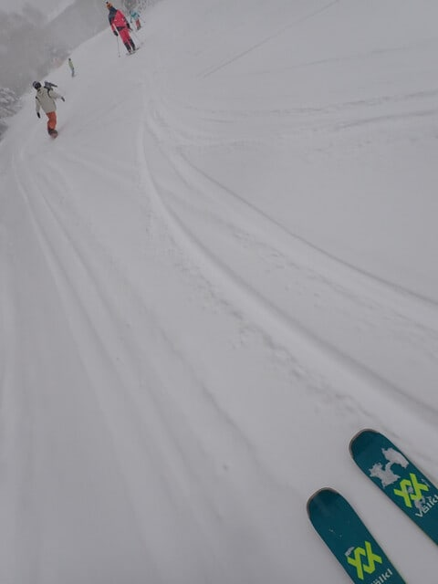
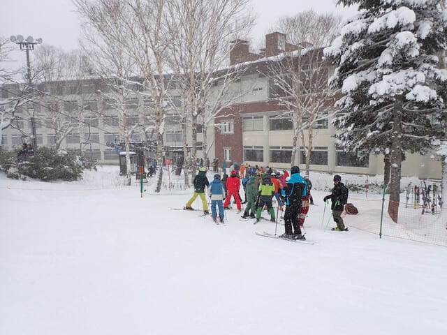
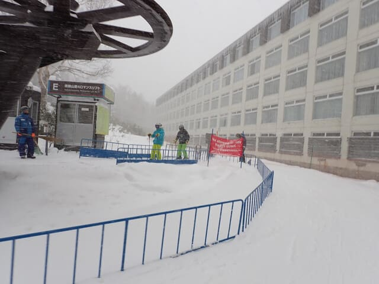
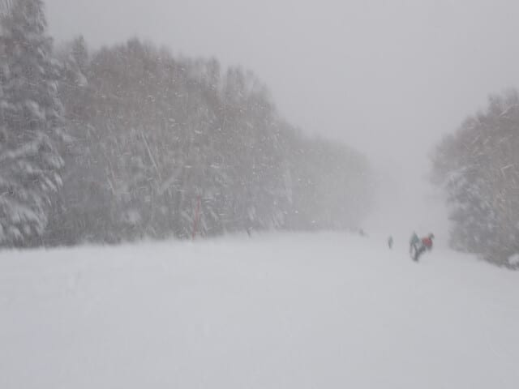
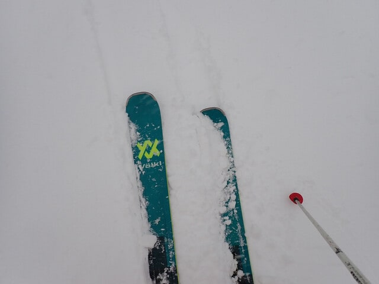
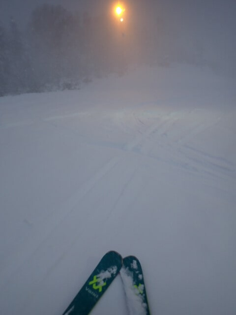
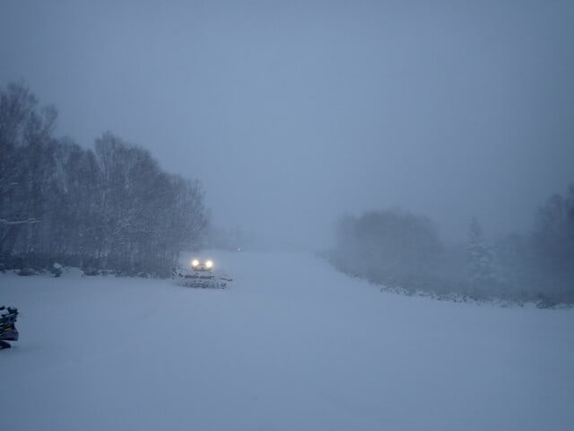

# 2024/12/8(日)の志賀高原焼額山スキー場速報レポート！…終日雪降り，第4ロマンス1本のみだけど雪質は冷え冷えトップシーズン並み！

📅 投稿日時: 2024-12-09 01:54:35

🏷️ カテゴリ: [2025スキー滑走日記](cacd3fbf84d4a679ee61a5894c3f95e14.md)

ということで．

今日も志賀高原で営業終了まで滑って

帰ってきたので…

帰宅は23時過ぎ（涙）

そして，片付けやら板の手入れやらしていると，

もう1時半じゃないですか（泣）

ということなので．

今日の志賀高原レポートは，

帰宅日恒例の速報モードにて…

日曜の朝イチの積雪は思ったほど積もらな

かったけど，それでも10cmほどは積もって

朝はプチ新雪状態！

新たなコースがオープンできるほどの

積雪はなかったので，今日も運転して

いるのは第4ロマンスリフト1本のみ．

リフト1本だけなので，午前中はちょっと

リフト待ちもあったけど，

最高はこれくらいで．

12時前にはリフト待ちがほぼなくなり．

それ以降はリフトは待っても数人程度で

ほぼ飛び乗りに近い状態になりました～！

…ただ．

午後に人が減ったのはもう一つ理由があり．

昼を過ぎると，朝から小雪程度の天気

だったのが，風も強まり，ときおり前が

見えないほどの強い雪になって．

遅くて長い第4ロマンスリフトだと，

乗ってる間に冷凍人間になっちゃいそうな

ほど冷えたのも理由だと思う…

ただ，そのおかげで，コース上は

常にプチ新雪状態！

昼間だけで，15～20cmくらい積もった

気がする…

ってなことで．

新雪が蹴散らされて，急斜面はちょっと

荒れ気味になったところもあったけど．

でも，気温も低く雪質は軽いパウダーで，

下地のガリガリも出てくることなく，

12月上旬としてはいい感じの冷え冷えの

雪を滑ることができましたよ～！！

結構降ったし．これから次の週末までも

冷えるので．

次の週末はかなり高い確率で，焼額は

第2ゴンドラが動くんじゃないかな～…

実際，日曜もパノラマコースでは全力で

人工降雪機を動かし続けていて，

圧雪車も入ってました～！！！

ということで．

ここ数シーズンはひどいシーズンインが

続いたけど．

この週末は焼額のシーズンインとしては，

結構いい感じでした～！

また明日，元気があったら詳細レポートやります～！！

## 💬 コメント一覧

### 💬 コメント by (レインボー77)
**タイトル**: Unknown
**投稿日**: 2024-12-09 19:46:51

月曜日の志賀高原情報

今日はシーズンベスト。夜の雪が踏まれて、ちょっと寒いけど雪はずっとベスト。リフトは飛び乗りだし、滑り放題。幸せってこういうことを言うんだって感じ。

ヤケビの私は３時間で15本だったけど、若い仲間はラスリフまで40本近く。ヤケビありがとうの一日でした。

エス様に申し訳ないような一日でした。

### 💬 コメント by (Skier_S)
**タイトル**: ＞レインボー77さま
**投稿日**: 2024-12-10 00:40:06

日曜も良かったですが…月曜はもっと良かったんですか…

月曜も滑りたかった…

たぶんこれからもいいコンディションが続いて来週の土日もいい雪が続くはず！

