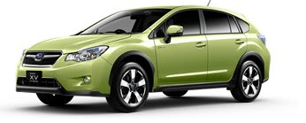

# スバルXVハイブリッドを試乗してみた

📅 投稿日時: 2013-11-22 02:19:12

スバルのXVハイブリッド．

今申し込んでも，なんと．

納車は来年の4月か5月になるという超人気らしいんですが．

XVって，インプレッサスポーツの車高を高くしただけなんじゃないの？

ハイブリッドって言っても，モーター出力それほど大きくないから，

車重が増える分，アルファード・ヴェルファイアHVみたいに

「モーターアシストがあっても，フツーの2.4Lと変わらん」

加速になってるんじゃ無いの？

レガシィより高いけど，そんな価値あるの？

…って，思ってました．

いや．ホントに，乗る前まで．

でも…

我が愛車の1万km点検…じゃ無かった，実質納車5ヶ月目の「6ヶ月点検」で．

待ち時間があったので．

ちょっと興味から，試乗してみたんですよね～．

XVハイブリッド．

(スバルHPより）

結論から言うと．

「…この車，欲しいかも…」

外観がインプレッサとほぼ同じに見えますが．

全く別物の車ですね～…これは．

レガシィのベースグレードと同じ価格帯だけど．

…足回りのでき，ボディ剛性，その他の走りの性能は．

うちのBRレガシィ B-Sportより上だわ…．

まず，車高が高いくせに，ロール量はうちのBRレガシィより

抑えられてる感じがする！

レガシィはフロントのアウト側が大きく沈み込む，

わりと安定したダイアゴナルロールが出て，

それでフロント外が押さえられるような感じ．

レガシィのロールスピードは遅めで，ロールの

おさまりがちょっと悪いかな～，早い右・左の

切り返しでは，ちょっとゆさゆさするな～，って

ときもありますが．

XVは車高が高いくせに，ロールがぴたっと

おさまるじゃないですか．

XVはタイヤ幅が225と，BRレガシィ B-Sportの205より太いけど．

それを受け止められるしっかりしたサスで．

タイヤ幅がある分，コーナ限界も高い．

ボディ重量はBRレガシィとほぼ同じくせに．

おそらく，安心してコーナーを抜けられる速度，

レガシィ標準グレードより間違いなく速い．

ブッシュも結構強めなのか，横Gがかかる・抜ける時のコンプライアンスによる

不自然なステア感もなく．

かといって，硬いわけではない足．

特筆は，サスのばたつきが少ないこと．

段差を超えたときの足の動きの収まりのよさは，

これは高級車並み．

路面のざらつきによる高周波振動はやわらかく吸収されているのに，

大きなサスの動きには，ブッシュのいやなタプタプ感によるゆり戻しが無く，

ピシッと抑えられてる感じ．

突き上げやばたつきが無いのに，しっかり路面に追随するので，

狙ったラインのトレースのしやすさは，レガシィよりいい感じ…

…これは，レガシィよりずっといい足じゃないか…！

＃レガシィも，SパッケージとかDITはいい足なのかもしれないけど

で．

エンジンも．

すごいいい感じ．

燃費ハイブリッドじゃないのが良く分かる．

これは，モーターによるパワーアシストハイブリッドだわ．

F1のKERSみたいな，走りのためのパワーアシスト．

普通なら，HV車は，エンジンは燃費を考えて，大量クールドEGR＆

実効圧縮比＜膨張比の超遅閉じアトキンソンサイクルにして．

そこで落ちるパワーをモーターで養う…

って感じにするのに．

基本的に，ハイブリッド用に燃費重視エンジンにはしていない．

エンジントルクがあるのに，アクセルを踏んだ瞬間，ここ一番の時に

モーターによるプラスアルファパワーが加わる感じ．

それも，アクセルを踏んでエンジン回転が上がる前，エンジンが反応する前から．

モーターによる「クククッ」って感じのトルク感が加わるので．

上り坂も，気持ちよく加速していきます．

あー．

モーターは，ドッカンアシストじゃないですよ．

直線でアクセル踏んだときに，どどどッと加速させる

アシストパワーじゃないです．

あくまで，コーナー立ち上がりとかで，アクセルを踏んだ瞬間から

クッと車が前に引っ張られるような．

そーゆー，官能を刺激するアシストです．

さらに面白いのは．

ハイブリッドのくせに，パドルシフトがあるので．

「ギアダウンしてエンジンブレーキかけたら，回生はどうなるんだろう？」

って不思議に思ったけど…．

常識的には，燃費重視で最大限の回生ができるよう，パドル操作の

エンジンブレーキ時でも多少CVTのギヤ比をコントロールして，

回生で制動を使ってくるかと思うところ．

実際に下り坂で，シフトダウンして，エンジンブレーキかけてみて，

エネルギーフローの画面を見たところ…

なんだこりゃ？全く回生を効かせていないよ…

こんなので，燃費が良くなるわけないじゃないか．

…ここに，スバルの設計の割りきりが出てるなぁ．

燃費重視なら，絶対ダウンシフトのエンジンブレーキ時にも回生を

利かせたくなるはず．

エンジンブレーキ時に過剰なブレーキ感を持たせず，

低いギアにしたいときにがんがんギアを落としていけるように．

そして，低いギアからの早いパワーの立ち上がりを使えるように．

パドルシフトによるエンジンブレーキ時の回生を，あっさり

あきらめてるようです．

とりあえず．

燃費を捨てて，モーターアシストによるエンジンピックアップの

良さ感を出し，

気持ちよく走るためのハイブリッドであることが，ここからも

よく分かる…

ってことで．

XVハイブリッド．

燃費を良くしようと思ったら，下り坂でシフトダウンによるエンジン

ブレーキを使わず，素直にブレーキペダルを踏みましょう…

そして．

この車．

静かなんです．

インプレッサよりずーーーーっと静かだし．

レガシィよりも，ロードノイズもエンジンノイズも低いよ…

あまりEVモードに入らないので，エンジンはほぼかかりっぱなしなんですが．

それでも静か．

…という感じで．

この車．

もしかすると，ものすごく良くできた車かもしれない．

ハンドル握ってて楽しいよ．

直線の加速力や燃費とかを求める人には合わないだろうけど．

コーナーの続くアップダウンのある道を，結構なハイペースで

走るとき．

このお値段で，これほど気持ちいい車はないかも…

いや．

これ．

欲しい…．

## 💬 コメント一覧

### 💬 コメント by (marim)
**タイトル**: Unknown
**投稿日**: 2013-12-09 21:10:31

はじめまして

こんにちは。

最近のスバル車はいいですね。

今年フォレスターを購入しましたが

走る曲がる止まるといった基本性能がよくできた車だと感じました。

我が家にもレガシィがありますが大きなボディなのにカーブの多い山道も変わらず

ピタッとはりつくように走ってくれます。

運転が楽しく楽になりましたよ^_^

### 💬 コメント by (Skier_S)
**タイトル**: marimさま
**投稿日**: 2013-12-10 03:29:39

コメントありがとうございます～．

新フォレスター購入ですか．

私は新型フォレスターはまだ乗ったことはないんですが…

さらにレガシィもお持ちとは，スバル車2台持ち

ですか？？？

今年購入したレガシィで初めて雪の

志賀高原を走り，やっぱり雪道では

無敵な車だと感じました…

雪道を走るのが楽しい今日この頃です．

楽しいスバル車ライフを！

