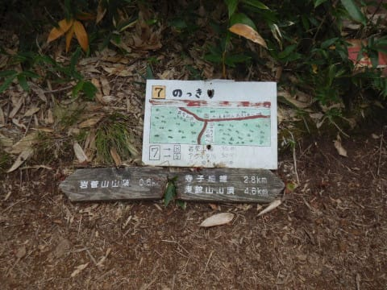
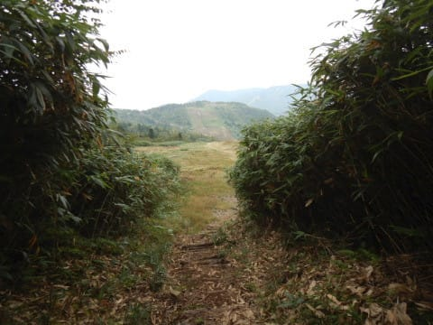

# 志賀高原の岩菅山に登ってみた5…山頂から下山まで

📅 投稿日時: 2020-10-24 02:43:57

ってなことで．

ギリギリながら，無事岩菅山頂まで到着

できて，下山を開始したわけですが…

ただ，岩菅山頂真下の急なガレ場を

下るのに．

筋肉痛だけではなく，

ちょいと膝に痛みが…（涙）

おそらく，山登りでよくやられる

腸脛靭帯を傷めたようです（泣）

でも．

13時ちょっと前にノッキリへ戻ってきて．

ノッキリー岩菅を1時間で往復！

後はひたすら来た道を戻っていきますが…

…やっぱりこの尾根道．

ノッキリが2075m，寺子屋山が2133ｍと

スタートとゴールに60mほどしか標高差が

無い，3kmほどのルートだというのに…

途中，思った以上にいやらしい

アップダウンがあって．

想像よりは体力を使います（涙）

とはいえ．

身体を動かし続けてほぐれてきたからか．

朝の筋肉痛はどこへやら．

そして，急な下りだと膝の痛みは

出るものの，ほぼ平坦な道なら

それほど痛みなく歩けるので．

なぜか，ふつうなら疲労している

はずの帰りの方が，行きより

ペースアップ！

振り返ると，さっき登ってきた岩菅山が

もう遠くなってます…

行きに2時間かかった，寺子屋山頂～ノッキリ間．

帰りは1時間40分でサックリ歩ききり．

14:40には寺子屋山頂へ戻ってきました！

…ここから東館ゴンドラ乗り場までは，

コースタイム40分．

15:50のラストゴンドラの時間まで，

30分程度の余裕をもって下山できましたね…！

後は，寺子屋山頂から10分で寺子屋スキー場へ出て．

また，ゲレンデをとぼとぼ歩きつつ…

寺子屋から，東館林間コースへ抜ける

道を通って…

…これは志賀高原を良く滑る人なら

見覚えがあると思いますが．

東館ゴンドラから東館林間コースへ抜ける道と，

寺子屋から抜ける道の合流地点ですね（笑）．

そして．

高山植物園まで戻ってきました～！

…って．

知らなかったけど．

東館山頂から，大沼池が見えるんだ…！

をを！

ホントだ！

見える！

ってなことで．

東館山頂駅到着，15:20．

30分の余裕をもって到着！

まだ，ラストゴンドラの時間まで余裕があるので．

これだけ毎シーズン志賀高原に来ていながら．

私は一度も登ったことが無い，東館ゴンドラ山頂駅の

展望台に登ってみました…！

…スキーシーズンでは，こんなところに来て

景色を眺めるより，ちょっとでも早く滑り

出したいので，絶対来ない場所…

こんなところだったのか…！

ってことで．

ここからも聖地焼額に祈りをささげ．

ほぼ最終のゴンドラで下山！

…いやー．

ほぼ始発のゴンドラから最終の時間まで．

ゴンドラ営業時間ギリギリ一杯の行動でした…

ってなことで．

ここでらいちょうバレーの中古搬器を眺めてから．

帰路に就いたのでした…

…うむ．

本日のコース．

ゴンドラ山頂が標高2000m．

岩菅山頂が2295mで．

スタートと山頂の標高差は300m弱．

このくらいなら登山というよりお散歩

コースで，妙義山の次の日にのんびりと

歩くにはちょうどいいなぁ…

と，本日のルートに選んだんだけど．

実際に歩いてみたあとに，Amazfit PACEの

記録を見ると．

獲得標高差，トータル800m近く…！！

このコース．

ひそかに500mくらいのアップダウンが

あったようです（涙）

トータル獲得標高差800mって．

そこそこの登山ルートと同じ

高度差なんですけど…（泣）

…このルート，さりげなくかなりの

アップダウンがあるので．

思ったほど楽なルートじゃないですよ…

と，最後に一言言っておきたくなった，

Skier_Sなのでした…

## 💬 コメント一覧

### 💬 コメント by (michi)
**タイトル**: Unknown
**投稿日**: 2020-10-24 07:04:54

岩菅山、私は中学登山で行きましたがこんなに大変な山だったんですね。

東館山頂から大沼池が見えるのは私も知りませんでした。

雪景色だと見える景色も違いますし気にして見ないとわからないですね。

### 💬 コメント by (uraw_skier)
**タイトル**: Unknown
**投稿日**: 2020-10-25 18:59:04

お疲れさまでした。

今年は中止になりましたが、７月にトレールランの大会があります。一ノ瀬をスタートしてノッキリまで登り、ノッキリから寺子屋まで尾根沿いを進み、一ノ瀬の上部に出て、迂回の一番楽なコースで下って、一ノ瀬にゴールするコースです。

距離１４．８キロ、獲得標高差は７２０メートル位だったと思います。

景色を眺める余裕はないのですが、なかなか辛く楽しいです。

### 💬 コメント by (Skier_S)
**タイトル**: 岩菅がスキー場になってたかもしれないんですよね…
**投稿日**: 2020-10-25 20:39:54

＞michiさま

中学校であの山を登山させるとは…

登るのに登山届がいる，本格的な山なんですが（笑）．

最後の山頂付近，結構急ですよね…

往復コースタイム6時間を超える山を中学生に登らせるとは，さすが長野県…！

＞uraw_skierさま

一の瀬ゲレンデからアライタ沢経由でノッキリですか？

途中階段があったりでかなりの斜度だし，ノッキリから寺子屋の尾根沿いって，

ところどころかなり狭くて，前の人に追いついても追い抜けないようなコースですよね…

そんなコースを走るとは，人間とは思えません…！！

すごい！

