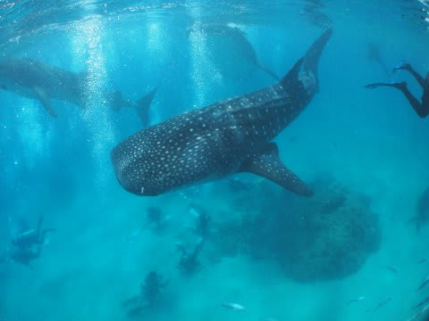

# 2013年11月　フィリピン・オスロブ　子連れでジンベエを見るぞっ！　その8

📅 投稿日時: 2014-07-15 02:09:29

とりあえず，

こんな感じで，ジンベエいっぱいの…

すさまじい海だけどっ！

でも．

…なんだか…ちょっと不自然なところも…

やはり，水面から餌付けされているので，

ジンベエ様が，ちょっと立ち泳ぎ気味なんですよね～

水面では，こんな感じの船から，おじさんがオキアミを撒いていて…

この餌を食べるために，立ち泳ぎ気味のジンベエさん．

…この写真左側の白いのが，エサやりボートの

底ですね．

水面から見ると，こんな感じで…

エサやり船の横にいる黒いジンベエさんの影が，

わかるでしょうか？

…そのおかげで，ジンベエはエサをもらえる水面近くを泳ぎ続けるので…

水面ではこんな感じで．

もう，水面にいるシュノーケラーは

ジンベエに近づきまくり！！！

でも，ダイバーはこんな感じで，着底してなくては

いけないので…

はっきり言って．

シュノーケラーの方が，ダントツジンベエに近づけますね！

うーむ．

ダイビングに行っている妻には悪いけど．

おそらく，このジンベエトリップ．

ダイビングより，シュノーケリングの方が，いいな！！

…しかし．

見事な立ち泳ぎだこと…

餌付けジンベエならでは，かな．
