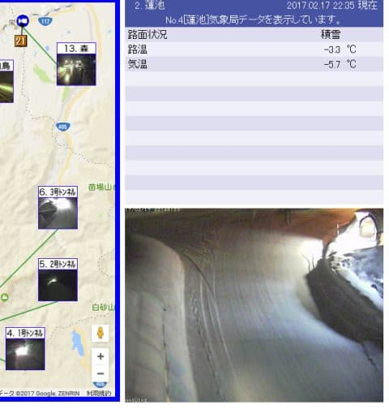

# ということで．今週末もいつも通り志賀高原で滑ってます

📅 投稿日時: 2017-02-17 23:36:50

えー．

月曜の段階で．

本日の天気を．

　…今のままの天気図だと．

　風でゴンドラ止まるかもしれないけど，

　志賀高原は雨にならないんじゃないか…？

と，書きましたが．

…ええ．[ゴンドラは止まった](https://www.facebook.com/yakebitaiyama/posts/1225547677540576)ようです．

昼前ごろから，

奥志賀ゴンドラ，焼額第1，第2ゴンドラ，

寺子屋全リフト，

東館山ゴンドラ，

渋峠リフト

…などは，強風で止まったようです．

はい．

強風は当てましたね…

…

ただ．

やっぱり，降りはじめ．

ちょっと雨っぽかったようですね…（涙）．

[熊の湯のスタッフブログ](http://ameblo.jp/kumakumanoyu/entry-12248639875.html)では．

「10時前から雪

そしてお昼頃から湿雪＆ミゾレ」

…と，なってますが．

実質，昼ごろは限りなく雨に近かったかと…

ただ．ライブカメラを見ると．

昼間は完全ウェットなアスファルトが

露出していた路面も．

午後4時ごろから白くなっていき…

今は完全に積雪状態になりました．

おそらく，10cmくらいは積もったのかな？

この積雪で，だいぶゲレンデ状況はマシになったかな…

これから明日にかけてはもう積雪はなさそうだけど．

とりあえず，明日の朝はこの10cm程度の積雪が

圧雪された，結構いいバーンコンディション！

…それが蹴散らされると，固めの下地が出てきそう…

今日は雨っぽかったので．

下地，かなり固くなってるかな…

土曜の天気は曇り時々雪，時折晴れ間も広がる感じ．

で，土曜の夜中にまたちょっと雪が積もりそうで．

日曜は朝のうち曇り，雪もちらつくかもしれないけど，

じき晴れて，太陽のもと滑れるかな～．

＃ウェザーニューズは全く違う予想だけど…

日曜も朝は新雪がちょっと積もるので．

日曜朝はまたゲレンデ状況が結構回復してそう．

…午後はまた下地の固いのが出てきそうですけど…

とりあえず．

土日とも気温は冷えてるので．

下地が固いのを除けば，

雪質自体は良さそう！

日曜は天気もいいので，結構楽しめるかも…

金曜の雨がちょっと残念だけど．

この週末も，結構楽しめそうな感じ！

では，また志賀高原でお会いしましょう～！

PS.やっぱり20日は…ヘタすると昼過ぎごろ，降りはじめは雨．

23日はほぼ確実に雨です（涙）．
