# あなたのターン，左右対称ですか？続き

📅 投稿日時: 2012-04-06 00:38:21

🏷️ カテゴリ: [スキー雑談](c1f9d2cb7478308da16419928ea3945e9.md)

前回の続きです…

とあるモデルが出てますが．

6年以上前の滑りですから，今から見るとへたくそですね～．

…いや，今も，このモデルはスキーへたくそですが(笑）．

では，続きをどうぞ～

----

さて．前回は「軸足の股関節は動きにくい」ということを示しました．

復習すると，

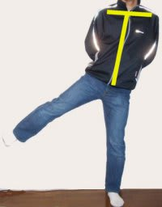

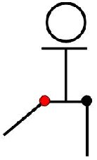

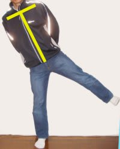

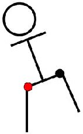

このように，赤丸で示した利き足の股関節の方が動いており，軸足の股関節が動いてません．

さて．では，これはどのようにスキーに影響するんでしょう？

ここで，片足を上げる時に，上げた足が地面から離れないように，上げてないほうの足を曲げていってみましょう．

こんな感じです．(写真1)

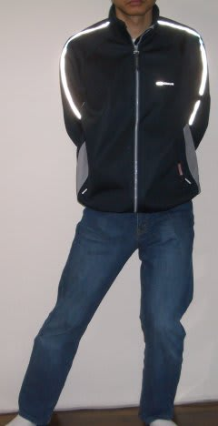

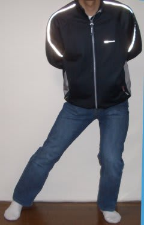

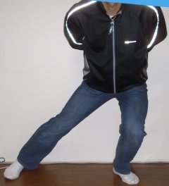

お？スキーの運動っぽくなってきましたね．

これも左右で比べてみましょう．(写真2)

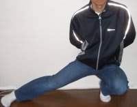

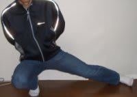

おっとっと．

やはり，片足を単純に上げただけの時と同じ傾向が出てますね…

左足を上げる（外に出す）時は，右肩が下がってます．

軸足の股関節の可動範囲が狭いからこうなっちゃうんですね．

さて．では，これがどのようにスキーに影響を与えるのか．

このモデルさんのスキーの滑りを見てみましょう．

写真1のような運動を意識して滑ってもらいます．

では，どうぞ～！！

…

…

…

あれ……？

…ちょっとモデルが恥ずかしがっているようです．

いまさらなに恥ずかしがってるの？

へたくそだから人に見せたくない？

何言ってんの．

ここは上手い下手を議論するんじゃなく，左右対称を見るだけだから．下手なのは気にしなくていいから．

なに？顔出しNG？

まぁ，Webに顔さらすのも確かに問題だし，読者が気分悪くするだろうし…

分かった．顔はボカす．

では，どうぞ～…

…

…

なに？まだなんかあるの？

変な滑りって笑われるんじゃないかって？

大丈夫だって．滑りが下手かどうかを見てるんじゃないから．誰も滑りが下手だって笑わないって．

大丈夫．笑わない．笑わないってば．

…さて．おまたせしました．

写真１の動きをイメージした，中斜面でのゆっくりとした滑りです．

どうぞー！！

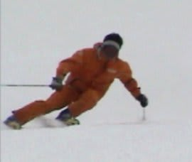

 

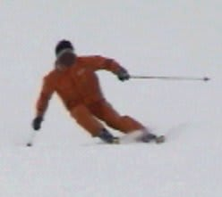

…

…ぷ

ぷぷぷぷ．

どわははははははっ！！！！！！

ぜんぜん左右ターンが違うっ！

写真2の左右非対称のまんま！！

おかしすぎる～！！！！！！

とても同じ滑りの左右ターンを取り出したものとは思えないくらい左右が違うっ！

うひゃひゃひゃひゃっ！

…いや，滑りが下手だって笑ってないでしょ．左右が違うって笑っただけだって．

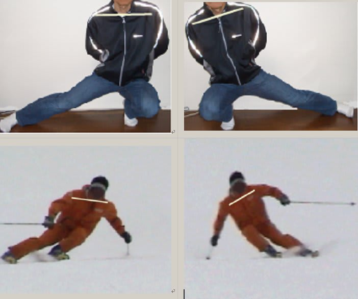

 

…いやー．見事に写真２の癖がそのまま滑りにでちゃってますねぇ…

分かりやすいモデルです．

このモデルが普段滑っているフリースキーでどうなっているかも見てみましょう．

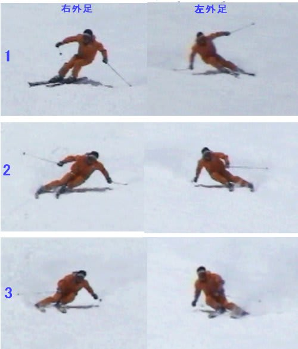

…たぶん，このフリースキーの写真を先に見ると「ちょっと左右が違うかな？」くらいにしか思わなかったでしょうが，写真3を見てからこの滑りを見ると，ターン中の動きが左右で全く違うことが分かりますね．

モデルの左股関節がちゃんと動いていない，ということが明らかです．

さて．

ここまで来ればお分かりかと思います．

ターンを左右対称にするためには，スキーを履いて練習しなくてもいいんです．

普通に立って，左右の足が均等に上げられるようにするだけでも効果があるんです．

左右の足が均等に上げられるようにするためには，自転車を右側から乗るとか，階段を左足から上り始めるように心がけるとか，日常生活での気遣いも大切です…．

ということで，「あなたのターン，左右対称ですか？」Part1は終了です．

これを読んだ多くの方が，ディスプレイの前で怪しげなバレリーナのような動きをしてしまったかと思います．家族や会社の人たちに見られませんでしたか？

こうして，皆さん「階段を下りるときに膝が入っている」「電車待ちで手がストックワークになっている」というような，怪しい人になっていくんですね．ご注意を．

P.S.　このモデルが誰か分かっても，それを言わないのが大人ってものです．
