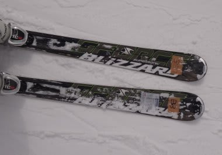
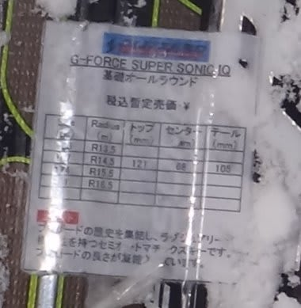

# そろそろ飽きてきたか？2012/2013シーズンモデルのスキー試乗レポート　Blizzard編

📅 投稿日時: 2012-04-20 22:05:14

🏷️ カテゴリ: [スキー板試乗](c0bd8048615710cee890e403a36cc9a2b.md)

あー．

この週末．

日曜の雨の降り始めの予想ですが．

だんだん遅くなってきてますね…

もしかすると，午前中いっぱいは降られずにすむかも．

日曜の早朝スキーは，間違いなく雨にぬれることなく滑れます．

…でも，雪は早朝からやわらかいかな…．

うーん．昼過ぎくらいから雨かな～．

運がよければ，もう少し遅くなるかも…

さて．

スキーの試乗レポートですが．

もうちょっと続きます．

明日出発が早いので，今日は1機種のみで…

-----

○Blizzard

G-Force Supersonic IQ 167cm

基礎用オールラウンド．

これも結構扱いやすい板．

トップからテールまできれいにしなって，エッジグリップで

回る感じの板です．

トーションはしっかりしてるけど，張りはそこそこ，しっとりした感じ．

NordicaのSpitfireみたいに強い板ではないです．

結構たわむので，167だけど小回りスペシャルに感じます．

まっすぐ落とそうと思っても，たわんでいって旋回半径が小さくなり，

167cmのR14.5mの板というのに，かなりの小回りになっていきます．

軽快で取り回しやすいんだけど，フレックスが柔らかいのにエッジがしっかり

くらいつくので，たわみすぎて小回りにしかならないのがちと残念…

でも，体重が軽い人・そんなに脚力がない人でも，しっかりエッジグリップして

たわませられるのでいいかも．

そんなに張りが強い板は嫌いだけど，しっかりエッジの線に乗って回ってこれる

小回り板がほしい人，脚力がないけど板をたわませてカービング小回りを

したい人にはいいかも．

…この板，もう少し長いのを履いたら，多分印象がもう少し変わるかと思います…

## 💬 コメント一覧

### 💬 コメント by (中西)
**タイトル**: Blizzard G Force supersoniq
**投稿日**: 2023-12-01 22:08:34

お手数をお掛け致します。

Blizzard G Force supersoniqスキー板のソール長

調整の方法をご存じないでしょうか。

教えていただければ有難いのです。

### 💬 コメント by (Skier_S)
**タイトル**: ＞中西さま
**投稿日**: 2023-12-01 23:10:53

すみません…Blizzardの板は試乗しただけで，所有していないので調整の仕方はわからないです…

役立たなくて申し訳ないです．

### 💬 コメント by (マルハバ)
**タイトル**: 多分これじゃないかと？・・
**投稿日**: 2023-12-02 11:51:16

https://detail.chiebukuro.yahoo.co.jp/qa/question_detail/q1330421848

### 💬 コメント by (中西)
**タイトル**: 多分これ
**投稿日**: 2023-12-10 04:35:52

マルハバ　様

有難う御座います。

その通りでした。ただ外す時に、上から角形の棒で突いて反りを広げないといけないと思いました。

しかし、古い板なのでそーつ長は変更しませんでした。また、バーがプラスチックなので破損するのが心配です。メーカーに耐用年数を聞いたのですが、回答ありませんでした。構造的に、不安なビィンディングです。

