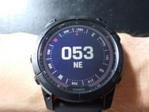

# 新しいスマートウォッチ，Garmin Fenix7Xを買ったよ！その5…時計の基本機能を一通り見てみる

📅 投稿日時: 2022-08-17 02:19:17

（Garmin Fenix7Xのレポート全16回のもくじ

機能説明，登山用地図の作り方，登山で使ってみた…など

は[ここをクリック](e516b23a4874189de2e9208be87fa5184.md)）

ってなことで．

まだまだ続く，Garmin Fenix7Xの紹介ですが．

今度は時計のいろんな機能を見てみましょう…

というか．

今回のを見るだけでもかなりお腹いっぱいに

なれる，

多機能さ満開

な感じの説明です…

とりあえず．

この，ウオッチフェイス画面から

上下ボタンを押すか，タッチパネルの

上下スワイプで現れる

「ウィジェット画面」．

画面をスクロールすると，

数多くのウィジェットが次々

現れます…

全てのウィジェットの写真を

載せるとすごいことになるので，

この写真は一部だけ載せてます…

　

　

　

　

最後の写真の一番下，鉛筆マークが

あるのから推測がつくと思いますが．

どの機能をウィジェット画面に表示するか

とか（使わない機能は非表示にもできる）

並び順をどうするかとかも設定出来て．

そして，このウィジェット画面の各項目を

タッチすると…

内容が詳細表示されるんですね～．

例えば，この天気の画面をタッチすると．

まずは本日の天気予報詳細．

現在の予想気温，降水確率，最高＆最低気温，風速＆風向が

見れて．

さらに画面をスクロールすると．

1時間ごとの天気や…

（左右にスクロールすると12時間先まで確認できる）

今後の数日間の天気を見れるし．

今後12時間の気温・降水確率の

予想グラフ，

露点，UV指数，相対湿度が見れるという．

天気のウィジェット詳細だけで

かなりの情報量…

さらに，この画面のABC（高度（Altitude)・気圧(Barometer)・コンパス(Compass)）

をタッチすると．

まずは高度・コンパス画面が出てきて…

これもスクロールさせると，過去の

高度変化グラフが確認できます．

（左右スクロールすると，

過去12時間まで確認可能）

もう一つスクロールさせると

気圧の時間変化が確認できるし…

さらにスクロールさせれば，

コンパス単体の画面．

さらに，睡眠画面を選ぶと…

睡眠時間や睡眠の質がどうだったかの

詳細が表示されて…

睡眠の質を点数で示してくれたり．

（3時間しか寝てないのね…

　そして睡眠の質が悪いと怒られている）

そして．余計なおせっかい（？）のアドバイスを

見ることができます．

心拍ウィジェットでは…

リアルタイム心拍のグラフやら

過去数日の安静時心拍のグラフ．

そのほかもいろんなウィジェットがあり．

歩数計ウィジェットもあれば…

（その日の歩数の積算グラフ，週に歩いた歩数，週に歩いた距離）

　

　

　

ここら辺の機能はまた後で詳細説明

しますが．

ストレス計測の結果やらが見れて．

　　

過去数時間，ストレスがどのくらいだったかを

見ることができたり．

過去のアクティビティの記録を

確認できたりします．

これは，赤岳下りのデータですね…

運動時間238分，下降1480m．

運動中のスピードグラフや…

標高の変化グラフ．

心拍数グラフも見られれば…

心拍ゾーンやら

トレーニング強度が確認できます．

3を越えると体力強化につながり，

5になると過負荷ということのよう

なので…赤岳登山，過負荷だった

ようですね（涙）

あとは，温度計（過去の温度変化グラフ）とか，

日の出・日の入りウィジェットやら

VO2Max画面やらがありますが…

VO2Maxウィジェットでは，VO2Maxから

計算されたランの予想タイムも表示されます！

それによれば，私はハーフマラソン2時間20分．

フルマラソンの予想時間，5時間30分ですか…

あんまり速くないですね（涙）

で．

音楽コントロールもできますが．

これは，スマホで再生している音楽の

再生コントロールや…

自分のウォッチに，PCのアプリ経由で

時計にダウンロードした音楽の再生が

できますが．

スマホが無くてもウォッチのWi-Fiを使って，

SpotyfyやらAmazonミュージックから

音楽を時計に直接ダウンロードすることも

できます…

ってなことで．

このウィジェットだけでも盛りだくさんだった

このスマートウォッチ．

まだまだ機能はいっぱいあるのだ！！

（まだ続く）

## 💬 コメント一覧

### 💬 コメント by (レインボー74)
**タイトル**: Unknown
**投稿日**: 2022-08-17 16:17:50

,そんなにいいのなら買おうかなと、チェック！

スキーブーツより高い！

今日、私のヴォクシー(七年16万キロ)が、エンジンのエアバルブのコントローラー取り替えで車屋さんへ。

スマートウォッチと同じくらいかかりそう。

ぐやじーっ！どうせならその大金をスマートウォッチに使いたかった！

不幸な私！

### 💬 コメント by (Skier_S)
**タイトル**: ＞レインボー74さま
**投稿日**: 2022-08-18 03:44:02

そうなんですよ…

高いんですよ…

電池もちがちょっと短めで（フル充電で10日ちょい)，画面がちょっと小さくてもいいなら，

FORERUNNER955ってのがアマゾンで68000円で買えます…

タッチパネルが無くていいなら，一つ古い型のFenix6Xがアマゾンで77000円ほどです．

