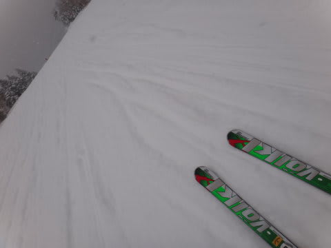

# Skier_S，ついにゲレンデにて発見さる

📅 投稿日時: 2013-03-05 02:20:10

あー

あれですね．

ついに．

ついに，発見されちゃいましたねー．

いや．なんというか．

とうとう，ゲレンデで

「Skier_Sさんですか？」

と．

声をかけられてしまいました…

このBlog．

知り合いにはまったく知らせず，私のことをまったく知らない不特定多数に向けて，

「謎のレポーターがスキー場情報を報告！」

ってスタンスで．

写すのは膝から下とスキー板のみ！

自分がどんな格好かは謎のまま．

自分が何をやったかではなく，ひたすらスキー場の状況を書く…

って感じで進めてたんですけど．

＃…それにしては，個人的感情は出まくってるんですけど…←自己突っ込み

やっぱり，なんですか．

レポート内容だけじゃなく，どんな人が書いてるのかってところに

興味を持つ奇特な方もいらっしゃるようで…

このBlogを始めたころは，どーせ読者もそんなにいないし．

スキー板の写真だけで私を見つけ出して，声をかけてくる人がいるとは，

ま～っっったく，想像もしてなかったんですけどね～．

＃謎にしておいた細大の理由は，「Skier_Sはスキーが上手いに違いない！」とか，

＃そーゆーイメージと実際に本人を見たときのギャップが怖かったってのもあったりする(^^;

ってことで．

発見第1号のゆうこさん，

おめでとうございます～！

＃何がめでたいのだかよくわからないけど

イメージと本人は，一致してたのかな…？

うーん．

しかし，

「あ，あれがSkier_Sじゃないか？」

って気づいた人，何人くらいいるんでしょうね～．

＃でも，実際に声をかけてもらうと，大変嬉しいということが分かった

＃今回の経験なのだった…

## 💬 コメント一覧

### 💬 コメント by (ゆうこ)
**タイトル**: 光栄です。
**投稿日**: 2013-03-05 09:40:54

ブログの記事1回分を使って私が発見したことを書いてくださって大感激です。

私は朝から大騒ぎしちゃいました！

実際にお会いしたSkier_Sさんもブログ同様気さくで話しやすく、ゴンドラ乗車中楽しい時間が過ごせました。

ブログの記事がいつも楽しくて文才あるなぁって思ってましたが、話してもとっても楽しかったです。

これからもよろしくお願いします♪

### 💬 コメント by (mari)
**タイトル**: Unknown
**投稿日**: 2013-03-05 09:59:42

ゆうこさん、良かったですね！

うらやましいです！！

私も以前からこのブログを拝見して、こんな楽しい文章を書ける人はどんな人なんだろう？

ぜひお会いしてみたい！と思っていたファンの一人です。

＃子供背負って滑ってる画像に密かに親近感もありましたし

昨年のアルペン試乗会のときもきょろきょろしてたんですが、見つけられず…

今シーズンちびっこ連れて初ヤケビのときもきょろきょろしてたんですが見つけられず…

今週末はボーダーの友人が一緒のため、一の瀬・焼額エリア遠征がほぼ確定です。

私も頑張って探しますので、見かけたら（見つかったら？）よろしくお願いしまーす！

### 💬 コメント by (Skier_S)
**タイトル**: ご愛読感謝…
**投稿日**: 2013-03-06 02:49:31

>ゆうこさま

あいやー．

喜んでもらえたんですか～．

良かったです…

私もお話できて楽しかったですよっ！

また今週末もお会いしましょう…

>mariさま

えー．

こんな駄文を垂れ流しているブログなのに．

ファンっていってくれる方がいるとは…

ありがたいことです（拝）．

…でも，書いている本人がちょっと驚いたりしてます（笑）．

今後もご愛読のほどを…

今週末は子連れなので，子供といるときは一の瀬エリアを滑ってます…

一人になったらヤケビをひたすら滑ってると思います．

もし見つけられたら，よろしくです～．

＃あ，でも，私が子供と滑っているようだと，声をかけずにスルーしてくれると嬉しいです…

