# 2月8，9日の週末の志賀高原スキー場の天気は？…土曜朝は激冷えブーツパフ，終日雪降り！日曜は積雪なさそうだけど，冷え冷え最高雪質！

📅 投稿日時: 2020-02-06 01:46:37

…なんだか．

昨日の腰痛の記事に，かなり多数のコメントを

いただいたのですが．

どうやらスキーヤーの皆さんは，

身体を壊しながら滑っている人が

かなり多数いらっしゃるようですね…（恐怖）

とりあえず．

役立ちそうな情報，いろいろありがとうございました…

皆さんのお勧めに従い，ロキソニン買ってしまいました．

効くといいな～…

で．

どうでもいいですが．

昨日の記事の最後の一文．

今週末までに直ってくれるといいんだけどなぁ…

と書いたのですが．

ここが，

「治ってくれる」

じゃなく，

「直ってくれる」

と書いてあったところに，

「やっぱり，Skier_Sは怪我が『治る』のじゃなく，

　故障を『直す』，機械の体だったのか！？？」

と思った方も多かったかと思います．

…が．これは単なる変換ミスですから！

私は，他の20000mゴールドな方のように，

身体にオイルが流れるサイボーグではなく．

身体に血が流れている人間ですから～！！

ってなことで．

本日の本題へ．

水曜深夜恒例，この週末の志賀高原の天気予想です！

えー．

その前に．

6日（木）の850hpa気温図を見ると．

最新の予想図でも，水色の-15℃線が

志賀高原に近づいてきてます！

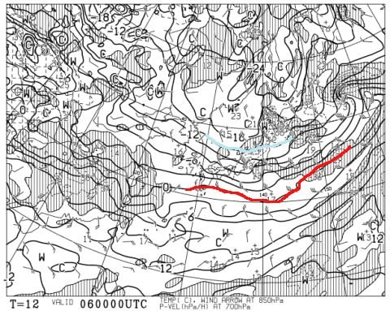

…明日の朝，志賀高原は，-18℃程度の

激冷えスタート！

そして．この日の地上天気図は…

うむ．

完全な冬型ですね．

ただ，ちょっと風が西風の予想に

なってきたので．

志賀高原は，太ももパフや

膝パフまでは積もらなさそう…

おそらくブーツパフ，

吹き溜まるところなら脛パフって

ところですね（涙）

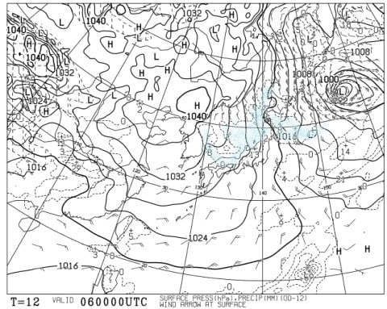

でも，白馬方面や日本海側はかなり

どっさり積もるかな？

6日は昼間も降り続け，昼間も

そこそこの積雪がありそう…

そして，7日（金）の850hpa図は．

水色に塗った，-9℃の線が志賀高原より

南まで下がってますね…

朝は-10℃以下，-12，3℃．

昼間も-10℃を大きく上回らない

冷え冷えですね…

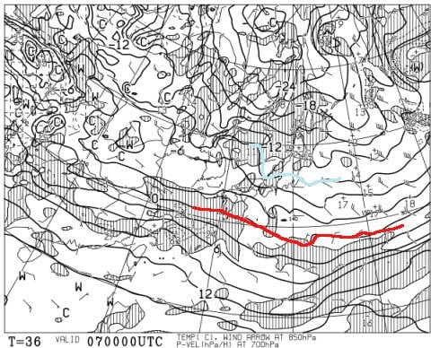

で，地上天気図は，

すっぽり本州が高気圧に覆われています！

朝のうちは山には雲がかかるかもしれないけど．

じき晴れて，いい天気の最高冷え冷えデー

っぽい！

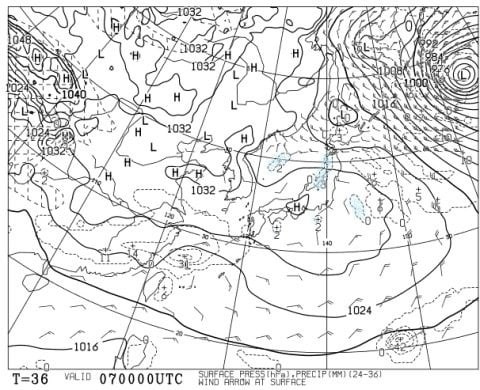

続いて．

肝心の週末の8日（土）の850hpa図を見ると．

水色の-6℃線が志賀にかかる程度なので．

7日までの激冷えに比べると，

多少気温は上がるものの…

7日までが寒すぎただけで，

これでもこの日の朝は-10℃近く，

昼間も-5℃くらいまでしか上がらない

冷え冷えデーですね…

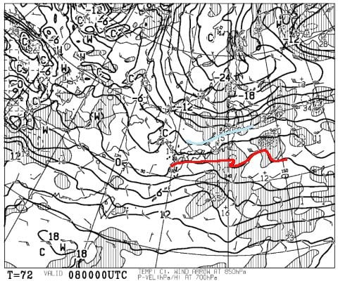

そして．

この日の500hpa図を見ると．

うむ？？

この日も，そこそこの雪の目安．

-30℃線が，志賀高原にかかってますよ？？

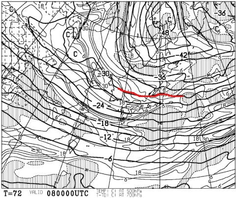

そして．8日土曜の地上天気図を見ると．

日本海側に降水域がかかっているので．

この日の朝は，10～20cmの積雪が

あるかも？？

そして，昼間も降り続けそう…

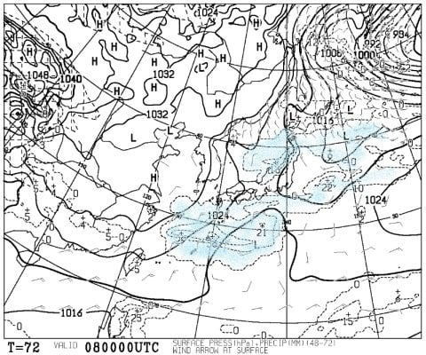

8日は雪が降り続ける天気ながら．

終日冷え冷えの，最高雪質の

一日になりそう…

そして．

9日の日曜の850hpa気温ですが．

この日も，水色の-9℃線が志賀に

近いづいているので．

-10℃クラスの冷え込み！

この日も冷え冷え！！

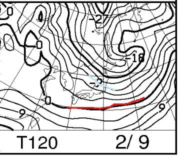

そして，地上天気図を見ると．

弱い冬型が入っているので．

ちょいと曇り空になるかな…

でも，網掛けの降水域は

かかってないので．

日曜は降らなさそうです…

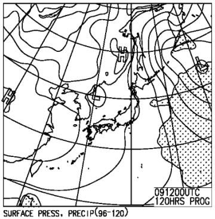

そして．

10，11日も，赤い0℃線は志賀より

南にあるので．

雨の心配はなさそう…

ただ，11日の祭日は．

志賀高原に赤い0℃線が近づくので．

それまでに比べると，気温が

上がりそう…

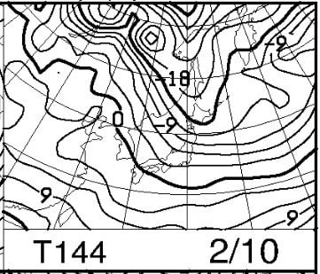

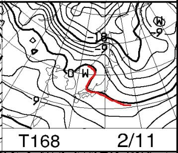

地上天気図は，2日間とも高気圧に

覆われそうなので．

10，11日は晴れのいい天気で

スキーができそうかな？

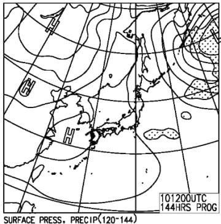

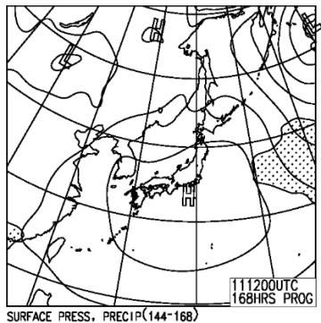

とりあえず．

今日から11日までは．

雪が壊滅的に溶けたり，雨が降ったり

することなく．

そこそこ冷え冷えの日々が続きそうです！！

ってなことで．

まとめると．

6日（木）：朝は-18℃程度まで冷える．激冷え．

　昨晩からひたすら雪が降り続け，朝はブーツパフ，

　吹き溜まりは脛パフ程度．

　北風が強いので，奥志賀ゴンドラはヤバいかも．

　雪は終日降り続け，昼間も気温は-10℃程度と

　激冷え！

　曇り＆雪降りで視界が悪いので，飛ばして

　快適に滑れる天気ではなさそうだけど．

　雪は超冷え冷えの軽い雪が積もり続け．

　昼間もうっすらゲレンデに新雪が積もっていく

　ような，真冬の寒い一日．

　午後のゲレンデはモサモサになっていくが，

　雪が軽いのでそれほどひどいボコボコに

　なりにくいかな…

7日（金）：朝は-12～-13℃程度で，雪がぱらついているか．

　風が西風なので，志賀高原では晴れたり

　時折雪雲が飛んできて曇ったり．

　昼間も-5℃くらいまでしか気温が上がらず，

　冷え冷え最高雪質の一日！

8日（土）：朝は-9℃ほどと，結構な冷え込み．

　朝は10cm．運が良ければ15cmは

　積もってるかも…

　この日は終日雪が降り続け，昼間も

　うっすら積もる程度．

　日が射さないので，ゲレンデの凸凹が

　見にくい上に，雪が柔らかいので

　午後には凸凹になっていきそう…

　でも，冷え冷え最高雪質の

　真冬の志賀高原らしい雪で滑れる

　一日！

9日（日）：朝はこの日も-10℃近くまで冷えるかな？

　朝のうちは雪がぱらつくが，積雪はほとんど無し．

　あったとしても2-3cmのうっすら程度．

　あさイチはやわらかシマシマ圧雪！

　この日は，午後に向かって雲が薄くなり，

　午後遅めには日が射していくか．

　昼間も気温が上がらず，うっすら日が射すか，

　運が良ければ午後はすっきり晴れで

　最高冷え冷え雪質のゲレンデを滑れる，

　いい感じのトップシーズンの一日！

10日，11日:そこそこ冷えて，基本的には晴れそう．

　2日とも積雪は無し．

　10日は激冷え，雲が多いかも…

　11日は晴れて，気温が上がりそう．

　昼間は0℃近くにまで上がるかも！？？

という感じで．

これから11日の祭日までは．

結構な冷え込みで，

トップシーズンの冷え冷え雪質を

楽しめそうですよ～！！

## 💬 コメント一覧

### 💬 コメント by (yumi)
**タイトル**: Unknown
**投稿日**: 2020-02-06 06:09:09

やったぁ～✨😍✨

😃✌️🎵☃️💖

### 💬 コメント by (副院長)
**タイトル**: 腰痛
**投稿日**: 2020-02-06 12:07:07

Sさま

皆さん心配なさってるようで、腰痛いかがでしょう。

症状的には回旋筋、多裂筋、横突間筋、胸棘筋など、局所的に痛めてるように思います。

上手なカイロプラクティック、マッサージで　ピンポイントに治してくれそうな感じがします。お安いところでいろいろ試すのがいいですよ。色々腰のケアーにお金をかける　中高年ゴルファーが　どこどこが上手とかの情報を持っているかと思います。お近くのゴルファーにお聞きください。

また、今後のことを考えると、比較対象的にいちどMR検査を受けられることを勧めます。

では、今週末雪の増えた焼額のレポートを待ってます。

### 💬 コメント by (yama)
**タイトル**: 腰痛
**投稿日**: 2020-02-06 15:04:53

10年ほど前起き上がれないほどの痛み襲われて医者に行きました。椎間板が２か所ほどつぶれていました。理学療法でかなり改善しています。スキーをしながら治すのが一番だと思います。

### 💬 コメント by (カンタロス)
**タイトル**: Unknown
**投稿日**: 2020-02-06 17:40:03

今まで、故障無し(？)なのが素晴らしく丈夫な体の証です。

私は、腰、膝はガッツリとザムストサポーターのお世話になってます。

一度やってしまうと、うまく付き合うしかないですからね(笑)

完治をお祈りします。

### 💬 コメント by (レインボー)
**タイトル**: Unknown
**投稿日**: 2020-02-06 17:52:38

本木曜日は、予報どおり強風15mで、Ｓさんの予報どおり奥志賀はクローズ。ヤケビはマイナス15度がずーっと。寒すぎて、レインボー隊員は12時過ぎに業務完了しました。

朝のオリンピックは30cm強の新雪でしたが、重くて苦戦しました。その後もずっと降り続け、フェイスマスクが凍って大変でした。でも、冬だ、の感動が勝って、楽しい一日をすごせました。

### 💬 コメント by (Skier_S)
**タイトル**: 冷え冷え祭りは今週末まで
**投稿日**: 2020-02-07 00:10:42

>yumiさま

今日はかなり積もったみたいですね！

また今週末は新雪が楽しめそうですよ～！！

＞副院長さま

おかげさまで，腰痛は快復してきているようです…

カイロプラクティックやマッサージって，行ったこと

無いんですよね…

そして，私の周りにはあんまりゴルファーがいません（涙）

とりあえず，長引くようならまた病院に行ってみます…

＞yamaさま

え？？

椎間板が2か所つぶれてたんですか？？

それは自然治癒したんですか…？？？

しかし．

そんな腰で，あんな滑りをしていたんですね…

＞カンタロスさま

膝と腰は大事にしてきたので，これまで怪我は手の骨折1度だけです．

とりあえず，あとを引かないように願うばかり…

＞レインボーさま

奥志賀ゴンドラが止まったのは予想通りでしたが．

まさか，リフトまで止まるとは思ってませんでした．

気温が低かったので，雪は軽かったのかと思ったのですが，

意外と重かったんですね．

でも，これから11日までが，今シーズン唯一の冷え込みか

もしれません…

今週末まで，思いっきり楽しまないと！！

### 💬 コメント by (新潟のスキーヤー)
**タイトル**: Unknown
**投稿日**: 2020-02-07 00:43:42

腰痛辛いですよね～ 

私も長年腰痛に悩まされておりますので、なんとなくヤバそうな時はコルセット巻いて滑っております！

昔は朝から晩までコブに入っていた事もありましたが、今は腰と要相談です。まぁ～腰以外にもあちこち痛いんで絶好調な日は、ほぼ無いですが…(^^;

ところで、今年も11,12で志賀高原に行くので、天気も気になるところですが、11日の祝日はSさんは焼額にいらっしゃるのでしょうか？ 気になります！笑

### 💬 コメント by (Skier_S)
**タイトル**: ＞新潟のスキーヤーさま
**投稿日**: 2020-02-07 23:13:26

いやー．

まだちょっと痛いです…（涙）

しかし，皆さん腰痛もちなんですね．

11日は志賀高原に居ますので，またお会いしましょう～！！！

