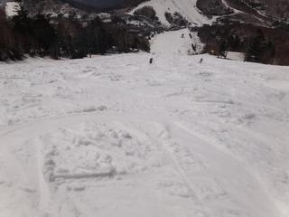

# 3連休中日，5月4日の志賀高原スキー場は…

📅 投稿日時: 2011-05-04 22:37:25

🏷️ カテゴリ: [2011スキー滑走日記](ca488c98cfb9169941c3e73770dcefb56.md)

今日も晴れ！

日焼け対策が気になるほどですな．

いやー．

人が多いですね．

久しぶりにスキー場に活気が戻ってきた感じがあります．

朝のうち，2－3分のリフト待ちが一瞬ありました．

ここしばらく，リフト待ちするほどの人がいなくて

寂しい感じだったので，なんか普通だと

「リフト待ちかよ…」

って思うところが，今回は

「ああ．人がいっぱいスキー場に戻ってきたんだなぁ…」

と，少しうれしく感じてしまうという．

…それくらい，ここしばらく寂しかったですからね．

しかし．リフト待ちがあったのも1－2回だけ．

あとはほとんどリフト待ちがない一日．

ただ，ゲレンデの人は多いです．

朝イチ以外，一の瀬メインバーン大回り不可能．

朝イチは，わずかにアイスバーンでしたが，

9時ごろには雪が緩み始めました．

んで，人が多いので，一の瀬メインバーンは…

10時半には，コブができ始めます．

12時には，かなりのこぶバーン．

14時には，完全なこぶバーンになりました．

リフト終了時は，かなり深いこぶラインが数本

できてましたね～

しかし．

雪が多い今年は．

こぶ溝に，まだまったく土が出てきてません．

コース全面，完全に雪で覆われています．

石ころを踏む心配がありません．

わかる人には，この時期に一の瀬リフト券売り場前に

これだけ雪があるということで，今年がどれだけ

すごいかわかるはず…

こんなにいっぱい雪があるのに，

明日営業終了というのがもったいない…

で，気温自体も今日は低めで．

Tシャツやトレーナーですべるのは無理なほど，

冷たい風が吹いており．

日が差しているというのに，結構板がすべる良い

雪のコンディションでした．

あー．

この3連休は，前半3連休といいコントラストですね．

最高のコンディションです．
