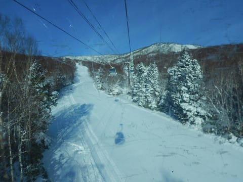
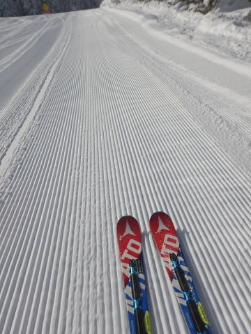
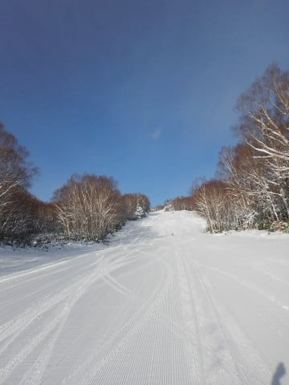
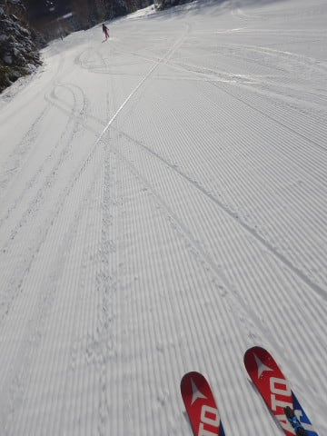
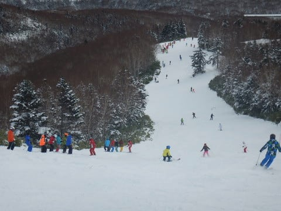
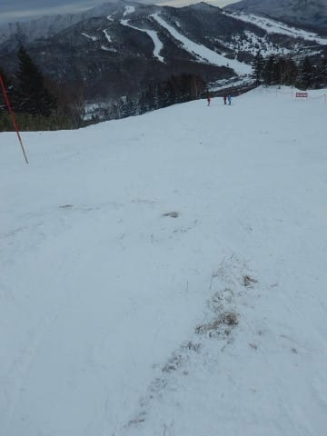
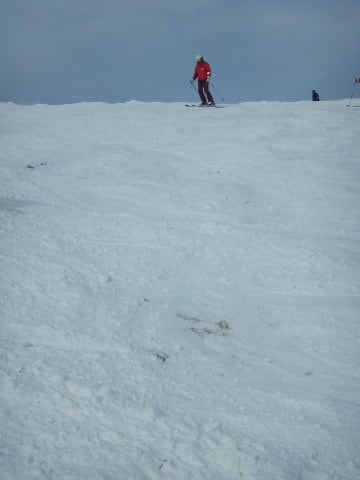
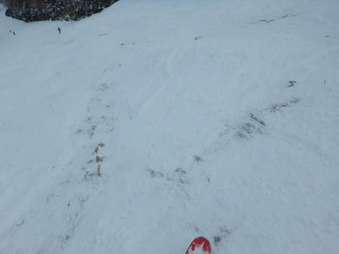
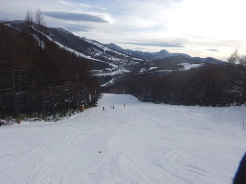
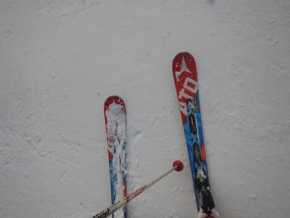

# 2018/12/16(日)の志賀高原焼額山スキー場，速報モード…朝は晴れ＆シマシマで最高！でも，もう一降りほしいかな…

📅 投稿日時: 2018-12-17 01:59:55

ということで．

今日も志賀高原でラストまで滑り．

帰宅するともうこんな時間…（涙）

なので．

本日の志賀高原の状況のレポートは，

日曜深夜恒例，速報モードにて！

まず．

本日朝イチから焼額ゴンドラに乗りこみますが…

昨晩からの積雪は1cmも無いほどだったけど．

昨日積もった雪が圧雪されて…

あさイチは，今シーズン初の，

柔らかシマシマバーン！

…これだよ．

本格シーズンが始まるまで，

ずっと夢見ていたコンディションは

これだよ…っ！

すっきり晴天のシマシマバーンを滑る，

この快感っ！！

でも．

某都道府県連の指導員研修会が開かれていた

本日．

午前中のゲレンデは，ちょっと人が多めでしたが…

でも，研修会の班がいくつか重なって

乗り場にやってくるようなタイミング以外は，

ゴンドラやリフトはほとんど待つことは

無かったですよ～．

ただ…

人工雪を打っていない，第2ゴンドラ山頂からの

パノラマコース．

昼前になると…

あれれ？？

うーむ．

かなり残念なことに…

午後はちょっとゴンドラ側を滑る意欲を

失わせるバーンコンディションでした（涙）

だもんで．

昼ごろからは，人工雪でしっかり雪付けを

してある，第2高速の唐松コースを滑りますが．

午後になると研修会も終わり，

ゲレンデはガラガラに！

…ただ，人工雪がガンガン打ってある

コースは，下地の硬いところが結構出ていたのが

ちと残念…

でも．

昼間もそれほど気温が上がらず．

天気も晴れ時々曇り…といった感じで，

今シーズンでは一番いいコンディションで

滑れたんじゃないかな！

…とりあえず．

志賀高原は，今晩～明日の雨の心配もなさそうだし．

18～19日はちょっと雪も積もってくれそうだし．

ゲレンデコンディションのさらなる改善を

望みたいところ…

…

…でも．

20日以降，3連休が終わるまで．

気温が上がりそうな気配（涙）

3連休も冷え冷えになるように祈りたいところ…

っていうか，踊りたいところですね…

3連休，第1ゴンドラ動いてほしいなぁ…

## 💬 コメント一覧

### 💬 コメント by (もりや)
**タイトル**: やっぱり小学生
**投稿日**: 2018-12-17 05:29:38

昨日はお世話になりました！子供達同士で雪合戦をしたり、雪で階段を作ったりと凄く楽しかったようです。その姿を見てると小学生なんだなーと思いました。それにしても、今日は子供達の間ではGokuさんが5人ぐらい分身して滑ってるよ！(爆笑)と言われ、私も娘も分身に気付かずに手を振ったり、追いかけたりしてしまいました(笑)

### 💬 コメント by (サトシ父)
**タイトル**: やっと
**投稿日**: 2018-12-17 07:08:37

ご挨拶できました。子供さん達スゴすぎます、老体にはついて行けません。次回は是非ゆっくりお話しできればと…

### 💬 コメント by (michi)
**タイトル**: 二日間ありがとうございました
**投稿日**: 2018-12-17 08:15:35

この週末は２ゴンが動いたことでやっとシーズンインした気持ちになりました(^^)

昨日は柔らかいゲレンデで大回り出来ましたし、久しぶりの方々にも再会し、集団滑走も楽しめました。

子供達は相変わらずの爆走で競って滑ってましたね（笑）途中で止まることをしないので追いかけるのが大変、、、みんなで滑るのが楽しくて仕方ないようです。

### 💬 コメント by (musi)
**タイトル**: ようやく
**投稿日**: 2018-12-17 12:05:26

本格的にシーズンが始まった感じですね。

雪が多い所という単純な選択方法で、血迷って

夏油高原まで遠征してきました。

ヘトヘトに運転に疲れて帰京して、道具を

片づけて、最初にした事がSさんの徒然日記

のチェックという、だいぶおかしな感じに

なってきました。夏油も楽しかったですよ。

（一部ブッシュが顔を出してました）

3連休は、志賀の宿を2カ月も前に予約して

いるので、18、19日に積もってもらいたい

なぁ。木の陰から、ジャケットに穴の空いている人を探してみます。

### 💬 コメント by (Goku)
**タイトル**: ゴールドメンバー完敗
**投稿日**: 2018-12-17 19:59:39

昨日はお疲れさまでした～♪

しかし、私たちゴールドメンバーを周回遅れにしたスーパーキッズには驚きを隠せません。

あのkonsukeさんでさえ追いつけなかったとか・・・

### 💬 コメント by (若杉勲71)
**タイトル**: 17日のヤケビ
**投稿日**: 2018-12-17 20:51:59

２ゴンは動いていましたが、パノラマは非圧雪でボコボコブッシュ。

喜んで滑っているのは前原さんだけでした。

２高は雪もまずまずで、初めて13時まで滑りました。いよいよエンジンがかかりかけました。

ずっとコンスケさんと一緒できて楽しかったです。

明日は初めて熊さんを覗いてきます。

### 💬 コメント by (しんちゃん)
**タイトル**: 降ってくれー
**投稿日**: 2018-12-17 21:11:16

スーパーキッズ、更にスーパーになってるんですね（驚）

３連休までに雪降ってくれー。

必死に例の踊りを踊っておきます(笑)

### 💬 コメント by (Skier_S)
**タイトル**: 明日からゴンドラ営業見合わせ（涙）
**投稿日**: 2018-12-18 00:53:30

＞もりやさま

日曜はお世話になりました～！

うちの娘も，すごい楽しかったようで，

毎週休まず志賀に行きたくなってきたようです…

しかし，子供二人の最後のハイペースはすごかった！

しかし，Gokuさんの影武者，かなりそっくりでしたね(笑)

＞サトシ父さま

やっとお会いできましたね…！

娘と滑っていたので，あまりゆっくりお話し

できなくて

すみませんでした…

上手いタイミングでゴンドラに一緒になれればと

思っていたのですが，

残念ながらいいタイミングは無かったようで…

これに懲りずにまた志賀高原にお越しください～！！

PS.お会いしたら渡そうと思っていたステッカー

　渡し忘れていました．すみません

＞michiさま

ゴンドラが動くと，やっとシーズンだという気になりますよね…

私もようやく本格シーズンになってきた感じがしました．

しかし，子供たちの速いこと…

あの後，午後に第2高速をグルグルしていた小学校高学年組二人は，

私とGokuさんというゴールドメンバー2人を周回遅れにするという，

恐ろしいペースで滑り続けてました…

速すぎる…

＞musiさま

え？夏油は雪が多いんですか！

そして，帰宅後のBlog確認，お疲れ様です(笑)．

3連休は志賀にいらっしゃるのですね．

こちらは初日は都合で滑れず，2日目，3日目のみの

志賀高原参戦となります．

木の陰から見守らず，ぜひお声がけください(笑)．

ジャケットの穴は，外から見ても分からないので

発見する目印にはならないかと思いますが，

私のことを発見した人の多くが，

「雰囲気ですぐ分かった」

とのことなので，かなり発見しやすいようです…

何人かでつるんで滑っていることも多いので，

声をかけにくい感じかもしれませんが，

皆さんBlog読者ですので，気にせずお声がけください～！

＞Gokuさま

いや…

まさか，周回遅れにされるとは思ってませんでした…

娘に追いつけなくなる日がこんなに早くに来るとは（涙）．

しかし，うちの娘にはゲレンデでもう少し曲がることを

覚えてほしい今日この頃です…

＞若杉さま

月曜のパノラマ，そんなにひどかったんですね…

火曜からはゴンドラ営業見合わせのようですが，

また水曜から復活してくれそうな天気図です．

そろそろエンジンが掛かってきましたか…

住まいの環境整備もそろそろ一区切りついたのでしょうか？

