# 12月29日の志賀高原は…晴天！最高！幸せっ！！！

📅 投稿日時: 2013-12-29 22:02:34

ということで．

正月休みも始まり．

やってきました，志賀高原．

…本日の焼額は…

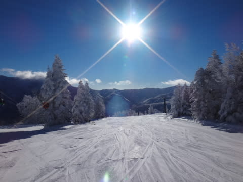

朝から晴天っ！！

今日は終日，気持ちのよい晴天でしたっ！

＃天気予想，朝から晴れ間が…ってのは当てたけど，

＃時折雪が降る…ってところが外れたのは黙っておく←だからここで書いたらバレバレだってば

で．

山頂の気温はマイナス13度．

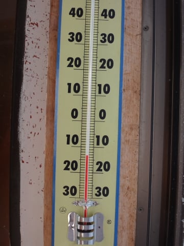

寒いよっ！

ぶるるる．

でも．

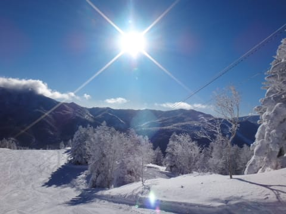

いやー．

景色は完全に真冬になりましたね～っ！

んで．

天気予想では，20～30cmの新雪って言ったけど．

…実際はこんな感じで．

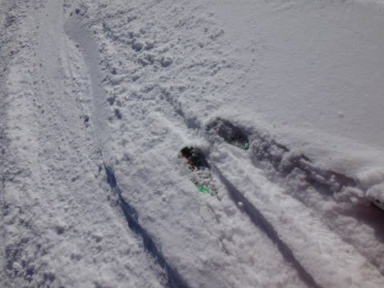

わずか10cmでした(外してゴメンナサイ)

圧雪バーンは…

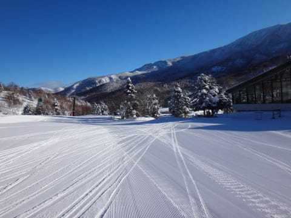

やわらかい新雪が圧雪されて，ピカピカ！

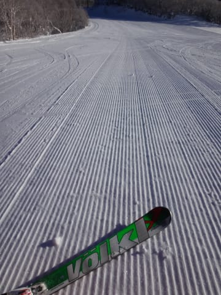

うほほほほ！

…シマシマバーンもよだれじゅるじゅるものですが．

10cmとはいえ，積雪があったので．

非圧雪バーンへ行ってみるのだ．

オリンピックコースは…

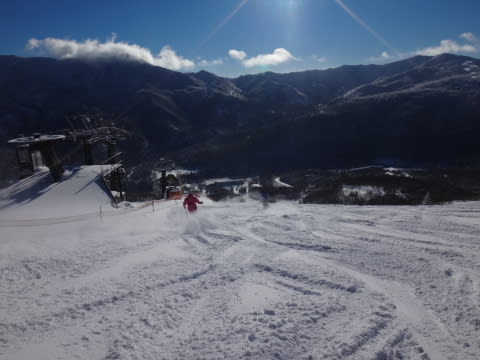

ふむ．

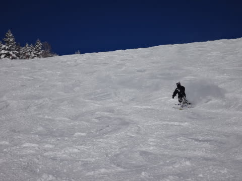

ほほ～っ！

それほど深い新雪ではないけど，

雪は軽くて，パウダーが舞い上がるっ！

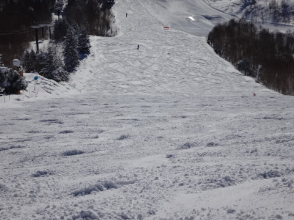

ふははは．楽し～！

と，楽しんでいたら．

さすが，正月休み…

ゲレンデの人が結構増えてきて．

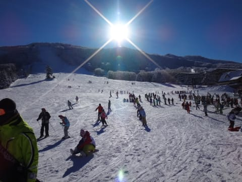

うーむ．

ゴンドラも最高5分以上待ち…

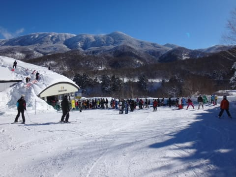

今日はゴンドラ2-5分待ち，ってところでした．

で．

雪がやわらかく，人が多いということで…

午後からはちょいと凸凹さんがコンニチハしてきました．

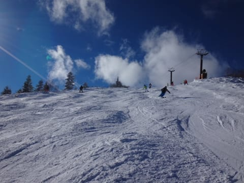

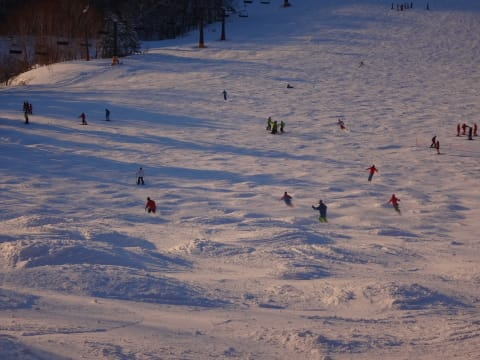

でも．

今日は終日天気が良くて．

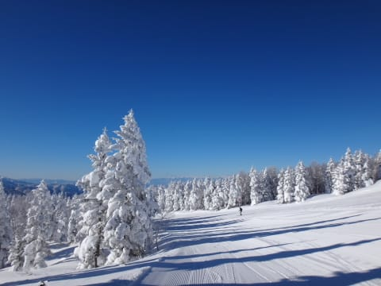

視界がよく．

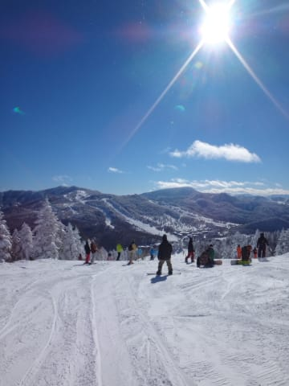

雪もこんな最高なので．

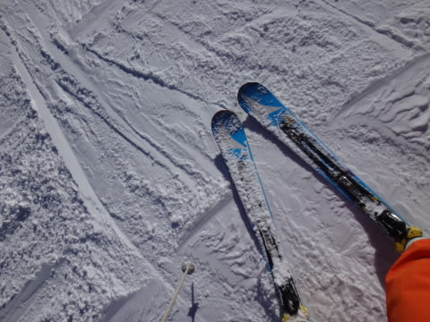

夕方まで，気持ちよく滑れたのでした…

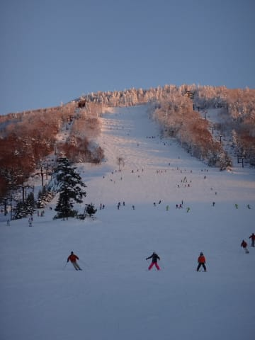

いやーーー．

さらに．

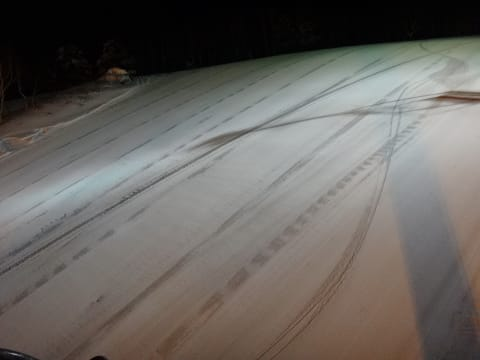

見よ！このナイターバーンをっ！！！

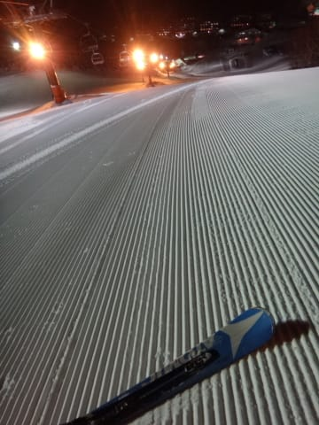

ああ…幸せ…

ということで．

今日はキンキンの激冷えで雪もよく．

さらに天気も最高で．

今シーズン最高のスキー日和でしたよっ！！

＃ちょっと混んでたけど

## 💬 コメント一覧

### 💬 コメント by (Goku)
**タイトル**: Unknown
**投稿日**: 2013-12-29 22:40:05

あ～やっぱり最高だったんですね。

私は・・・そのピーカンの志賀高原の山々を眺めながら、今日は家中の大掃除でした(涙)

気を紛らわすため、一心不乱に徹底的にやってやりました(笑)

### 💬 コメント by (Skier_S)
**タイトル**: gokuさま
**投稿日**: 2013-12-30 22:02:50

今日はお疲れ様でした～．

今日の志賀高原は楽しめたのでは

ないでしょうか…

＃ちょっと混んでましたが(涙)

午後はゴンドラは空いてたのがちょっと救いですか．

今日は早く帰るとおっしゃってましたが，

気のせいでなければ，夕方もゲレンデで

滑ってらっしゃいませんでした？

