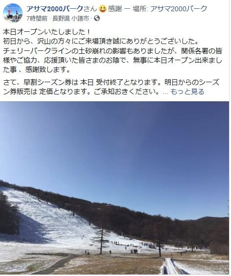
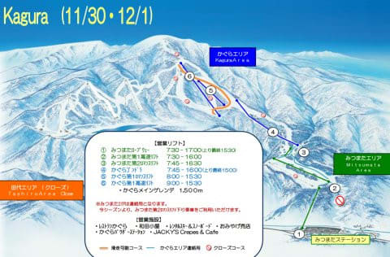
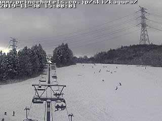

# 11月30日（土）熊の湯，高天ヶ原オープン！…かぐらも高速リフトが動き，アサマ，ハンターマウンテンもオープン

📅 投稿日時: 2019-11-30 23:20:49

🏷️ カテゴリ: [日記](cc4b5682fb7b8b144980957a978653fb0.md)

ということで．

本日30日土曜から，熊の湯が再オープンしましたが．

志賀高原に行っていた焼額常連メンバーからの

報告によると．

結構天然雪が積もって，コンディションは意外と

良かったようですね…

そして．

意外なことに．

午後1時から，高天ヶ原トリプルも

稼働したようです！

さらには，予定通りアサマ2000も

オープンしたようですが…

ちょっとコース幅狭そうですね．

（[アサマ2000Facebook](https://www.facebook.com/asama2000park/photos/a.761279247230852/3821265924565487/?type=3&theater)より）

この斜度で，このコース幅しかないと

結構きつそう…

で．

本日はペアリフトのみで営業予定だった

かぐら．

あさイチはペアだけだったようですが．

こちらも想定外に，かぐら高速リフトも

とちゅうから動きだし．

明日も高速クワッドリフトが滑れるようです…！！

（[かぐらスキー場公式HP](https://www.princehotels.co.jp/file.jsp?id=304673)より）

うーむ．

連絡用とはいえ，みつまたも雪の上を滑って降りれるようだし．

（[かぐらスキー場公式HPライブカメラページ](https://live.monitorbox.jp/site/kagura/91/)より）

かぐらが一番コンディションがいいのかな…？？

あと，

ハンターマウンテンもオープンしたみたいですね．

ってなことで．

明日，どこに行こうか悩んでいるのですが．

明日はどこに行っても終日天気が良く．

ちょっと気温が上がりそうな感じです…

明日朝起きた段階で，どこに行くか決めます．

ってなわけで．

明日も早いので，今日はもう寝ます．

おやすみなさい…

## 💬 コメント一覧

### 💬 コメント by (かず)
**タイトル**: Unknown
**投稿日**: 2019-12-01 13:14:07

お久しぶりです　今シーズンもよろしくお願いします

やっとシーズン券申し込みしたところです　今年も板２枚購入してしまいました・・・・

### 💬 コメント by (Skier_S)
**タイトル**: ＞かずさま
**投稿日**: 2019-12-02 01:55:31

お久しぶりです～！

今シーズンもよろしくお願いします．

…しかし，板2枚購入ですか！？？

物欲にまみれてますね(笑)．

また，志賀高原でお会いしましょう！

