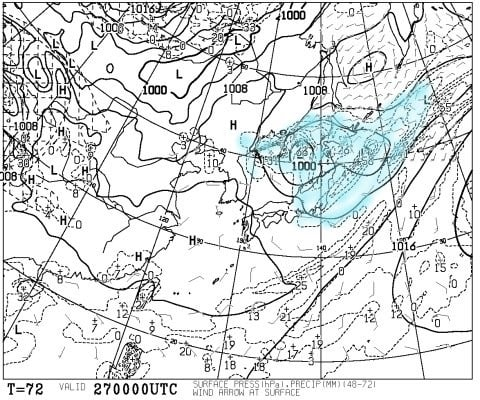
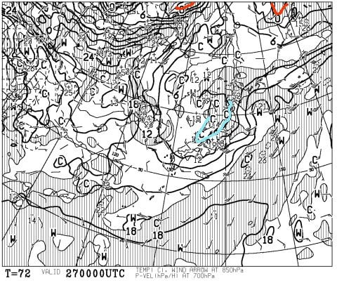
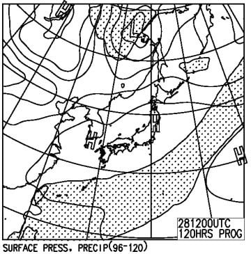

# まだ終わってないの…？今週末，5月27，28日のスキー場の天気は…土曜は曇り，日曜は晴れかな

📅 投稿日時: 2017-05-25 00:43:37

🏷️ カテゴリ: [スキー天気予想](c6554f5c3c106093b511a8daae23757e8.md)

ということで．

今週末は，かぐらのファイナルデーとなるわけですが．

レポートしたように，まだまだ雪は

いっぱいあるので，

昨年と同じレベルのゲレンデになるまで

耐えるのなら…

（昨年5月22日）

…あと2週間は営業できるのでは？？

と，思ってしまう，Skier_Sです．

ホントに，雪が多い年は延長営業してくれたら

嬉しいんですけどね～．

ってことで．

今週末はラストかぐらに繰り出すわけで．

今週末の天気が気になる終わってしまったスキーヤーも

数多くいると思うので．←数多くいないから…！

今週も，週末の天気予想，行くのだ！

えー．

土曜の地上天気図ですが…

東日本全域を，水色で塗った降水域が

カバーしているように見えますが．

この降水域は，金曜朝9時～土曜朝9時の24時間の

降水予測．

おそらく，長野～新潟県あたりは，金曜夜には

雨が上がると思うので．

…土曜は朝のうち曇り，午後に晴れていく…

という感じでしょうか．

で．

気にする必要はほとんどない，850hpa気温図ですが．

いつも赤くマークする0℃線は，この図の

北の端っこにぎりぎり見えるかどうか…

というところまで北上して．

かぐら近辺は，水色の+6℃線が掛かってますね…

そうそう，かぐらの山頂は標高がだいたい1500m．

つまり，ほぼ気圧850hpa面に相当するわけで．

この気温図は，概ねかぐら山頂の気温に近い

ということになるかと…

朝9時のかぐらは，+6℃を超える気温になるということかな．

そして，日曜の地上天気図は…

あぁ．

これも，降水域の網掛けはスキー場にかかってないので，

晴れますね．

ということで．

まとめると

27日土曜：朝は雲が多く，午後は雲が上がって太陽が覗く．

　朝は日が射さないので，一瞬肌寒く感じるかもしれないけど．

　昼間に気温は+10℃を超える程度に上がる．

　気温は先週末ほど暑くない．

　雪は，まぁこの時期の平均的な感じで．

　朝からかなりしっとり重い雪でしょうか…

28日日曜：朝から晴れ！

　気温は土曜とほぼ同じだけど，日差しが

　ある分暑く感じるか…

　雪質は期待してはいけません（笑）．

って感じで．

今週末は，土曜・日曜ともに．

雨に降られる心配は無くスキーができそうです…

しかし．

雪が多い今年．

ホントに今週末がかぐらラストデーとは

信じられないのですが…（泣）
