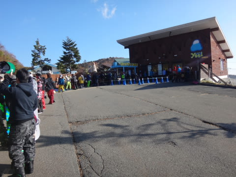

# 2016シーズンのオープンから1週間…10月25日，日曜日のイエティの混雑は？

📅 投稿日時: 2015-10-27 00:57:47

えー．

昨日はですねぇ．

イエティから帰宅した後．

娘と一緒に寝てしまうという失態から，

詳細レポートができなかったのですが…

…実に，実に恐るべし，布団の魔力っ！

…おそらく．

布団というヤツは．

人間のやる気を失わせる何か強力な魔力を持っているに，

違いない…っ！！

と思わざるを得ない今日この頃，皆様いかがお過ごしでしょうか　(以上，時候の挨拶)

というわけで．

オープンから一週間たった，この日曜日のイエティの詳細レポートをば…

日曜日は，朝からすっきり快晴！

朝のイエティの気温は10℃程度でしたが，

日が射すので暖かく感じますね～．

で．朝8時からのオープン時に，入場を待っている人はこれくらいいたけど．

＃リフト券待ちはゼロ．リフト券購入後の入場待ちです

「あれ？いい天気なのに，これだけしかいないの？」

という感じ…

昨シーズンまでは，もっともっと人が多かった気がするけどなぁ…？

そして，8時オープンと同時に，まだ朝日が射すゲレンデへ，

Go！

朝イチの雪質は，コース真ん中は結構固めの，ちょっとカリカリした感じ．

コース端っこはザラメっぽいかな…

そして．

朝イチは．

誰もいない！！

誰もいない，結構締まった雪を飛ばせるよっ！！

朝の9時ごろまで，リフト待ちはこの程度で，快適だよ！！

…と，思っていたら．

やはり快晴の日曜日．

9時半ごろには，このくらいのリフト待ちに…

そして，日が照っているので，10時ごろには

雪も結構緩んで，滑りが悪くなってきた感じ…（残念）

でも，まぁすっきり天気も良く．

ゲレンデはこの程度なので，まだそんなに混んでないかな．

と，思っていたところ．

10時にはクワッドと並行してかかるペアリフトが動き出し…

リフト輸送力があがったからか…

10時を過ぎてくると，ゲレンデの混雑度，かなりアップ！（涙）

ただし，ペアリフトは待ち時間0だし．

昼ごろのクワッドリフトは，タイミングによっては待ち時間が

この程度と，いつもよりは短くて．

…まぁ，ペアリフト使えば待たずにグルグルできるから，

許せるかな．

…ただ，ゲレンデは．

うむ．

この人口密度…

低速トレーニングしかできませんね（涙）．

…まぁ，いいんだ．この時期は．

シーズンインの，基本的な練習ができれば，いいんだ…←というふうに，自分をごまかす

まぁ，この時期．

こんないい天気の中，スキーができるだけで，シアワセだよねっ！！

ってことで．

ちょっと混んでたけど．

天気も良く，結構暖かく（薄手のジャケットくらいでちょうどいい感じ），

リフト待ちも少なく．

まぁ，恵まれてたかな～．

とりあえず．

この時期定番の，動画もつけておきます…

午後1時ごろのリフト降り場から麓までです…
