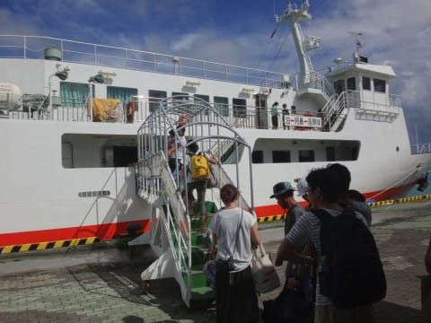

# 2016年8月　子連れ座間味ダイビング旅行記　その14…そして座間味を後にして

📅 投稿日時: 2017-07-27 02:23:29

ダイビング日記を中断して，自動車ネタを書くと．

このBlogのアクセス数がそこそこ増えるということが

明らかになりつつある今日この頃，

皆さまいかがお過ごしでしょうか…．

って感じで．

夏モード時恒例の，

「これのどこが徒然スキーヤー日記なのだ…？」

という疑問を抱かずにいられなくなるBlogですが．

本日はめげずに，また人気のないダイビング日記へ，Go!

--

ということで．

最後のダイビングが終わり，

カレー屋さんで遅めのお昼ご飯を食べた後は，

干していた器材をバタバタと片づけるだけで，

あっという間に3時過ぎ．

ダイビング終了時．

ダイブショップのスタッフ曰く．

　「フェリーの出航15分前に港に着いても，

　　乗れないことは無いけど．

　　ばらばらに座ることになったり，

　　冷房の効かないデッキの席に

　　なったりするので，

　　早めに並んでおいた方が良い」

とのことだったので．

出航は4時ですが，早めの3時過ぎに，

ダイビングショップの車にお迎えに

来てもらって，港へ向かいます…

…が．

やはり．

今日の午後の高速船が欠航になったため．

出航45分前というのに，もうすでに，

かなりすごい列が…（涙）．

早めに来たつもりだったのに，

列の後ろの方になっちゃいました（泣）

ってことで．

乗船時間まで，30分ほど待たされて．

乗船したところ．

やはり，残念ながら．

船室の中の席は揃って座れなかったので．

残念なことに，冷房の効かないデッキ席に…

まぁ，デッキ席と言っても，日よけはあるので

直射日光やら雨が直撃しない分マシですか…

ということで．

中1日の，短い滞在だった座間味ともお別れです～！

サヨナラ，座間味～！

また来年～！！

定時に座間味港を離れたフェリーは…

慶良間諸島内側のエメラルドグリーンの海を横切り…

そして，那覇に向かって進みます．

天気はいいけど…

やっぱり風が強く，外洋は波もちょいと高め．

高速船の欠航もやむなしかなぁ…

そんな感じで，ちょっと荒れ気味ながらも．

南国の日差しの中を進んでいたフェリーでしたが…

ところが．那覇入港直前．

それまで晴天だったのが，

にわかに掻き曇って…

そして，いきなりの通り雨！

通り雨が通ったあと．

那覇入港時は，見事な虹が…！

まるで，那覇港が「お帰りなさい」と

虹のアーチでお出迎えしてくれたようです…

