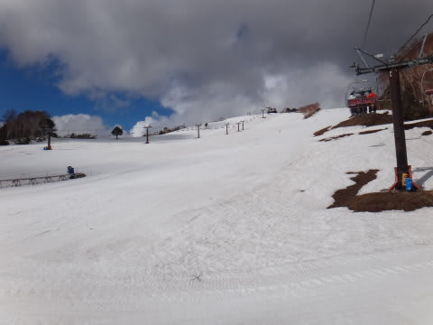
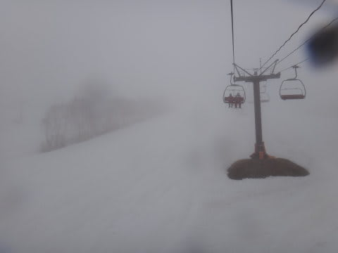
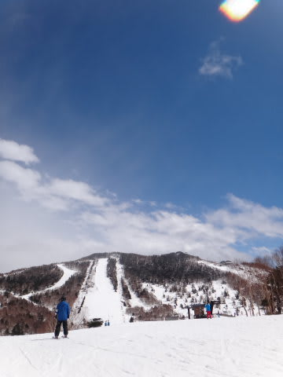
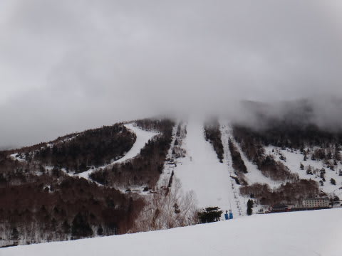
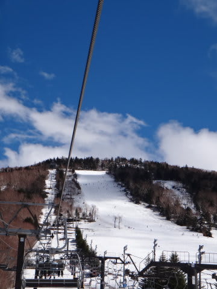
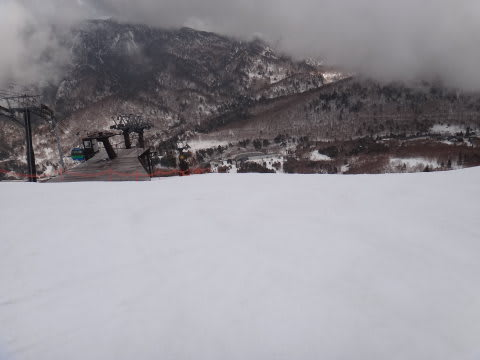

# 4月7日日曜の志賀高原の状況は…詳細は明日

📅 投稿日時: 2013-04-08 07:16:15

あー．

昨日，レポートを書く体力が無く寝てしまったので．

日曜の詳細は明日までお待ちを…(謝）．

で．

日曜の志賀高原の概況は…

…予想よりはよかったんですよ．

予想よりは．

朝7時ごろまでは，予想通りのかなりの雨…

だったんですが．

8時ごろには雨がやんで．

それどころか，青空も見えてきたという…

強風で，奥志賀ゴンドラ，焼額第2ゴンドラ，寺子屋は動かず．

一の瀬クワッドも営業開始が15分ほど遅れ，8時45分スタート…

って感じでしたが．

ヤケビは減速運転とはいえ，第1ゴンドラは動いたし．

昨日動かなかったダイヤモンド，山の神は動きました．

いやー．

まさか晴れるとは…

と思っていたところ．

その後，いきなりすごい激しい雨が降ったり…

また晴れたり…

昼ごろにはアラレが降ったり…

ガスったり…

午後にはまた晴れたかと思えば…

夕方はまた雲が出て，冷え込んで小雪もちらつくという…

天気予想通り，めまぐるしい天気の一日でした．

…また明日，詳細レポートしますので．

しばしお待ちを！
